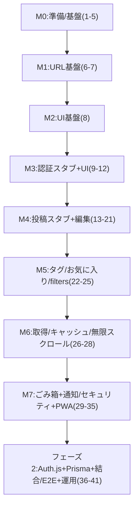

## 前提（この計画の読み方）

- 本計画は `[docs/04.作業計画書.md](docs/04.作業計画書.md)` の **項番（チェック管理単位）**を保持しつつ、実装は **意味のある塊（マイルストーン）**で進める。
- フェーズ方針は作業計画書の通り。
  - **フェーズ1**: スタブ認証・スタブCRUDでUI/ロジックを先に完成（TDD）
  - **フェーズ2**: Auth.js + Prisma + PostgreSQL（Neon）へ差し替え、結合/E2Eで担保
- 禁止事項/制約（必ず遵守）
  - `.env` 系の内容取得・出力・コミットはしない（値は扱わない）
  - **スキーマのマイグレーション作成/適用**や **DBデータ更新（INSERT/UPDATE/DELETE）**は、実作業としては行わない（必要な場合は「手順/承認が別途必要」として計画に明記する）

## 作業計画書の更新運用（実装と同期する）

- 更新対象: `[docs/04.作業計画書.md](docs/04.作業計画書.md)`
- 更新の目的: 「実装の進捗」と「作業計画表のチェック状態/保留理由」が常に一致している状態を保つ
- 更新タイミング（最小ルール）
  - 各マイルストーンの完了時に、そのマイルストーンに含まれる項番の **チェックリスト（未/済）** と **進捗情報** を更新する
  - ブロッカーが発生した時は、該当項番の **進捗情報** に「保留(理由: ...)」を追記し、理由を1行で明確化する（例: Miro待ち、CI/テストDB手順不足）
- 更新粒度
  - 進捗管理は **項番単位（1〜41）**で行う（マイルストーンは括りとして補助）
- 完了条件（DoDに追加）
  - 各マイルストーン完了時点で、該当する項番が「済」になっている（または、保留理由が明記されている）
  - 実装内容の変更により項番の分割/統合が必要になった場合は、`docs/04` も最小差分で追従更新されている

## マイルストーン構成（依存関係）

---

## M0: 準備/基盤（対象: 1〜5）

- 参照
  - `[docs/03.v2/01_基盤-方針.md](docs/03.v2/01_基盤-方針.md)`
  - `[docs/03.v2/90_品質-セキュリティ-テスト.md](docs/03.v2/90_品質-セキュリティ-テスト.md)`
  - `[docs/05.テキスト・コンテンツ定義.md](docs/05.テキスト・コンテンツ定義.md)`
- 入口（開始条件）
  - MVPの「やらないこと」が明文化される（作業計画書の例: タグ/お気に入り/ごみ箱等は“やらない”候補だが、現行の41項番では実装対象なので、**MVP定義をこの計画と整合**させる）
- 実装方針（このマイルストーンで決め切ること）
  - **テキスト定義の一元参照**: `[docs/05...]` を正として、UI文言を参照できる定数/辞書の置き場所を確定
  - **テスト実行の最小整備**: `mono-log/package.json` に Jest があるが `test` スクリプトがないため、テスト実行導線（例: `pnpm test`）を用意する計画を立てる
  - **接続ポイント雛形**: `authAdapter` と `postRepository` のI/Fと配置を先に固定（アプリコードから Auth.js/Prisma を直呼びしない）
  - **Miro参照準備**（項番2）は外部依存のため、できるところまで（フレーム一覧化の器/手順）を先に整備し、実フレーム反映はブロック扱い
- 出口（DoD）
  - `authAdapter` / `postRepository` の「呼び出し点」がコード上で固定されている
  - UI文言の参照先が1か所に集約され、Toast/Alert等で利用できる
  - Jest/RTL のスモーク（最小1本）が安定して回る
- 対象項番
  - 1,2,3,4,5

---

## M1: URL基盤（対象: 6〜7）

- 参照
  - `[docs/03.v2/10_URL-状態管理.md](docs/03.v2/10_URL-状態管理.md)`
- 実装の要点（設計で決まっている“置き場所”を守る）
  - URL正規化: `lib/routing/normalizeHomeSearchParams.ts`
  - 適用箇所: `mono-log/app/page.tsx`（現状はテンプレートのため、ここを起点に置き換える）
  - URL更新規約: `mergeSearchParams()` などのユーティリティで **重複排除/ソート/削除**を担保
- 出口（DoD）
  - 未ログイン時は query 全削除で `/` に寄る（`redirect("/")`）
  - ログイン中は `mode/view/tags/favorite` が canonical に整形される（差分がある場合のみ `redirect()`）
  - `tags` は重複排除＋昇順ソート、`favorite` は `1` に正規化
- テスト方針（必須）
  - 正規化関数と URL merge 関数は **純粋関数としてユニットテスト**（作業計画書の指定通り）
- 対象項番
  - 6,7

---

## M2: UI基盤（対象: 8）

- 参照
  - `[docs/03.v2/03_UI基盤.md](docs/03.v2/03_UI基盤.md)`
- 実装方針
  - shadcn/ui をCLI追加して利用（Dialog/Popover/Alert/Sonner/Skeleton/Checkbox 等）
  - Tailwind の `md=768px` を基準に、Miroのレイアウトに追従できるコンポーネント土台を用意
- 出口（DoD）
  - Toaster（sonner）等の共通UIがレイアウトに常設され、テストでも描画が担保される
- 対象項番
  - 8

---

## M3: 認証（接続ポイント + スタブ + UI）（対象: 9〜12）

- 参照
  - `[docs/03.v2/20_認証-認可-スタブ.md](docs/03.v2/20_認証-認可-スタブ.md)`
  - `[docs/03.v2/02_設定-環境変数-PWA.md](docs/03.v2/02_設定-環境変数-PWA.md)`
- 実装方針
  - `authAdapter` 経由でログイン/ログアウト/セッション取得を集約
  - スタブ認証は `USE_STUB_AUTH` かつ `NODE_ENV` が `test/production` 以外でのみ有効（それ以外は必ず 403）
  - ログアウト時は URL パラメータ全削除＋キャッシュ破棄（`posts`, `posts-filter`）
- 出口（DoD）
  - 未ログイン/ログイン中の画面出し分けが動く（Server Component を正）
  - スタブが **本番/CIでは絶対に動かない**ことがテスト/確認で担保されている
- テスト方針
  - `authAdapter` のユニットテスト（ガード条件含む）
  - ログイン/ログアウト UI は RTL の UI テスト（モーダル/Popover、Toast文言は `[docs/05...]` を参照する）
- 対象項番
  - 9,10,11,12

---

## M4: 投稿（接続ポイント + スタブCRUD + 本文形式 + 編集/離脱ガード）（対象: 13〜21）

- 参照
  - `[docs/03.v2/30_投稿-編集-本文形式.md](docs/03.v2/30_投稿-編集-本文形式.md)`
  - `[docs/03.v2/20_認証-認可-スタブ.md](docs/03.v2/20_認証-認可-スタブ.md)`（authorIdスコープ）
- 実装方針
  - `postRepository` は **必ず `authorId=session.user.id` でスコープ**（DTOで authorId を受け取らない）
  - スタブCRUDは `USE_STUB_POSTS` かつ `NODE_ENV` が `test/production` 以外でのみ有効
  - 本文: tiptap JSON を正として保存し、`contentText` はサーバー側生成（抽出/正規化）
  - `hasEdits` による離脱ガードを URL変更/編集切替/モーダルclose/ブラウザ離脱に適用
- 出口（DoD）
  - memo/note の新規作成・編集導線が仕様通りに成立
  - `content/contentText` 形式が統一され、一覧プレビューが可能
  - 離脱ガードが主要導線で一貫して動く
- テスト方針
  - `contentText` 生成のユニットテスト
  - エディタ/編集UI/離脱ガードは UI テストを先行（TDD）
- 対象項番
  - 13,14,15,16,17,18,19,20,21

---

## M5: タグ/お気に入り/filters（対象: 22〜25）

- 参照
  - `[docs/03.v2/40_タグ-お気に入り.md](docs/03.v2/40_タグ-お気に入り.md)`
  - `[docs/03.v2/10_URL-状態管理.md](docs/03.v2/10_URL-状態管理.md)`（tags/favorite の canonical）
- 実装方針
  - `normalizeTagLabel`（NFKC/制御文字除去/空白圧縮/1行化）+ バリデーション（空/32文字/上限10）
  - フィルタUIは state を持たず URL 更新のみ（`mergeSearchParams`）
- 出口（DoD）
  - tags は複数&ソート&重複排除で URL に反映される
  - favorite は通常ビューのみ操作可能で、URLの絞り込みと整合
- テスト方針
  - 文字正規化/URL反映はユニットテスト
  - UIはRTLで主要操作を担保
- 対象項番
  - 22,23,24,25

---

## M6: 取得/キャッシュ/無限スクロール/スクロール復元（対象: 26〜28）

- 参照
  - `[docs/03.v2/50_取得-キャッシュ-ページング.md](docs/03.v2/50_取得-キャッシュ-ページング.md)`
- 実装方針
  - TanStack Query の queryKey
    - キャッシュ対象: `mode/view`（`["posts", { view, mode }]` 等）
    - 非キャッシュ: `tags/favorite` 絞り込み（`gcTime: 0` + `staleTime: 0`）
  - 無限スクロール: `useInfiniteQuery` + IntersectionObserver + Skeleton
  - スクロール位置: queryKey 単位で `sessionStorage` に保存/復元（復元中は observer を抑制）
- 出口（DoD）
  - mode/view 切替・戻る/進むで一覧が即時復元される
  - 追加取得の失敗時も一覧が維持され、再試行できる
  - スクロール復元が体感的に破綻しない
- テスト方針
  - queryKey生成/scrollKey生成/scrollStoreはユニットテスト
  - IntersectionObserver はモックして UI テスト（最低限）
- 対象項番
  - 26,27,28

---

## M7: ごみ箱 + エラー通知共通化 + 開発用エラー + PWA + XSS最小対策（対象: 29〜35）

- 参照
  - `[docs/03.v2/60_ごみ箱.md](docs/03.v2/60_ごみ箱.md)`
  - `[docs/03.v2/70_エラー-通知.md](docs/03.v2/70_エラー-通知.md)`
  - `[docs/03.v2/02_設定-環境変数-PWA.md](docs/03.v2/02_設定-環境変数-PWA.md)`
  - `[docs/03.v2/90_品質-セキュリティ-テスト.md](docs/03.v2/90_品質-セキュリティ-テスト.md)`
- 実装方針
  - `view=trash` 時は filters UI 非表示・effective filters 固定
  - ごみ箱操作は多重実行防止（Mutation isPending で disabled）
  - エラー分類（401/403/404/422/5xx）→ UI挙動を共通化
  - `errorTest` クエリで通知を出す（`NODE_ENV=production` では無効）
  - PWA manifest + icons を `public/icons/` に配置
  - XSS: tiptap read-only レンダリング、リンク許可プロトコル制限、内部情報非表示
- 出口（DoD）
  - ごみ箱の単体/一括操作が成立し、キャッシュ更新も破綻しない
  - エラー時の状態維持/通知が一貫
  - manifest が生成され、icons が揃う
  - `dangerouslySetInnerHTML` 非依存で本文表示ができる
- 対象項番
  - 29,30,31,32,33,34,35

---

## フェーズ2: Auth.js + Prisma + 結合/E2E + 運用手順（対象: 36〜41）

- 参照
  - `[docs/03.v2/20_認証-認可-スタブ.md](docs/03.v2/20_認証-認可-スタブ.md)`
  - `[docs/03.v2/80_DBモデル.md](docs/03.v2/80_DBモデル.md)`
  - `[docs/03.v2/90_品質-セキュリティ-テスト.md](docs/03.v2/90_品質-セキュリティ-テスト.md)`
- 重要な扱い（計画上の注記）
  - DB/マイグレーション作成・適用や DB データ操作は、実作業としては **別途手順確認と承認が必要**（本計画では「必要な作業」として定義し、実行はしない）
  - 結合テスト（項番39）/E2E（項番40）/運用手順（項番41）は、作業計画書上も保留理由があるため、まず不足情報（テストDB/CI、stg運用、ドキュメント）を解消してから着手する
- 出口（DoD）
  - スタブ依存を外し、本番構成で認証〜CRUDが成立
  - `NODE_ENV=test/production` でスタブが完全に無効であることが、結合/E2Eで担保される
- 対象項番
  - 36,37,38,39,40,41

