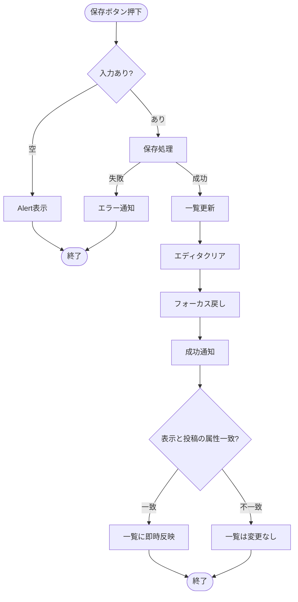

# 機能仕様（設計書と対）

- UI の実装方針（利用ライブラリ、テーマ、Miro連携など）は `docs/03.設計書.md` の「UI実装ガイド」を参照する。
- UI 表示文言（アラート/通知/確認メッセージ等）は `docs/06.テキスト・コンテンツ定義.md` を参照する。

## 目次

- 共通ルール
- ページレイアウト（Miro準拠）
- ヘッダー
- 認証
- 投稿（作成・編集）
- 投稿一覧（無限スクロール）
- 表示切り替え（モード/ごみ箱）
- 外部リンク/フッター
- ごみ箱

## 共通ルール

- 本書における「削除」は **ごみ箱に移動** を指す（復元可能）
- 「完全に削除」は **取り消し不可の削除** を指す
- レスポンシブのブレイクポイントは Tailwind CSS のデフォルトを採用する。本書の `md未満` / `md以上` は Tailwind の `md` を指す（具体値は `docs/03.設計書.md`「ブレイクポイント（Tailwindデフォルト）」を参照）
- 通信/認証/操作エラー時は、原則「トースト表示 + リトライ導線 + 状態維持」でユーザーが復帰できるようにする

## ページレイアウト（Miro準拠）

- ヘッダー:
  - 常に表示
  - 画面スクロール時も最上部に固定する
- メイン:
  - 未ログイン:
    - メインタイトル
    - ログインボタン
    - このアプリについて
    - 免責事項

  - ログイン中:
    - エディタと投稿一覧。md未満は縦並び、md以上は左右分割でエディタを固定。
- フッター:
  - 未ログイン: 表示する
  - ログイン中: 非表示にする

## ヘッダー

- 共通
  - アプリ名を左寄せで表示する
- 未ログイン
  - 未ログイン時: ログインボタン（右寄せ）
  - ログイン中（md未満）: ユーザーアイコン（右寄せ）
  - ログイン中（md以上）:
    - 表示切替（センターに配置）
    - ユーザーアイコン（右寄せ）

## 認証

### ログインボタン

- ボタン押下でログイン用モーダルウィンドウを表示する
- モーダル内に「Googleでログイン」ボタンを表示する
- ログインボタンを押下すると認証処理を実行する。成功したら、未ログイン用のウェルカムメッセージ／ログインボタンを非表示にし、ログイン中画面に表示を切り替える
- モーダルの右上のバツボタンを押下するとモーダルが解除される
- 認証に失敗した場合はエラー通知（トースト）を表示し、モーダルは開いたままにする（リトライ可能）

### ユーザーアイコン

- ユーザーアイコン押下でポップオーバーを開き、ユーザー名と「ログアウト」リンクを表示する
- ユーザーアイコンまたはポップオーバー以外のエリアをクリックすると閉じる

### ウェルカムメッセージ

表示する文章は [06. テキスト・コンテンツ定義](./06.テキスト・コンテンツ定義.md#ウェルカムメッセージ) を参照。

## 投稿（作成・編集）

### UI構成

- テキスト入力フィールド（リッチテキスト）
- 入力欄の下に、左から順に以下のUIを配置する
  - モードチェックボックス
    - 「メモ」「ノート」の2種類
    - 初期値は「メモ」
  - 保存ボタン
    - 新規投稿時: ラベル「保存」
    - 編集時: ラベル「更新」
  - キャンセルボタン（既存投稿の編集時のみ表示）

### 初期化処理

- 新規投稿か既存投稿の編集かを判定

### 新規投稿

- 初期設定モードをセットする
- 空のエディタを表示する
- エディタをフォーカスする
- UI操作: 保存ボタンを押下
  - アクティブになっているモードを取得する
  - エディタに入力された内容を取得する
  - 取得したデータをデータベースに登録する
  - 投稿一覧に投稿を反映する（表示中の条件に一致する場合）
  - 保存完了後の状態
    - エディタの入力内容をクリアする
    - 再びエディタにフォーカスを当てる
    - 成功通知（トースト）を表示する
    - モードを変更した場合、表示内容が新しいモードに合わせて切り替わる
  - エディタが空の場合は保存を行わず、Alertで未入力であることを通知する（文言は `docs/06.テキスト・コンテンツ定義.md`）

### 新規投稿保存フロー

**ポイント**:
- バリデーション失敗時は Alert、create失敗時はエラー通知（トースト） + 状態維持で再入力しやすくする
- エディタクリア + フォーカス戻しで連続入力を容易にする
- 表示中の mode/view/tags と保存投稿の属性が一致する場合のみ即時反映し、不一致の場合はモード切替時に表示する

### 既存投稿の編集

- 既存投稿のモードをセットする
- 既存投稿の投稿内容をエディタにセットする
- UI操作: 更新ボタンを押下
  - 保存処理と同様の流れで更新を実行
  - 成功通知（トースト）を表示する
- UI操作: キャンセルボタンを押下
  - 編集状態から通常表示に戻る
  - 新規投稿用エディタを表示する

## 投稿一覧（無限スクロール）

- 初期化処理
  - Skeletonを表示する
  - 取得すべきモードを取得
  - 該当するモードの投稿を **作成日時の降順** で直近 n 件ロードして表示する（初期値: 10）
  - Skeletonを非表示にする
	- 同時に下記を実行
		- モードタイトル（表示または差し替え）
		- 投稿一覧をフェードイン
  - 未取得の投稿がある場合は、無限スクロール形式で続きを取得し表示する
  - 取得に失敗した場合はエラー通知（トースト）を表示し、再読み込みできる導線を提供する（状態維持）

### 無限スクロール

- ページ最下部に到達したとき、次の n 件をロードし、ロード完了後に続きとして表示する（無限スクロール）
- 投稿をロードする際はSkeletonによるローディング表示を行い、投稿を読み込んでいることをユーザーに認知させる
- 全件ロードしたら成功通知（トースト）を表示し、以後はSkeletonを表示させない（文言は `docs/06.テキスト・コンテンツ定義.md`「成功メッセージ」）
- Skeletonは投稿一覧のレイアウトと同じ構造で表示し、レイアウトシフトが発生しないようにする
- Skeletonの表示件数は常に1ページ分（初期値10件）とし、初回ロード・追加ロードのいずれでも高さが揃うようにする
- 追加ロードに失敗した場合はエラー通知（トースト）を表示し、再試行できる導線を提供する（状態維持）

### ローディング表示

#### Skeleton（推奨）

- **投稿一覧などのリスト表示のローディングに使用する**
- 投稿一覧のローディング中は、投稿アイテムと同じレイアウトのSkeletonを表示する
- ローディング中は実データを非表示にし、Skeletonのみを表示する
- データ取得完了後はSkeletonを非表示にし、実データを表示する
- レイアウトシフトを防ぐため、Skeletonは実データと同じ構造・サイズで表示する
- Skeletonは常に1ページ分（初期値10件）と同じ件数だけ用意し、追加ロード時も実データと同じ高さを確保する

### 投稿アイテム（個別投稿）

#### 表示要素

- 所属するモード（メモ／ノート）
- 作成日（投稿日）
- 投稿本文
- 編集ボタン
  - 押下すると、その投稿の表示領域をエディタに差し替える
  - 差し替わったエディタ内にはその投稿の内容が表示され、編集可能状態になっている
  - 編集用エディタにはモードチェックボックス、キャンセルボタン、更新ボタンを表示する
- ごみ箱アイコン
  - ラベルは「削除」
  - 押下でその投稿を削除（ごみ箱に移動）する
- ごみ箱に移動した投稿はごみ箱状態になる
  - 一覧から表示が消える
  - 成功通知（トースト）を表示する
  - 失敗した場合はエラー通知（トースト）を表示し、再試行できる導線を提供する（状態維持）

## 表示切り替え（モード/ごみ箱）

- 配置:
  - md以上（タブレット・PC）: ヘッダー内
  - md未満（モバイル）: 画面の下部に固定
- 「すべて」ボタン
- 「メモ」ボタン
- 「ノート」ボタン
- 「ごみ箱を見る」リンク
- 初期設定では「すべて」がアクティブになっている
- 各モードとごみ箱は URL クエリで判定し、ブラウザでの進む/戻るで状態を保存できるようにする
  - 「すべて」表示も `mode=all` としてクエリパラメータで明示する
  - /?mode=memo → メモのみ表示
  - /?mode=note → ノートのみ表示
  - /?mode=all → すべて表示
  - /?view=trash → ごみ箱表示
- URL正規化（canonical化）の詳細は `docs/03.設計書.md`「URL正規化（canonical化）方針」を参照

## 外部リンク/フッター

### 外部リンク

- GitHubアイコン: リポジトリへのリンク
- Xアイコン: X（旧Twitter）へのリンク
- 「お問い合わせ」リンク

### フッター

- コピーライト表示

## ごみ箱

### 概要

- ごみ箱にはごみ箱状態の投稿を表示する（`mode` の値に関わらず全件表示）
- ごみ箱表示画面では、通常の投稿一覧と同じレイアウトの一覧コンポーネントを利用する
- ごみ箱内一覧を表示していても、通常の投稿一覧のキャッシュ状態は保持する（元の一覧画面に戻ったときに状態を復元できる）

### ごみ箱一覧上部のインターフェース

- 「表示されている投稿を選択」チェックボックス
  - チェックを入れると、現在表示されている投稿すべてにチェックを付ける
  - チェック状態ではラベルを「n件選択中」のように切り替える
  - チェック状態のときのみ「選択した投稿を削除」ボタンを表示する
- 「選択した投稿を削除」ボタン
  - 押下で削除確認モーダルを開く
  - モーダルで「n件の投稿を完全に削除しますか?」とメッセージを表示する
- 「ごみ箱を空にする」ボタン
  - 押下で削除確認モーダルを開く
  - モーダルで「ごみ箱内のすべての投稿を完全に削除しますか?」とメッセージを表示する
- 対象はロード済み／未ロードを問わず、ごみ箱状態の投稿すべてとする

### 削除確認モーダル

- 確認メッセージ（例：n件の投稿を完全に削除しますか?）
- 警告メッセージ（この操作は取り消せません）
- キャンセルボタン：モーダルを閉じる
- 削除ボタン：対象の投稿を完全に削除し、成功通知を表示する
  - 失敗した場合はエラー通知（トースト）を表示し、再試行できる導線を提供する（状態維持）
  - 本モーダルは一括削除（複数選択削除／ごみ箱を空にする）でのみ使用する

### ごみ箱内の各投稿の要素

- 選択用チェックボックス
  - チェック状態に応じてラベルを「n件選択中」に更新する
- 復元ボタン
  - 押下で復元し、ごみ箱一覧からは非表示にする
  - 成功通知（トースト）を表示する
  - 失敗した場合はエラー通知（トースト）を表示し、再試行できる導線を提供する（状態維持）
- 削除ボタン
  - ラベルは「完全に削除」
  - 押下でその投稿を完全削除し、成功通知（トースト）を表示する
  - 失敗した場合はエラー通知（トースト）を表示し、再試行できる導線を提供する（状態維持）
