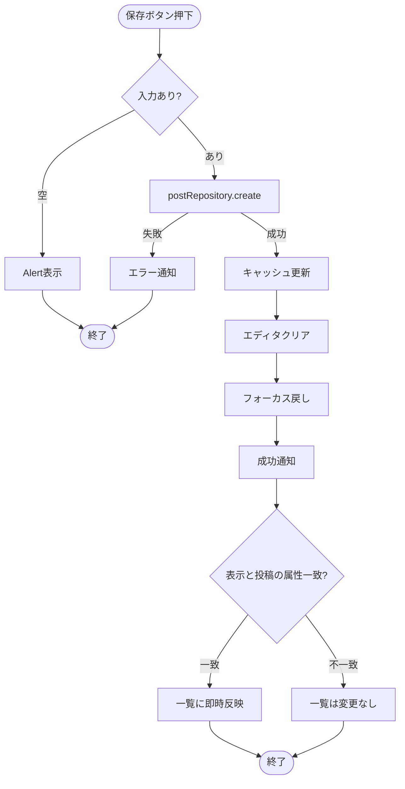
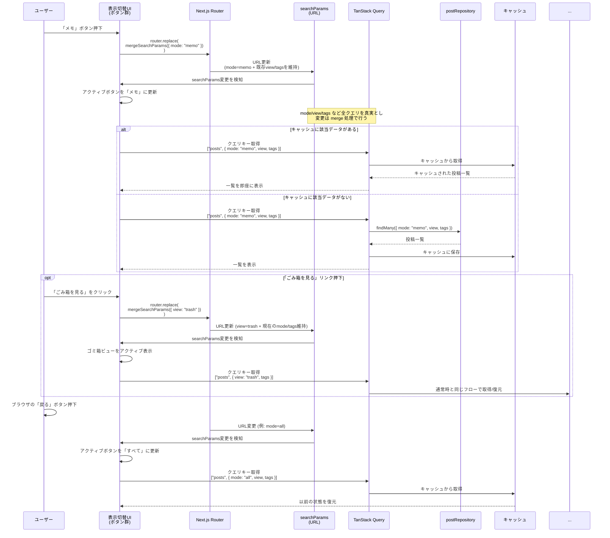

# 概要

- 本書はアプリの外部仕様（画面/操作/表示/文言）の正とする
- 内部設計（方針・内部構造・実装詳細）は `docs/03.設計書.md` を参照する
- 要件は `docs/01.要件定義書.md`、作業順・依存関係・完了条件（DoD）は `docs/04.作業計画書.md`、テキスト/コンテンツは `docs/06.テキスト・コンテンツ定義.md` に集約する
- 検索は将来実装予定（要件は `docs/01.要件定義書.md` を参照）
- 重要なフローは mermaid を優先して記載する

# 機能設計

## UI(shadcn/ui)

- 本プロジェクトの共通UIは **shadcn/ui をCLIで追加して利用**する（手動実装を避ける）。
- 公式ドキュメント（実装/利用方法）は以下を参照する。
  - button: https://ui.shadcn.com/docs/components/button
  - dialog: https://ui.shadcn.com/docs/components/dialog
  - alert: https://ui.shadcn.com/docs/components/alert
  - alert-dialog: https://ui.shadcn.com/docs/components/alert-dialog
	- popover: https://ui.shadcn.com/docs/components/popover
	- skeleton: https://ui.shadcn.com/docs/components/skeleton（投稿一覧のローディング表示に使用）
	- sonner: https://ui.shadcn.com/docs/components/sonner
  - checkbox: https://ui.shadcn.com/docs/components/checkbox

## ブレイクポイント（Tailwindデフォルト）

- `md`: 768px （本プロジェクトでは Tailwind のデフォルト値を採用）

## 外観（テーマ）設計（next-themes）

### 方針

- アプリ全体の外観（`system` / `light` / `dark`）は **next-themes** で管理する。
- Tailwind の `dark:` を利用するため、Theme の反映は **class strategy**（`attribute="class"`）を採用する。

### 配置（RootLayout）

- `ThemeProvider` は RootLayout 配下でアプリ全体をラップする（Providerの外側で `useTheme()` を呼ばない）。
- 推奨設定（例）
  - `attribute="class"`
  - `defaultTheme="system"`
  - `enableSystem`
  - `disableTransitionOnChange`（必要なら）
- hydration 差分が出る場合は `html` に `suppressHydrationWarning` を付与する（必要な場合のみ）。

### ライブラリ連携（sonner）

- `sonner` の Toaster は `useTheme()` の値を `theme` として渡すため、**必ず ThemeProvider 配下**でレンダリングされる構造にする。

### 文字サイズ切り替え

- `fontScale` は `normal` / `large` / `xlarge` の 3 段階を想定。`User.fontScale` とブラウザ `localStorage` の両方に保存し、サインアウト時も直近の設定を保持する。
- RootLayout で `data-font-scale` 属性を `html` に付与し、Tailwind の `@layer base` で `:root[data-font-scale="large"] { font-size: 1.1rem; }` のようにスケールを制御する。
- クライアントでは `useTheme()` と同様の `useFontScale()` フックを用意し、Popover 内の UI から `setFontScale("large")` を呼び出して `localStorage` → Server Action で `User` テーブルを更新する。
- テーマ切替 UI と同じくフェーズ1で基盤を整え（ThemeProvider 内で context を提供）、フェーズ3で UI + テストを実装する。

### 段階的導入（運用）

- フェーズ1: ThemeProvider の導入（基盤）を先行し、後続の UI 実装で手戻りが出ない状態を作る（切替UIは別タスク）。
- フェーズ3: テーマ切替UI（system/light/dark）と永続化、回帰テストを実装する（チェックリスト `P3-APP-01`）。

## UI設計方針（Miro連携）

- Miro ボード上のフレーム／アイテム情報を取得し、レイアウト構造や要素の優先度を設計のインプットとして活用する。
- 座標やサイズをピクセル単位で再現せず、並び順・まとまり・文言を参考にレスポンシブな構造を優先する。
- コンポーネント設計時は Miro 情報を要件定義書と照合し、TDD でスナップショット／挙動テストを先に書いてから実装する。
- Miro 側に更新が入った場合は差分を確認し、必要に応じて UI 設計を更新する。

## ページレイアウト（Miro準拠）

- ヘッダー:
  - 常に表示
  - 画面スクロール時も最上部に固定（position: sticky / top: 0）
- メイン:
  - 未ログイン:
    - メインタイトル
    - ログインボタン
    - このアプリについて
    - 免責事項

  - ログイン中:
    - エディタと投稿一覧。md未満は縦並び、md以上は左右分割でエディタを固定。
- フッター:
  - 未ログイン: 表示する
  - ログイン中: 非表示にする

## コンポーネント構成

## コンポーネント: ヘッダー

- 共通
  - アプリ名を左寄せで表示する
- 未ログイン
  - 未ログイン時: ログインボタン（右寄せ）
  - ログイン中（md未満）: ユーザーアイコン（右寄せ）
  - ログイン中（md以上）:
    - 表示切替（センターに配置）
    - ユーザーアイコン（右寄せ）

## コンポーネント: ログインボタン

- ボタン押下でログイン用モーダルウィンドウを表示する
- モーダル内に「Googleでログイン」ボタンを表示する
- ログインボタンを押下すると認証処理を実行する。成功したら、未ログイン用のウェルカムメッセージ／ログインボタンを非表示にし、ログイン中画面に遷移する
- モーダルの右上のバツボタンを押下するとモーダルが解除される

## コンポーネント: ユーザーアイコン

- ユーザーアイコン押下でポップオーバーを開き、ユーザー名と「ログアウト」リンクを表示する
- ユーザーアイコンまたはポップオーバー以外のエリアをクリックすると閉じる

## コンポーネント: ウェルカムメッセージ

表示する文章は [06. テキスト・コンテンツ定義](./06.テキスト・コンテンツ定義.md#ウェルカムメッセージ) を参照。

## コンポーネント: 投稿エディタ

### UI構成

- テキスト入力フィールド（tiptap）
- 入力欄の下に、左から順に以下のUIを配置する
  - モードチェックボックス
    - 「メモ」「ノート」の2種類
    - 定義:
      - メモ: 使い捨て前提（完了したら不要になる想定）
      - ノート: 書いて残す前提（後で読み返す想定）
    - 初期値は「メモ」
  - 保存ボタン
    - 新規投稿時: ラベル「保存」
    - 編集時: ラベル「更新」
  - キャンセルボタン（既存投稿の編集時のみ表示）

### 初期化処理

- 新規投稿か既存投稿の編集かを判定

### 新規投稿

- 初期設定モードをセットする
- 空のエディタを表示する
- エディタをフォーカスする
- UI操作: 保存ボタンを押下
  - アクティブになっているモードを取得する
  - エディタに入力された内容を取得する
  - 取得したデータをデータベースに登録する
  - 投稿一覧の現在のキャッシュに投稿を追加する
  - 保存完了後の状態
    - エディタの入力内容をクリアする
    - 再びエディタにフォーカスを当てる
    - 「保存しました」フィードバックメッセージを表示する
    - モードを変更した場合、表示内容が新しいモードに合わせて切り替わる
  - エディタが空の場合は保存を行わず、Alertで未入力であることを通知する

### 新規投稿保存フロー

**ポイント**:
- バリデーション失敗時は Alert、create失敗時は sonner.error + 状態維持で再入力しやすくする
- 保存後は現在のクエリキー（`["posts", { mode, view, tags }]`）を `setQueryData` で更新し、キャッシュとUIを同期させる
- エディタクリア + フォーカス戻しで連続入力を容易にする
- 表示中の mode/view/tags と保存投稿の属性が一致する場合のみ即時反映し、不一致の場合はモード切替時に表示する
- `view=trash` 表示やタグフィルタ中は、対応するクエリキー（例: `["posts", { view: "trash" }]`）には影響を与えず、通常一覧のキーのみ更新する

### 既存投稿の編集

- 既存投稿のモードをセットする
- 既存投稿の投稿内容をエディタにセットする
- UI操作: 更新ボタンを押下
  - 保存処理と同様の流れで更新を実行
  - 「更新しました」フィードバックメッセージを表示する
- UI操作: キャンセルボタンを押下
  - 編集状態から通常表示に戻る
  - 新規投稿用エディタを表示する

## コンポーネント：投稿一覧

- 初期化処理
  - Skeletonを表示する
  - 取得すべきモードを取得
  - 該当するモードの直近n件をロードしTanStack Queryのキャッシュに登録
  - Skeletonを非表示にする
	- 同時に下記を実行
		- モードタイトル（表示または差し替え）
		- 投稿一覧をフェードイン
  - 未取得の投稿がある場合は、無限スクロール形式で続きを取得し表示する

### 無限スクロール

- ページ最下部に到達したとき、次の n 件をロードし、ロード完了後に続きとして表示する（無限スクロール）
- 投稿をロードする際はSkeletonによるローディング表示を行い、投稿を読み込んでいることをユーザーに認知させる
- 全件ロードしたら[すべての投稿を取得しました]とメッセージを表示し、以後はSkeletonを表示させない
- Skeletonは投稿一覧のレイアウトと同じ構造で表示し、レイアウトシフトが発生しないようにする
- Skeletonの表示件数は常に1ページ分（初期値10件）とし、初回ロード・追加ロードのいずれでも高さが揃うようにする
- フェーズ1では postRepository スタブ（固定データ）＋ IntersectionObserver で無限スクロール UI の挙動を完成させ、フェーズ2で Prisma + Server Actions + Cursor ベースの本番処理に差し替える

#### データ取得・ページング・キャッシュ

- フェーズ1
  - `useInfiniteQuery` を利用し、`pageParam` は `cursor`（投稿ID文字列）で扱う。初回は `undefined` で 10 件（`limit`）取得する
  - `getNextPageParam` は最終要素の ID（スタブ）を返し、さらにデータが無ければ `undefined` を返す
  - キャッシュ構造は `["posts", { mode, view, tags }]` キー配下に `pages: PostDTO[][]` を持ち、UI 側は `pages.flat()` で描画する
- 追加フェッチ中は `isFetchingNextPage === true` をトリガーにリスト末尾へ Skeleton セクション（1ページ分）を追加表示し、既存の投稿はそのまま表示し続ける
  - postRepository スタブは `findMany({ cursor, limit, mode, status })` をサポートし、`cursor` が与えられた場合はそれ以降の投稿を返す
- フェーズ2
  - Server Action + Prisma で `cursor` ベースのページングを実装し、`NEXT_PUBLIC_USE_STUB_POSTS` フラグでスタブ ↔ 本番を切り替える
  - TanStack Query のキャッシュキーは `cursor` を含めない（ページングは `getNextPageParam` のみが持つ）ため、モードやビューを変更した場合でもページング状態を安全に切り替えられる
  - 追加フェッチ後は `queryClient.setQueryData` でページ配列を更新し、`invalidateQueries` は削除や復元などデータ破壊的操作時のみ行う

## コンポーネント: ローディング表示

### Skeleton（推奨）

- UIはshadcnのSkeletonコンポーネントを使う
- https://ui.shadcn.com/docs/components/skeleton
- **投稿一覧などのリスト表示のローディングに使用する**
- 投稿一覧のローディング中は、投稿アイテムと同じレイアウトのSkeletonを表示する
- ローディング中は実データを非表示にし、Skeletonのみを表示する
- データ取得完了後はSkeletonを非表示にし、実データを表示する
- レイアウトシフトを防ぐため、Skeletonは実データと同じ構造・サイズで表示する
- Skeletonは常に `findManyOptions.limit`（初期値10件）と同じ件数だけ用意し、追加フェッチ時も実データと同じ高さを確保する

## コンポーネント：投稿一覧 個別投稿

### 表示要素

- 所属するモード（メモ／ノート）
- 更新日（投稿日）
- 投稿本文
- 編集ボタン
  - 押下すると、その投稿の表示領域をエディタに差し替える
  - 差し替わったエディタ内にはその投稿の内容が表示され、編集可能状態になっている
  - 編集用エディタにはモードチェックボックス、キャンセルボタン、更新ボタンを表示する
- ゴミ箱アイコン
  - 押下でその投稿をゴミ箱に移動する
  - ゴミ箱に移動した投稿の status は trashed になる
  - 一覧から表示が消える

## タグ機能設計

### 基本方針

- タグはユーザー単位で管理し、1 投稿に複数タグを付与できる（多対多）。
- 登録/更新/削除 UI はフェーズ2で投稿エディタの下部に配置し、`tagSelector` コンポーネントを通して `postRepository` を呼び出す。
- CRUD は `postRepository` → `tagRepository`（予定）で抽象化し、スタブ／本番の切り替えは既存の環境変数フラグを使う。

### フィルタリング

- 表示切替UIに「タグフィルタ」ボタンを追加し、押下でポップオーバーを開いて複数タグを選択できる。
- URL クエリ `tags=tagId1,tagId2` で状態を保持し、戻る／進むで復元できるようにする（`mode` / `view` と同様に `searchParams` を監視）。
- TanStack Query のキーは `{ mode, view, tags }` を含むオブジェクトに拡張し、タグの組み合わせごとにキャッシュを保持する。

### キャッシュ／永続化

- 投稿保存時は `postRepository.create` / `update` の入力に `tagIds: string[]` を含め、Server Action 側で PostTag を upsert する。
- ゴミ箱移動・復元・削除時は、`postRepository` で `status` を更新したうえで、関連するクエリキーのキャッシュを `setQueryData` で差分更新してタグ付き一覧と整合させる（クエリ無効化による全再取得は行わない）。

## コンポーネント: 表示切り替え

- 配置:
  - md以上（タブレット・PC）: ヘッダー内
  - md未満（モバイル）: 画面の下部に固定
- 「すべて」ボタン
- 「メモ」ボタン
- 「ノート」ボタン
- 「ごみ箱を見る」リンク
- 初期設定では「すべて」がアクティブになっている
- 各モードとごみ箱はパラメーターで判定し、ブラウザでの進む/戻るで状態を保存できるようにする
  - 「すべて」表示も `mode=all` としてクエリパラメータで明示し、`searchParams` を監視して状態を復元できるようにする
  - /?mode=memo → メモのみ表示
  - /?mode=note → ノートのみ表示
  - /?mode=all → すべて表示
  - /?view=trash → ゴミ箱表示
- タグやごみ箱を切り替えても、そのときの投稿一覧の内容をキャッシュして状態を復元できるようにする

### 表示切替フロー

**ポイント**:
- URL（searchParams）が唯一の真実（Source of Truth）
- UI状態は searchParams から導出
- TanStack Query のキャッシュで戻る/進む時に即座に復元
- クエリ変更は mergeSearchParams で既存の view/tags などを保持したまま差し替える
- 「ごみ箱を見る」リンク・タグフィルタも searchParams ベースで分岐し、同一フローでキャッシュ復元する
- ボタン押下は URL 更新のみ（直接的な状態変更は行わない）
- URL正規化（canonical化）の詳細は `docs/03.設計書.md`「URL正規化（canonical化）方針」を参照

## コンポーネント: Link
- 外部リンク
  - GitHubアイコン: リポジトリへのリンク
  - Xアイコン: X（旧Twitter）へのリンク
  - 「お問い合わせ」リンク

## コンポーネント: フッター
- コピーライト表示

## コンポーネント: ゴミ箱

### 概要

- ゴミ箱には status が `trashed` の投稿を表示する（`mode` の値に関わらず全件表示）
- ゴミ箱表示画面では、通常の投稿一覧と同じレイアウトの一覧コンポーネントを利用する
- ゴミ箱内一覧を表示していても、通常の投稿一覧のキャッシュ状態は保持する（元の一覧画面に戻ったときに状態を復元できる）

### ゴミ箱一覧上部のインターフェース

- 「表示されている投稿を選択」チェックボックス
  - チェックを入れると、現在表示されている投稿すべてにチェックを付ける
  - チェック状態ではラベルを「n件選択中」のように切り替える
  - チェック状態のときのみ「選択した投稿を削除」ボタンを表示する
- 「選択した投稿を削除」ボタン
  - 押下で削除確認モーダルを開く
  - モーダルで「n件の投稿を完全に削除しますか?」とメッセージを表示する
- 「ごみ箱を空にする」ボタン
  - 押下で削除確認モーダルを開く
  - モーダルで「ゴミ箱内のすべての投稿を完全に削除しますか？」とメッセージを表示する
  - 対象はロード済み／未ロードを問わず、status が trashed の投稿すべてとする

### 削除確認モーダル

- 確認メッセージ（例：n件の投稿を完全に削除しますか?）
- 警告メッセージ（この操作は取り消せません）
- キャンセルボタン：モーダルを閉じる
- 削除ボタン：対象の投稿を完全に削除し、「投稿を削除しました」sonner通知を表示する

### ゴミ箱内の各投稿の要素

- 選択用チェックボックス
  - チェック状態に応じてラベルを「n件選択中」に更新する
- 復元ボタン
  - 押下で status を `active` に変更し、ゴミ箱一覧からは非表示にする
- 削除ボタン
  - 押下でその投稿を完全削除し、「投稿を削除しました」sonner通知を表示する
