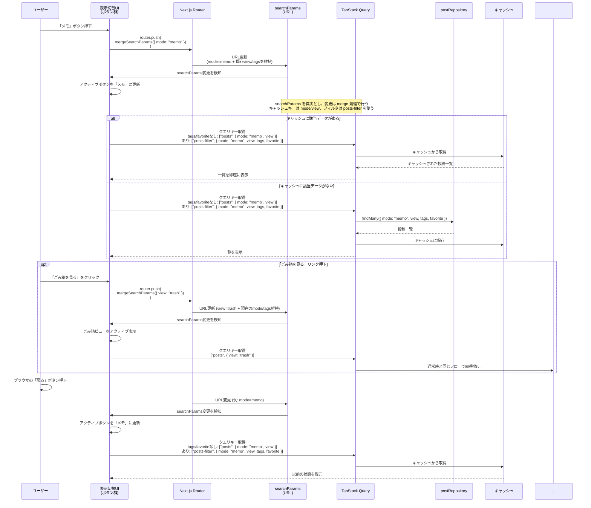

本ファイルは設計書V1（アーカイブ済み）から、URL/状態管理に関する章を分割したもの。

## この章で決めること

- URLスキーム（searchParams）と canonical URL の方針
- URL→画面状態の導出（有効な取得条件/effective filters を含む）
- URL更新規約（UI操作→URL）と正規化（canonical化）ルール

## この章の守備範囲

- URL（searchParams）をソースとして画面状態を決めるルールを扱う
- データ取得/キャッシュの実装詳細は扱わない（取得章を参照）

## 関連ドキュメント（参照先）

- 取得/キャッシュ: `docs/03.v2/50_取得-キャッシュ-ページング.md`
- タグ/お気に入り（意味/制約）: `docs/03.v2/40_タグ-お気に入り.md`
- ごみ箱（操作/UI）: `docs/03.v2/60_ごみ箱.md`

# 基本設計

## SPA（画面状態とURL）

- 本アプリは SPA とし、**画面状態（モード/ごみ箱等）は URL パラメータから一意に決定される（URL を単一の正とする）** 形で設計する
- 主要パラメータ
  - `mode`: 通常一覧の表示モード（`memo|note`）
  - `view`: 画面の表示ビュー（`trash`）
  - `tags`: タグ絞り込み（複数）
  - `favorite`: お気に入り絞り込み
- URL の正規化（canonical化）
  - 不正値/未指定値を許容値へ変換してから URL を確定する（詳細は「URL正規化（canonical化）方針」を参照）
  - 目的: 共有/ブックマーク/戻る・進むで状態復元できること、キャッシュキーの一貫性を保つこと

# ルーティング / URLスキーム設計

本アプリでは、画面状態（モード/ごみ箱/絞り込み条件）を URL（searchParams）で表現する。

## 対象URL

- `/`（ログイン前/後で同じURLを利用）
  - 未ログイン時: ウェルカム + ログイン導線を表示（URL の searchParams は全削除して `/` に正規化する）
  - ログイン中: 投稿エディタ + 投稿一覧（タイムライン）を表示

## URLスキーム（`/` の searchParams）

| key | 型 | 許容値/形式 | デフォルト | 用途 |
| --- | --- | --- | --- | --- |
| `mode` | string | `memo` \| `note` | `memo` | 通常一覧の表示モード |
| `view` | string? | `trash` | なし | `trash` の場合はごみ箱一覧 |
| `tags` | string[] | `tags=<tagId>` の複数指定 | `[]` | タグ絞り込み（複数選択） |
| `favorite` | boolean | `favorite=1`（truthy のみ有効） | false | お気に入り絞り込み |

補足:
- `tags` は `tags=tagA&tags=tagB` のように **同一キーの複数指定**で表現する（順序は意味を持たない）
- `tags` の複数指定は **OR 条件（いずれかを含む）** とする

### 表示別の URL 例（canonical）

`mode` は canonical URL として **常に含める**（`/?mode=memo` が基準）。`view=trash` 中は URL 上に `tags` / `favorite` が存在しても **一覧フィルタには使わず**、値は保持する。

| 表示 | canonical URL例 | 参照するparams | 一覧フィルタとして無視するparams | フィルタUI |
| --- | --- | --- | --- | --- |
| 通常一覧（メモ） | `/?mode=memo` | `mode`, `tags`, `favorite` | - | 表示 |
| 通常一覧（ノート） | `/?mode=note` | `mode`, `tags`, `favorite` | - | 表示 |
| ごみ箱 | `/?mode=memo&view=trash` | `mode`, `view` | `tags`, `favorite`（値は保持） | 非表示 |
| ごみ箱（URLに filters が残っている例） | `/?mode=memo&view=trash&tags=<tagId>&favorite=1` | `mode`, `view` | `tags`, `favorite`（値は保持） | 非表示 |

補足:
- 「通常ビュー」は `view` 未指定（`view !== "trash"`）を指す

## 状態導出（URL → 画面）

- `mode` / `view` / `tags` / `favorite` を URL から導出し、表示・データ取得の条件に反映する
- ごみ箱表示（`view=trash`）時は UI/UX を単純に保つため **モード切替（ModeSwitch）/タグ/お気に入り絞り込みは無効（UIは非表示）** とし、`status=trashed` の一覧を表示する（URL上の `mode` / `tags` / `favorite` の値は保持）

### 有効な取得条件（effective filters）

- `view=trash` のとき
  - 一覧取得条件は `status=trashed` に固定し、`mode` / `tags` / `favorite` は取得条件として無視する（URL上の値は保持してよい）
- 通常ビュー（`view !== "trash"`）のとき
  - 一覧取得条件は `mode` / `tags` / `favorite` を使用する

## URL更新規約（UI → URL）

- ユーザー操作による状態遷移は原則 `router.push()` で URL を更新し、ブラウザの戻る/進むで状態復元できるようにする
- **現在と同じ状態への切替**で URL が変わらない場合は更新を行わない（確認ダイアログも出さない）
- URL 更新は `mergeSearchParams()` で既存パラメータを保持しつつ差分のみ反映する
- 正規化（canonical化）による URL 整形は `replace`/`redirect` 相当で履歴を汚さない（次節参照）

---

# URL正規化（canonical化）方針

トップページ（`/`）では、セッション状態に応じて URL を正規化（canonical化）する。

- 未ログイン時: URL パラメータは **全削除**し、常に `/` に寄せる
- ログイン中: searchParams を正規化（canonical化）し、不正値や未指定値を許容値に変換してから URL に反映する

## 正規化の目的
- URL を常に「正しい形」に保つことで、共有・ブックマーク・戻る/進む操作での状態復元を確実にする
- 不正なクエリパラメータが残らないようにし、キャッシュキーの一貫性を保つ

## 正規化ルール

**`mode` パラメータ**:
- **許容値**: `memo`, `note`
- **意味**:
  - `memo`: 使い捨て前提のメモ
  - `note`: 書いて残すノート
- **未指定時**: `mode=memo` を付与
- **不正値時**: `mode=memo` に正規化
- **常に URL に含める**: `/` ではなく `/?mode=memo` を canonical URL とする

**`view` パラメータ**:
- **許容値**: `trash` のみ
- **不正値時**: パラメータを削除（`view=hoge` → 削除）

**`tags` パラメータ**:
- **形式**: `tags=<tagId>` を複数指定（例: `tags=tagA&tags=tagB`）
- **未指定時**: パラメータなし（`tags=[]` として扱う）
- **空値**: 削除（例: `tags=` → 削除）
- **重複**: 重複排除してから URL に反映する
- **順序**: 意味を持たないため、昇順にソートして URL に反映する（canonical化）

**`favorite` パラメータ**:
- **許容値**: `1`, `true`（truthy のみ有効）
- **無効値時**: パラメータを削除（例: `favorite=hoge` → 削除）
- **false 相当**: パラメータを削除（例: `favorite=0` / `favorite=false` → 削除）
- **true 相当**: `favorite=1` に正規化する

**その他のクエリパラメータ**:
- `errorTest` など、将来追加される可能性のあるパラメータは（ログイン中のみ） **保持**する
- 正規化処理は（ログイン中のみ） `mode` / `view` / `tags` / `favorite` を対象とし、未知のキーはそのまま維持する

## 実装場所

- **正規化関数**: `lib/routing/normalizeHomeSearchParams.ts`
- **適用箇所**: `app/page.tsx`（Server Component）
- **適用条件**:
  - 未ログイン時: searchParams が存在する場合、`next/navigation` の `redirect("/")` で `/` にリダイレクト
  - ログイン中: 正規化前後で差分がある場合、`next/navigation` の `redirect()` で canonical URL にリダイレクト

### 例

※以下はログイン中の例（未ログイン時は query を全削除して `/` に正規化する）

- `/` → `/?mode=memo`（リダイレクト）
- `/?mode=hoge` → `/?mode=memo`（リダイレクト）
- `/?mode=memo` → そのまま（リダイレクトなし）
- `/?view=trash` → `/?mode=memo&view=trash`（`mode` が付与されるためリダイレクト）
- `/?mode=note&tags=tag1` → そのまま（リダイレクトなし、`tags` は保持）
- `/?favorite=1` → `/?mode=memo&favorite=1`（`mode` が付与されるためリダイレクト）
- `/?favorite=true` → `/?mode=memo&favorite=1`（`favorite` を正規化する）
- `/?mode=note&tags=b&tags=a&tags=a` → `/?mode=note&tags=a&tags=b`（`tags` を正規化する）

---

# 表示切り替え
## 表示切り替え 内部フロー

**ポイント**:
- UI状態は searchParams から導出
- TanStack Query のキャッシュにより、ブラウザの戻る/進む時ボタンを押下したときに前回の投稿一覧を即時に復元する（スクロール位置は後述の Scroll Restoration で復元する）
- クエリ変更は mergeSearchParams で既存の view/tags などを保持したまま差し替える
- 「ごみ箱を見る」リンクは searchParams ベースで分岐し、キャッシュを切り替えて復元する
- タグ/お気に入り絞り込みは searchParams ベースで分岐するが、キャッシュは使わず毎回再取得する（仕様書に合わせる）

---
