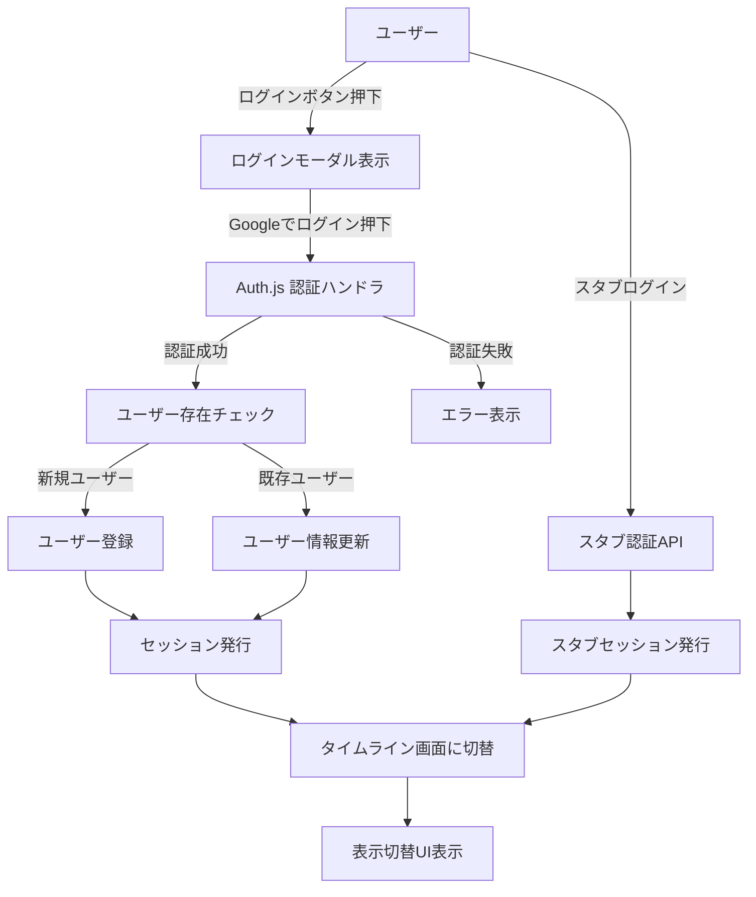
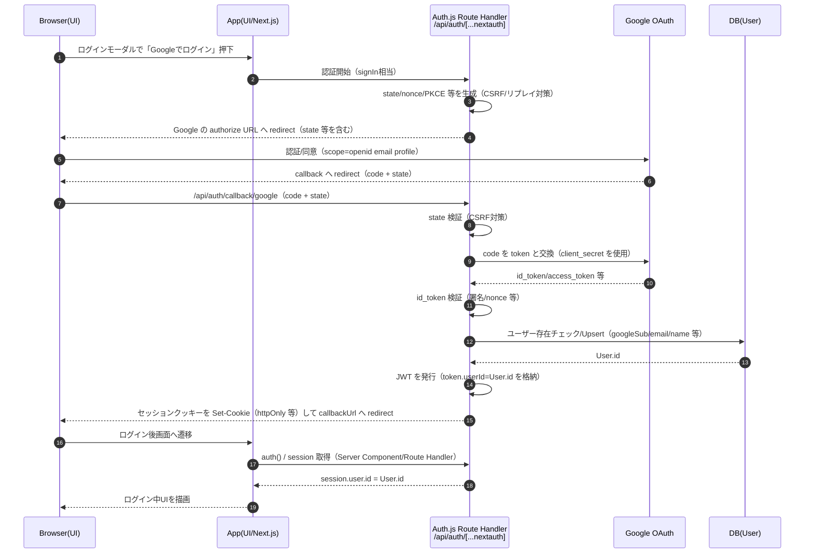
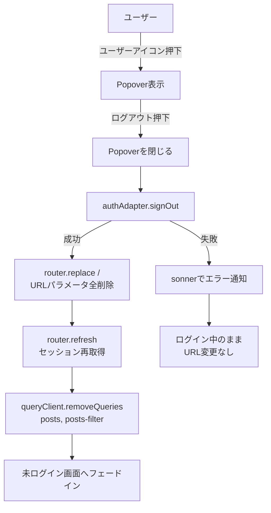

本ファイルは設計書V1（アーカイブ済み）から、認証/認可およびスタブ運用に関する章を分割したもの。

## この章で決めること

- 認証方式（Auth.js）とセッション仕様（載せる属性、失効時挙動）
- 認可（authorIdの基準）とチェック位置/エラー扱い
- スタブ認証・スタブ運用のガード（本番/CIで無効）

## この章の守備範囲

- 認証/認可の仕様と、スタブ運用のガードを扱う
- 画面レイアウト（モーダルの見た目等）は扱わない（Miro/仕様書を参照）

## 関連ドキュメント（参照先）

- 環境変数（Auth.js/スタブ切替）: `docs/03.v2/02_設定-環境変数-PWA.md`
- エラー通知（UI対応）: `docs/03.v2/70_エラー-通知.md`

# ログイン
## 認証とセッション（実装設計）

### 前提

- 認証方式: Auth.js を利用し、Googleを認証プロバイダーとしてシングルサインオンを行う
- セッション方式: JWT ベースとする

### Google OAuth 設定一覧（MVP）

本節は、Google Cloud Console（OAuth）と Auth.js（Google Provider）の参照元とする。

| 項目 | local | stg | prod | 備考 |
| --- | --- | --- | --- | --- |
| OAuth scope（最小） | `openid email profile` | `openid email profile` | `openid email profile` | Google API（Gmail/Drive 等）を呼ばない前提のため、MVP は最小権限とする |
| Authorized redirect URI（callback URL） | `http://localhost:3000/api/auth/callback/google` | `https://<stg-domain>/api/auth/callback/google` | `https://<prod-domain>/api/auth/callback/google` | Google Cloud Console に登録する値。stg/prod の `<...-domain>` は Vercel の実ドメインを正とする |
| Authorized JavaScript origins（任意） | `http://localhost:3000` | `https://<stg-domain>` | `https://<prod-domain>` | Google Cloud Console の設定。必要な場合のみ登録する |
| Provider 設定（Auth.js） | `Google({ authorization: { params: { scope: "openid email profile" } } })` | 同左 | 同左 | 実装では `app/api/auth/[...nextauth]/route.ts` に集約する |
| ベースURL（Auth.js が参照する URL） | `http://localhost:3000` | `https://<stg-domain>` | `https://<prod-domain>` | 環境変数（例: `AUTH_URL`）で明示し、コールバックURLの基準を保つ |

#### セッションに載せる属性（アプリが参照してよい形）

- `session.user.id`: アプリ内のユーザー識別子（`User.id`）。投稿の `authorId` はこれを基準にする
- `session.user.email`: 表示/問い合わせ/将来のアカウント管理に利用
- `session.user.name`: UI 表示に利用
- `session.user.image`: ユーザーアイコン表示に利用
- （任意）`session.user.googleSub`: Google 側の subject。将来の監査/同一性確認のために保持したい場合は追加する

#### セッション失効・未認証時の挙動（MVP）

- `auth()` が取得できない（未ログイン/セッション切れ）場合:
  - 401 扱いとして `toast.error` を表示し、入力/画面状態は維持したままログインモーダルを自動で開く（ベストエフォート）
  - ログイン成功後の自動リトライは行わず、ユーザーが同操作を再実行する（初期方針）

### 認可（authorIdの基準）

目的: クライアント入力の改ざんや呼び出し漏れがあっても、他ユーザーの投稿データへ到達できないようにする。

#### 採用するユーザー識別子（authorIdの基準）

- **基準**: `User.id`（= `session.user.id`）
- 投稿所有者: `Post.authorId = User.id`
- `email` は変更され得るため authorId に採用しない（表示/問い合わせ用途）
- `googleSub` は（保持する場合）同一性確認用の属性であり、authorId には採用しない

#### 認可チェック位置（どこで検証するか）

- **正（必須）: Repository（`postRepository`）**
  - すべての取得/更新/削除は **必ず `authorId = session.user.id` でスコープ**する
  - 例: 一覧取得は `authorId + status (+ mode)` で絞り込み（既存の一覧仕様と整合）
- **補助（入口）: Server Actions**
  - リクエストDTOで `authorId` を受け取らない（クライアント入力を基準にしない）
  - `postRepository` 呼び出し前に、未認証（セッションなし）の場合は 401 扱いで失敗させる

#### エラーの扱い（MVP）

- 未認証（セッションなし）: 401
- 対象の投稿が存在しない / 他人の投稿: 404（Not Found）を基本とする
- 権限なし（環境ガード等で操作自体を禁止）: 403

### 目的

- サインイン／サインアウト後に、セッション状態に応じた UI（未ログイン／ログイン中）へ確実に切り替わること
- 認証方式（スタブ／Auth.js 本番）を切り替えても、アプリ側の呼び出し点を変えずに実装できること

### 構成要素と責務

- Route Handlers（`app/api/auth/[...nextauth]/route.ts`）
  - Auth.js の認証フロー（サインイン、コールバック処理、セッション発行）を担当する
  - 認証成功時のユーザー存在チェック／User 作成・更新（メールアドレス更新を含む）は Auth.js コールバック内で行う
- 接続ポイント（`authAdapter`）
  - アプリコードが直接 Auth.js / スタブ実装を参照しないための入口
  - 環境変数により「スタブ／本番」を切り替える（ガード条件の詳細は「スタブ認証の運用ガード」に集約）
- セッション参照（サーバー）
  - Server Component / Route Handler から `auth()` を呼び、セッションを取得して UI に渡す
- セッション参照（クライアント）
  - `next-auth/react` の `useSession()` をヘッダー、ログインボタン、ユーザーアイコン等の表示分岐に利用する
  - ログインボタン側に独自の状態チェック処理は持たせず、セッションを単一の情報源として扱う
- CRUD（参考：データ処理方針）
  - Server Actions + TanStack Query で非同期処理を行い、Prisma Repository 経由で DB にアクセスする
  - UI のキャッシュ／再検証は TanStack Query に委譲する

### セッションによる画面出し分け方針

- 判定レイヤーは Server Component（例: `app/page.tsx`）とし、セッション有無で未ログイン／ログイン中の画面を出し分ける
- ミドルウェアでの判定は当面行わず、必要になった段階で検討する

### UI更新（サインイン／サインアウト後）

- サインイン／サインアウト後は、リダイレクトまたは `router.refresh()` 等でセッションを再取得し、UI を更新する
- 更新後は、表示切替 UI を含むログイン後レイアウト（または未ログインレイアウト）が描画される
- サインアウト後は URL パラメータを全削除し `/` に寄せたうえで、未ログイン画面へ **フェードイン**で切り替える（ログアウト専用画面は作らない）

### フェーズ方針（スタブ → Auth.js）

- フェーズ1: `/api/auth/stub` によるスタブセッション（開発専用 Cookie）を利用する
- フェーズ2: Auth.js（Google OAuth）へ差し替える
- スタブを本番・CIで誤って使わないための条件・実装箇所は「スタブ認証の運用ガード」に集約する

## 認証フロー（ログイン: ユーザー操作／状態遷移）

- ログインボタン押下 → ログインモーダル → 「Googleでログイン」押下 → Auth.js による認証フローへ遷移

- 認証失敗やユーザーキャンセル時は `AuthFail` に遷移し、エラー通知（sonner）を表示し **ログインモーダルは閉じる**（再試行は再度ログイン操作から行う）。
- スタブ利用の前提と切り替え条件は「フェーズ方針（スタブ → Auth.js）」および「スタブ認証の運用ガード」を参照する。

### Auth.js（Google OAuth）内部フロー（セキュリティ観点）

本節は「ユーザーがログインボタンを押してから、アプリが `session.user.id`（= `User.id`）を信頼できる状態になるまで」を、Auth.js の責務として整理する。

#### セキュリティが保たれる理由（MVPでの基準）

| フェーズ | 何を信頼するか | 主要な仕組み | 備考 |
| --- | --- | --- | --- |
| 認証開始〜Googleへリダイレクト | まだ何も信頼しない | state/nonce/PKCE の生成 | CSRF・リプレイ・コード横取りのリスクを下げる |
| callback 受信〜トークン交換 | callback の正当性のみ検証する | state 検証 + server-side で token 交換（client_secret） | client_secret はクライアントに出さない |
| トークン検証〜ユーザー確定 | Google が返した同意結果を検証する | id_token 検証（署名/nonce 等） | scope は最小（`openid email profile`） |
| セッション確立 | クッキー内のJWTを検証して session を復元する | `AUTH_SECRET` による署名（必要なら暗号化） + httpOnly cookie | セッションは「ログイン状態」の証明であり、アプリの主体IDは `session.user.id` を正にする |

### セッション確立後にセキュリティを保つ仕組み（認可の基準）

認証が成功しても、それだけでは「このユーザーがどの投稿を操作してよいか」は決まりきらないため、アプリ側の認可（authorization）を **`session.user.id` を基準**として実装する。

| レイヤー | 入口/責務 | セキュリティ上の役割 | 具体方針（MVP） |
| --- | --- | --- | --- |
| UI（クライアント） | ボタン/フォーム | 改ざんされ得るため基準にしない | `authorId` を入力/送信しない（postId等のみ） |
| Server Actions | アプリの通信I/F（入口） | 未認証を排除し、DTOの境界を固定する | `auth()` から userId を取得し、未認証は 401。DTOに authorId を持たせない |
| Repository（`postRepository`） | DBアクセス直前 | 認可の最終防波堤（漏れを許さない） | すべての where に `authorId=session.user.id` を必須化 |
| DB（制約/インデックス） | データの基準 | スコープ前提の効率と整合 | Post は `authorId` を持ち、一覧取得も authorId で絞る（既存設計と整合） |

※認可（authorIdの基準）の詳細は、本章の「認可（authorIdの基準）」を参照する（本節は概要）。

## スタブ認証

- フェーズ1では Auth.js の代わりにスタブを実装する。`/api/auth/stub` + HTTP-only Cookie で簡易セッションを保持している。
- HTTP-only Cookie であるためフロントエンドの JS からは読み取れないが、ブラウザの開発者ツール上では値を確認できる。「開発環境のみ」「スタブユーザーしか生成されない」前提で使用する。
- 本番デプロイ時（`NODE_ENV=production`）にスタブが有効化されないよう `USE_STUB_AUTH` + ガードを必須化し、CI では `NODE_ENV=test` でスタブを無効化して Route Handler + Auth.js を呼び出す。
- Auth.js 本番接続が完了したらスタブ Cookie を削除し、Google OAuth → Route Handler → JWT セッションで統一してリスクを根本的に排除する。

## スタブ認証の運用ガード

**実装箇所**:
- 接続ポイント（authAdapter）とスタブ認証の Route Handler で `USE_STUB_AUTH` をチェックし、無効時は 403 を返す

**環境変数**:
- 開発環境: `.env.local` に `USE_STUB_AUTH=true` を設定した場合のみ有効（デフォルト無効）
- CI/テスト環境: `NODE_ENV=test` により自動的に無効化
- 本番環境: `NODE_ENV=production` により自動的に無効化（`USE_STUB_AUTH=true` が設定されていても無効）

**確認手順**:
1. 本番環境（`NODE_ENV=production`）で `/api/auth/stub` にアクセスすると 403 が返ることを確認
2. CI 環境（`NODE_ENV=test`）でスタブ認証が無効化されていることを確認（統合テストで Auth.js を呼び出す）
3. 開発環境でのみスタブ認証が動作することを確認

**注意事項**:
- スタブ Cookie (`stub-session`) は開発環境専用であり、本番環境では使用しない
- スタブユーザーは固定値（`stub-user-1`, `stub@example.com`）のみが生成される
- フェーズ2で Auth.js 本番接続が完了したら、スタブ認証の Route Handler と Cookie を削除する

---

# ログアウト

- ユーザーアイコンを押下→Popoverが開く
- Popoverの中の「ログアウト」テキストを押下
- クリック直後に Popover を閉じる
- ログアウト処理を実行（接続ポイント `authAdapter` 経由）
	- 成功:
		- URL パラメータを **全削除**し、`router.replace("/")` で `/` に遷移する
		- `router.refresh()` によりセッションを再取得し、未ログイン画面へフェードインで切り替える
		- TanStack Query のユーザー投稿キャッシュを破棄する（キャッシュ対象のキーに限定）
			- `queryClient.removeQueries({ queryKey: ["posts"] })`
			- `queryClient.removeQueries({ queryKey: ["posts-filter"] })`
	- 失敗:
		- `sonner` でエラー通知を表示する（Popover は閉じたまま）
		- URL は変更しない（必要ならリトライ可能）

---

# スタブ
## スタブ／本番切り替え方針

- CRUD 処理およびログイン処理は、
		- 開発環境: スタブ／モックを利用して UI・ロジックを先行実装する
		- 本番環境: Prisma / Auth.js への本番実装のみを呼び出す
	という形で環境ごとに明確に分離する。

- スタブと本番実装の切り替えは環境変数で行い、アプリコードからは接続ポイント（authAdapter / postRepository）を経由してのみアクセスする。

## スタブ／モック設計

- 切り替えの接続点
  - スタブ／本番の切り替え判定は、接続ポイント（`authAdapter` / `postRepository`）に集約する（アプリコードが直接スタブ実装を参照しない）
- 有効化条件（開発専用）
  - 認証スタブ: `USE_STUB_AUTH=true` かつ `NODE_ENV` が `test/production` 以外（詳細は「スタブ認証の運用ガード」）
  - 投稿スタブ: `USE_STUB_POSTS=true` かつ `NODE_ENV` が `test/production` 以外（詳細は「環境変数設計」）
- 本番/CIでの排除（誤デプロイ耐性）
  - `NODE_ENV=test/production` では `USE_STUB_*` が指定されていてもスタブは常に無効化し、スタブ導線は使えないようにする
  - Auth.js 未実装期間は、さらに「投稿操作（Server Actions）の暫定ガード」により本番/Previewで投稿操作自体が動作しないようにする

## 環境とスタブ／本番実装の使い分け

- 開発環境（ローカル）
  - UI・ロジックはスタブ認証／スタブCRUD経由で実装・検証する。
  - Server Actions や Prisma の CRUD は、テスト用 PostgreSQL（ローカル）に対して結合テストや API レベルのテストから本物実装を呼び出して確認する。
- テスト環境（CI / `NODE_ENV=test`）
  - スタブは無効化し、本物の Auth.js + テスト用 DB を利用する。
  - 「認証＋Server Actions＋DB＋UI」がつながる結合テストをここで実行する。
- ステージング環境（任意）
  - 本番と同様の構成（Vercel + Neon + Auth.js）を用意し、E2Eテストでブラウザ操作ベースの確認を行う。
- 本番環境
  - 常に本物の Auth.js + Neon DB のみを利用し、スタブは無効化する。

## 投稿操作（Server Actions）の暫定ガード（Auth.js 未実装期間）

本設計では、投稿の取得/作成/更新/削除等の **通信I/Fは Server Actions を正**とする（UI → Server Actions → `postRepository` → DB）。
Auth.js の認証/認可が未実装の期間に限り、誤って本番/Preview にデプロイしても投稿操作が動作しないようガードを入れる。

- **目的**: 認可未実装の状態で誤って本番/Previewにデプロイしても、投稿の取得/更新/削除等が実行されないようにする
- **方針**: `NODE_ENV=production`（Vercel Preview を含む）では、投稿に関する Server Actions（およびそれが呼ぶ接続ポイント/Repository）を **強制的に 403 相当**で失敗させる
  - 補足: Server Actions は Next.js の内部 I/F（パスは実装依存）経由で呼ばれるため、`/api/posts/**` のようなパスベースのガードを前提にしない
- **解除条件**: Auth.js 本番接続（P2-AUTH-01）で **セッション由来の userId（authorId）を基準**として認可チェックを実装後、このガードを撤去する
- **注意**: Auth.js 未実装の期間は暫定的に「クライアント入力（例: authorId）」に依存する実装が発生し得るが、開発中限定の暫定措置であり、本番公開は不可

---
