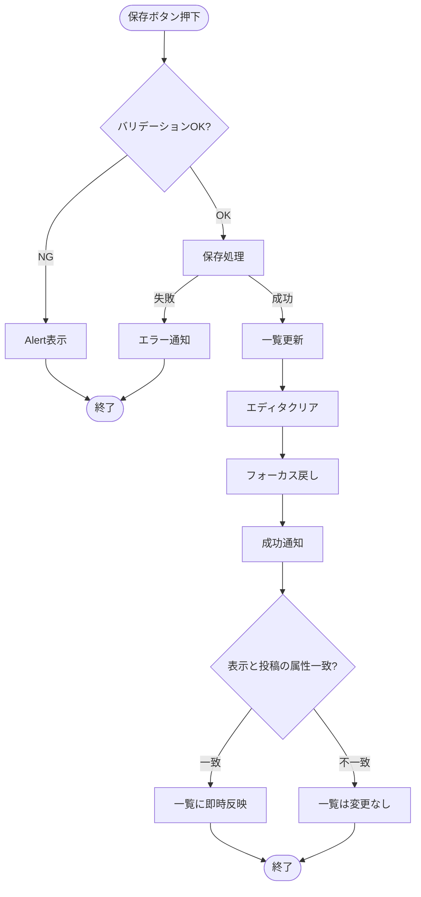

本ファイルは設計書V1（アーカイブ済み）から、投稿エディタ・本文形式・保存/編集フローに関する章を分割したもの。

## この章で決めること

- 投稿本文の保存形式（tiptap JSON を正、memo/noteで分けない）
- `contentText` の派生データ生成（サーバー側生成、抽出ルール）
- 新規/編集/離脱ガードなど、投稿編集体験の実装ルール

## この章の守備範囲

- 投稿の作成/編集体験と、本文データの扱い（`content`/`contentText`）を扱う
- 一覧の取得/キャッシュ/ページングは扱わない（取得章を参照）

## 関連ドキュメント（参照先）

- 取得/キャッシュ（一覧反映）: `docs/03.v2/50_取得-キャッシュ-ページング.md`
- エラー通知（文言は `docs/06...`、扱いはエラー章）: `docs/03.v2/70_エラー-通知.md`

# 投稿エディタ

## UI構成

- テキスト入力フィールド
  - `mode=memo`: 一行テキスト（短文）を入力する input フィールド
  - `mode=note`: リッチテキストエディタ（tiptap）
- 配置（レイアウト）
  - スマートフォン表示: 画面下部に固定（入力しやすさ優先）
  - PC表示: サイドバーに固定
- 拡大/縮小（新規ノートのみ）
  - `mode=note` の新規投稿エディタは「拡大」ボタンでフルスクリーン表示へ切り替えられる
  - `mode=memo` の新規投稿エディタは拡大/縮小しない
- モード
  - URL（searchParams）の `mode` を単一の正として導出し、表示切替 UI で切り替える
  - **投稿作成後はモードを変更できない**
- タグボタン（タグ入力UIの開閉）
  - 詳細は「タグ / お気に入り」を参照
- 保存ボタン
  - 新規投稿時: ラベル「保存」
  - 編集時: ラベル「更新」
- キャンセルボタン（既存投稿の編集時のみ表示）

## エディタ拡大（新規ノート）

新規投稿エディタ（固定）のノート（`mode=note`）は、入力体験のため「拡大/縮小」を提供する。

- 状態
  - 通常: `docked`（スマホ下部固定 / PCサイドバー固定）
  - 拡大: `expanded`（フルスクリーン）
- トリガー
  - 「拡大」押下: `docked` → `expanded`
  - 「戻す（縮小）」押下 / `Esc`: `expanded` → `docked`
- 実装方針
  - エディタは **同一インスタンス** を維持し、DOM の移動/再マウントを行わない（入力・カーソル・Undo 履歴を保つ）
  - `expanded` 時はエディタコンテナに `position: fixed; inset: 0;`（Tailwind: `fixed inset-0`）を適用し、親レイアウトの幅から切り離す
  - `expanded` 時は背景スクロールを禁止する（scroll lock）
- `hasEdits` との関係
  - 拡大/縮小は入力内容を破棄しないため確認は出さない
  - ただし、`hasEdits=true` の状態で URL パラメータ変更やページ離脱が発生する場合は「編集中の離脱ガード」に従う
- 保存
  - 保存成功後は現在の表示状態（`docked`/`expanded`）を維持し、下書きをクリアしてフォーカスを戻す

## エディタフレーム（共通デザイン）

新規ノートの「拡大表示」と既存ノート編集の「モーダル表示」は、同じ見た目・操作感に揃える。

- 共通フレーム（EditorFrame）
  - ヘッダー: タイトル + 右上の「閉じる/戻す」ボタン
  - 本文: tiptap（read-only ではなく編集モード）
  - フッター: 保存/更新、タグ編集などの操作群
- 使い分け
  - 新規ノート（拡大）: 「戻す（縮小）」で `expanded` → `docked`（内容は保持）
  - 既存ノート編集（モーダル）: 「閉じる」でモーダルを閉じる（`hasEdits=true` の場合は確認を出す）

## 投稿本文の保存形式（tiptap JSON を正）

- 投稿本文の正は tiptap（ProseMirror）の doc JSON とする（メモ/ノートで保存形式を分けない）

- メモ（`mode=memo`）
  - UIは input だが、保存時に「最小の doc（paragraph + text）」へ変換して `content` に保存する
  - 1行テキストの制約を担保するため、サーバー側で改行等を正規化する
- ノート（`mode=note`）
  - UIは tiptap エディタ
  - マークダウン“テキスト”は保存しない（必要なら将来エクスポート時に生成する）

### `contentText` の生成・保存

- `contentText` は `content`（tiptap JSON）から導出される **派生データ** とする
- 生成タイミング
  - 投稿の作成/更新の Server Action で、サーバー側で `content` を元に抽出して保存する
  - クライアントから `contentText` を送っても採用しない（必要なら比較してログに残す）
- 抽出ルール（最小）
  - `mode=memo`: 1行に正規化した文字列を `contentText` とする
  - `mode=note`: ProseMirror doc JSON を走査してテキストを連結し、ブロック境界は改行として扱う（前後はトリム）
- 利用箇所
  - 一覧表示の本文プレビューは `contentText` を表示する（`dangerouslySetInnerHTML` しない）
    - `mode=memo`: 全文表示（省略しない）
    - `mode=note`: 最大10行まで表示し、10行を超える場合は「もっと見る / 折りたたむ」で開閉できる（初期は折りたたみ）
      - 「10行」は **表示上の行数**（CSS `line-clamp` 等）で定義する
  - 将来の全文検索は `contentText` を対象とする（初期リリースは未対応）

## 新規投稿

- 初期設定モードをセットする
- 空のエディタを表示する
- エディタをフォーカスする
- UI操作: 保存ボタンを押下
  - アクティブになっているモードを取得する
  - エディタに入力された内容を取得する
  - 取得したデータをデータベースに登録する（`content` を保存し、`contentText` はサーバー側で抽出して一緒に保存する）
  - 投稿一覧に投稿を反映する（表示中の条件に一致する場合）
  - 保存完了後の状態
    - エディタの入力内容をクリアする
    - 再びエディタにフォーカスを当てる
    - 成功通知（トースト）を表示する
  - 本文が未入力（空白のみ含む）の場合は保存を行わず、Alertで未入力であることを通知する（文言は `docs/06.テキスト・コンテンツ定義.md`）

### バリデーション（正規化後）

- 投稿本文・タグのバリデーションは、保存/更新の Server Action を最終判断とする
  - クライアント側の先行チェックは任意（UX向上目的）だが、サーバー側判定が最終
- 投稿本文の判定対象は `contentText`（サーバー側で `content` から抽出・正規化済み）とする
  - 文字数の算出は `contentText.length`（実装で統一）

| 条件 | 代表ステータス | UI | 状態 | 表示文言（正） |
| --- | --- | --- | --- | --- |
| 空（`contentText.trim().length === 0`） | 422 | Alert | 維持 | 「内容を入力してください」 |
| `mode=memo` で 280 文字超 | 422 | Alert | 維持 | 「内容は最大280文字までです」 |
| `mode=note` で 20000 文字超 | 422 | Alert | 維持 | 「内容は最大20000文字までです」 |
| タグ数が 10 件超（正規化・重複排除後） | 422 | Alert | 維持 | 「タグは最大10件まで追加できます」 |

※認可（authorIdの基準）の方針は `docs/03.v2/20_認証-認可-スタブ.md` の「認可（authorIdの基準）」を参照する。

## 新規投稿保存フロー

**ポイント**:
- バリデーション失敗時は Alert、create失敗時はエラー通知（トースト） + 状態維持で再入力しやすくする
- エディタクリア + フォーカス戻しで連続入力を容易にする
- 表示中の mode/view と保存投稿の属性が一致する場合のみ即時反映し、不一致の場合はモード切替時に表示する
- タグ/お気に入り絞り込み中は一覧をキャッシュしない方針のため、差分反映は行わず再取得で整合を取る

## 既存投稿の編集

- 既存投稿のモードをセットする
- 既存投稿の投稿内容をエディタにセットする
- 編集UIの出し方
  - メモ（`mode=memo`）: **インライン編集**（対象投稿カードの表示領域を編集UIに差し替える）
  - ノート（`mode=note`）: **モーダル（またはSheet）内で編集**（EditorFrame のデザインは新規ノートの拡大表示と共通）
    - モーダル表示中は、背景の固定投稿エディタ（新規投稿用）はロックし入力できないようにする（誤操作防止）
- 投稿作成後はモードを変更できない（編集時も固定）
- `hasEdits`（未保存の変更あり）
		- 編集開始時点の内容と比較して、未保存の変更がある状態を `hasEdits=true` とする
		- 対象: 本文 / タグ / お気に入り（編集UIで変更可能なもの）
- UI操作: 更新ボタンを押下
	- 保存処理と同様の流れで更新を実行
	- 成功通知（トースト）を表示する
	- 成功時は編集を終了し `hasEdits=false` に戻す
- UI操作: キャンセルボタンを押下
	- `hasEdits=false` の場合は即キャンセル
	- `hasEdits=true` の場合は離脱確認を表示し、ユーザーが「破棄して続行」を選んだ場合のみキャンセルする
	- キャンセル時は編集状態から通常表示に戻り、新規投稿用エディタを表示する

### 編集中の離脱ガード（確認）

- `hasEdits=true`（新規投稿の未保存入力を含む）のときに以下の操作を行う場合は確認を表示する
		- モード切替 / タグ絞り込み / お気に入り絞り込み / ごみ箱表示切替など、URLパラメータが変わる操作
		- 他の投稿の編集開始
		- ノート編集モーダル（またはSheet）のクローズ操作（× / Esc / 背景クリック）
		- ブラウザの戻る/進む、リロード、タブを閉じる
- 確認の選択肢
	- 「破棄して続行」：編集を破棄して操作を実行する
	- 「編集を続ける」：操作をキャンセルし、編集状態を維持する
		- URLパラメータが変わる操作の場合、URL変更も取り消し（元のURLに戻す）編集状態を維持する

---
