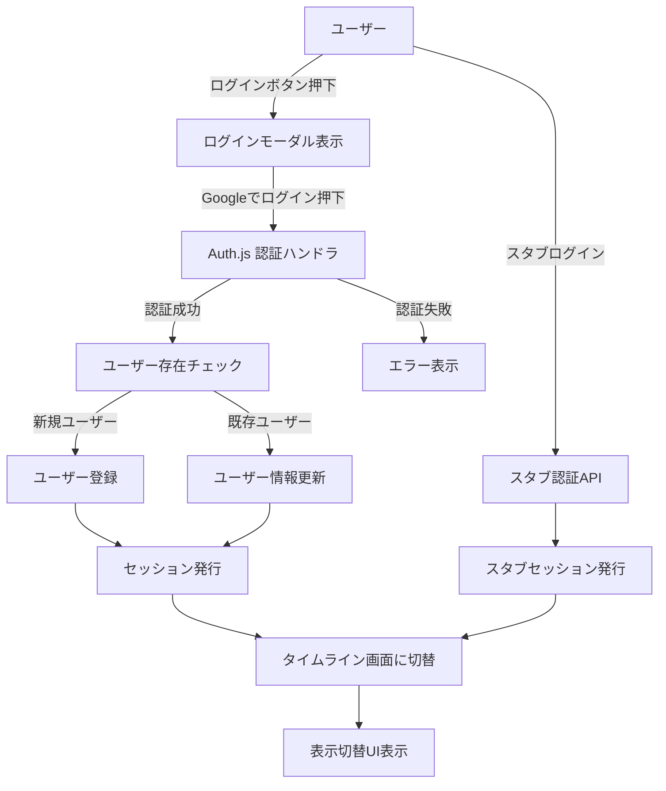
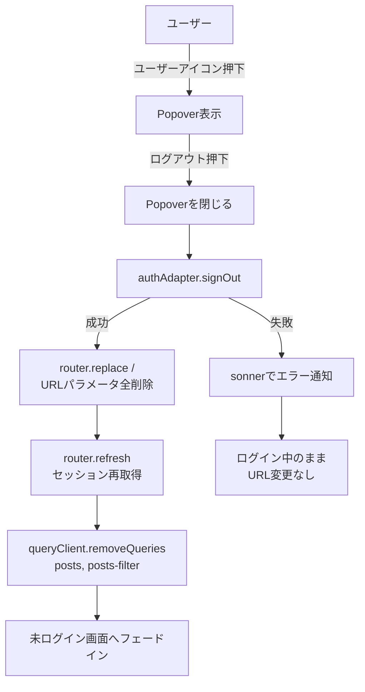
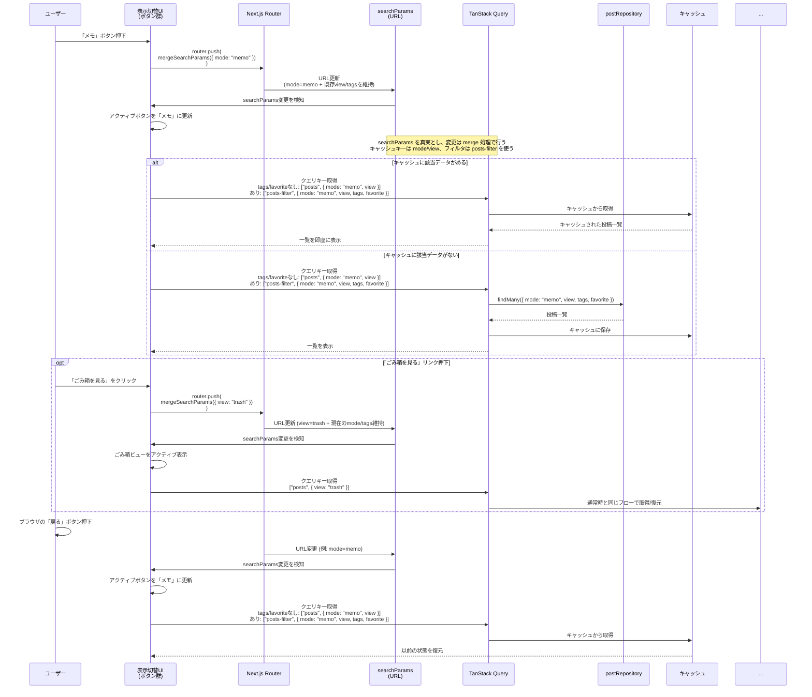
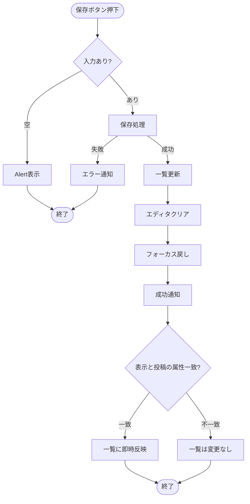

# 開発・テストの方針

- 依存管理およびスクリプト実行には pnpm（Voltaでバージョン固定）を用いる
- テスト駆動開発で実装する
	    - Red → Green → Refactor
- **日常の開発ではスタブ認証・スタブCRUDを用いて** UI／ロジックを素早く検証する
- 単体・結合・E2Eのテストファイルは、それぞれ実行タイミングや依存関係が異なるので**ファイルを分離**して実装する

---

# 開発・テストの流れ

- **フェーズ1: UIを実装する**
	- 結合テストがしやすいように、接合するUIから優先的に実装する
	- 各UIを実装する際は必ずユニットテストを実装する
		- フェーズ1の単体テストはスタブ・モックを使用する
		- 実装可能な結合テストがあれば都度実装する
	- 単体テスト・結合テストは随時実行する
	- UIの実装が終わったらE2Eテストを実装・実行する
- **フェーズ2: 認証ロジック、データベースを介したCRUD処理を実装する**
	- 単体テストはフェーズ1と同様にテストを実装する
	- 結合テスト・E2Eテストはモック・スタブを介さずに本番同等の環境を構築し実行する

---

# システム構成

- アプリ
    - Next.js v15（Turbopackは使わない、install時のオプションはすべてデフォルトにする）
    - Biome
    - tiptap — 投稿エディタのリッチテキスト入力に使用。投稿本文は tiptap の JSON 形式で DB に保存する
    - prisma
    - dayjs — 投稿の作成日・更新日の日時フォーマット表示に使用
    - TanStack Query — 投稿一覧のキャッシュ・再検証・無限スクロールのデータ取得に使用（詳細は「投稿データ取得・キャッシュ戦略（TanStack Query）」を参照）
- デザインシステム
	- storybook（検討中、初期リリース時は導入しない）
- テスト
    - Jest（単体テスト、結合テスト）
    - Playwright（E2Eテスト）
- UI
    - shadcn/ui
    - tailwindcss
- アイコン
	- https://lucide.dev/
- DB
    - 種類とバージョン: PostgreSQL v17
    - ローカル: ローカル用PostgreSQL
    - 検証用: Neon
    - 本番用: Neon
- 認証
	- Auth.js
- ホスティング
	- Vercel

---

# 可用性・運用

- Vercel + Neon によるホスティング
- Neon の自動スナップショットによるバックアップ

---

# 設定
## envファイル構成

| 種類  | ローカル開発     | ローカルテスト   | STG    | PRD    |
| --- | ---------- | --------- | ------ | ------ |
| env | .env.local | .env.test | Vercel | Vercel |

## 環境変数設計

| key                  | stg/prod（Vercel env） | local（.env.local） | 備考                                                              |
| -------------------- | ---------------------- | ------------------- | --------------------------------------------------------------- |
| DATABASE_URL         | Neonのpooling           | ローカルDBのURL      |                                                                 |
| DATABASE_DIRECT_URL  | Neonのpooling無し       | ローカルDBのURL（通常 `DATABASE_URL` と同値でOK） |                                                                 |
| AUTH_SECRET          | 本番用の値              | local用の値           | [公式のコマンドで生成する](https://authjs.dev/guides/environment-variables) |
| GOOGLE_CLIENT_ID     | GoogleCloudから取得     | スタブ（開発中）      |                                                                 |
| GOOGLE_CLIENT_SECRET | GoogleCloudから取得     | スタブ（開発中）      |                                                                 |

---

# カラースキーム

- 未定

---

# UI

## コンポーネントテンプレート(shadcn/ui)

- 本プロジェクトの共通UIは **shadcn/ui をCLIで追加して利用**する（手動実装を避ける）。
- 公式ドキュメント（実装/利用方法）は以下を参照する。
  - button: https://ui.shadcn.com/docs/components/button
  - dialog: https://ui.shadcn.com/docs/components/dialog
  - alert: https://ui.shadcn.com/docs/components/alert
  - alert-dialog: https://ui.shadcn.com/docs/components/alert-dialog
  - popover: https://ui.shadcn.com/docs/components/popover
  - skeleton: https://ui.shadcn.com/docs/components/skeleton（投稿一覧のローディング表示に使用）
  - sonner: https://ui.shadcn.com/docs/components/sonner
  - checkbox: https://ui.shadcn.com/docs/components/checkbox

## ブレイクポイント（Tailwindデフォルト）

- `md`: 768px （本プロジェクトでは Tailwind のデフォルト値を採用）

---

# 基本設計

## SPA（画面状態とURL）

- 本アプリは SPA とし、**画面状態（モード/ごみ箱等）は URL パラメータから一意に決定される（URL を単一の正とする）** 形で設計する
- 主要パラメータ
  - `mode`: 通常一覧の表示モード（`memo|note`）
  - `view`: 画面の表示ビュー（`trash`）
  - `tags`: タグ絞り込み（複数）
  - `favorite`: お気に入り絞り込み
- URL の正規化（canonical化）
  - 不正値/未指定値を許容値へ変換してから URL を確定する（詳細は「URL正規化（canonical化）方針」を参照）
  - 目的: 共有/ブックマーク/戻る・進むで状態復元できること、キャッシュキーの一貫性を保つこと

## SPA（投稿一覧キャッシュの切替）

- モード切替、ごみ箱表示のような「同一画面内の状態切替」では、**取得済みの投稿一覧をキャッシュから即時復元**する
- キャッシュ/再検証は TanStack Query に集約する
  - `mode`/`view` をクエリキーに含め、状態切替時に「キャッシュを切り替えて表示」できるようにする
  - `tags` / `favorite` による絞り込みは **キャッシュせず毎回再取得**する（仕様書「タグ絞り込み/お気に入り絞り込み時は再取得」に合わせる）
  - 詳細は「投稿データ取得・キャッシュ戦略（TanStack Query）」「投稿一覧ページング（無限スクロール）内部設計」「表示切替（URLをSource of Truth）内部フロー」を参照

## 対象ブラウザ

- サポート対象
  - PC: Chrome / Firefox / Safari / Edge の最新版
  - Mobile: iOS Safari / Android Chrome の最新版
- 方針
  - 仕様上必須の機能（ログイン、投稿作成/編集、モード/ごみ箱切替、無限スクロール、トースト通知）が対象環境で一通り動作することを担保する
  - 特定ブラウザ依存の挙動がある場合は、回避策（CSS/JS）を設計として明記し、E2E/手動確認項目に落とす

## スマートフォンのホーム画面追加（PWA / manifest）

- `manifest.json`（または Next.js の Metadata Route により同等の manifest を生成）を実装する
- キー設計
  - `name` / `short_name`: アプリ名（例: Mono Log）
  - `id` / `start_url` / `scope`: SPA の起点（**未ログインでも開ける URL**）。本プロジェクトでは未ログイン時に URL パラメータを全削除する方針のため `/` を起点候補とする（ログイン中は canonical 化により `/?mode=memo` へ寄せる）
  - `display`: `standalone`
  - `theme_color` / `background_color`: スプラッシュ/ブラウザUI色（デザイン確定後に決め打ちし、「カラースキーム」へ採用値を記載する）
  - `icons`: 192/512 に加え `purpose: "maskable"` を含む（Android で重要）
- 初期リリース方針
  - オフライン対応は要件に含めず、Service Worker の導入は将来検討とする（導入する場合は運用/キャッシュ戦略を別途設計する）

## デザイン・レイアウト

- 画面レイアウトは別途資料（Miro）を正とし、スマートフォン相当と PC 画面相当の 2 系統で実装する
- ブレイクポイントは「ブレイクポイント（Tailwindデフォルト）」の `md: 768px` を基準とする

---

# ルーティング / URLスキーム設計

本アプリでは、画面状態（モード/ごみ箱/絞り込み条件）を URL（searchParams）で表現する。

## 対象URL

- `/`（ログイン前/後で同じURLを利用）
  - 未ログイン時: ウェルカム + ログイン導線を表示（URL の searchParams は全削除して `/` に正規化する）
  - ログイン中: 投稿エディタ + 投稿一覧（タイムライン）を表示

## URLスキーム（`/` の searchParams）

| key | 型 | 許容値/形式 | デフォルト | 用途 |
| --- | --- | --- | --- | --- |
| `mode` | string | `memo` \| `note` | `memo` | 通常一覧の表示モード |
| `view` | string? | `trash` | なし | `trash` の場合はごみ箱一覧 |
| `tags` | string[] | `tags=<tagId>` の複数指定 | `[]` | タグ絞り込み（複数選択） |
| `favorite` | boolean | `favorite=1`（truthy のみ有効） | false | お気に入り絞り込み |

補足:
- `tags` は `tags=tagA&tags=tagB` のように **同一キーの複数指定**で表現する（順序は意味を持たない）
- `tags` の複数指定は **OR 条件（いずれかを含む）** とする

## 状態導出（URL → 画面）

- `mode` / `view` / `tags` / `favorite` を URL から導出し、表示・データ取得の条件に反映する
- ごみ箱表示（`view=trash`）時は UI/UX を単純に保つため **タグ/お気に入り絞り込みは無効** とし、`status=trashed` の一覧を表示する（URL上の値は保持）

## URL更新規約（UI → URL）

- ユーザー操作による状態遷移は原則 `router.push()` で URL を更新し、ブラウザの戻る/進むで状態復元できるようにする
- URL 更新は `mergeSearchParams()` で既存パラメータを保持しつつ差分のみ反映する
- 正規化（canonical化）による URL 整形は `replace`/`redirect` 相当で履歴を汚さない（次節参照）

---

# URL正規化（canonical化）方針

トップページ（`/`）では、セッション状態に応じて URL を正規化（canonical化）する。

- 未ログイン時: URL パラメータは **全削除**し、常に `/` に寄せる
- ログイン中: searchParams を正規化（canonical化）し、不正値や未指定値を許容値に変換してから URL に反映する

## 正規化の目的
- URL を常に「正しい形」に保つことで、共有・ブックマーク・戻る/進む操作での状態復元を確実にする
- 不正なクエリパラメータが残らないようにし、キャッシュキーの一貫性を保つ

## 正規化ルール

**`mode` パラメータ**:
- **許容値**: `memo`, `note`
- **意味**:
  - `memo`: 使い捨て前提のメモ
  - `note`: 書いて残すノート
- **未指定時**: `mode=memo` を付与
- **不正値時**: `mode=memo` に正規化
- **常に URL に含める**: `/` ではなく `/?mode=memo` を canonical URL とする

**`view` パラメータ**:
- **許容値**: `trash` のみ
- **不正値時**: パラメータを削除（`view=hoge` → 削除）

**`tags` パラメータ**:
- **形式**: `tags=<tagId>` を複数指定（例: `tags=tagA&tags=tagB`）
- **未指定時**: パラメータなし（`tags=[]` として扱う）
- **空値**: 削除（例: `tags=` → 削除）
- **重複**: 重複排除してから URL に反映する
- **順序**: 意味を持たないため、昇順にソートして URL に反映する（canonical化）

**`favorite` パラメータ**:
- **許容値**: `1`, `true`（truthy のみ有効）
- **無効値時**: パラメータを削除（例: `favorite=hoge` → 削除）
- **false 相当**: パラメータを削除（例: `favorite=0` / `favorite=false` → 削除）
- **true 相当**: `favorite=1` に正規化する

**その他のクエリパラメータ**:
- `errorTest` など、将来追加される可能性のあるパラメータは（ログイン中のみ） **保持**する
- 正規化処理は（ログイン中のみ） `mode` / `view` / `tags` / `favorite` を対象とし、未知のキーはそのまま維持する

## 実装場所

- **正規化関数**: `lib/routing/normalizeHomeSearchParams.ts`
- **適用箇所**: `app/page.tsx`（Server Component）
- **適用条件**:
  - 未ログイン時: searchParams が存在する場合、`next/navigation` の `redirect("/")` で `/` にリダイレクト
  - ログイン中: 正規化前後で差分がある場合、`next/navigation` の `redirect()` で canonical URL にリダイレクト

### 例

※以下はログイン中の例（未ログイン時は query を全削除して `/` に正規化する）

- `/` → `/?mode=memo`（リダイレクト）
- `/?mode=hoge` → `/?mode=memo`（リダイレクト）
- `/?mode=memo` → そのまま（リダイレクトなし）
- `/?view=trash` → `/?mode=memo&view=trash`（`mode` が付与されるためリダイレクト）
- `/?mode=note&tags=tag1` → そのまま（リダイレクトなし、`tags` は保持）
- `/?favorite=1` → `/?mode=memo&favorite=1`（`mode` が付与されるためリダイレクト）
- `/?favorite=true` → `/?mode=memo&favorite=1`（`favorite` を正規化する）
- `/?mode=note&tags=b&tags=a&tags=a` → `/?mode=note&tags=a&tags=b`（`tags` を正規化する）

# ログイン
## 認証とセッション（実装設計）

### 前提

- 認証方式: Auth.js を利用し、Googleを認証プロバイダーとしてシングルサインオンを行う
- セッション方式: JWT ベースとする

### 目的

- サインイン／サインアウト後に、セッション状態に応じた UI（未ログイン／ログイン中）へ確実に切り替わること
- 認証方式（スタブ／Auth.js 本番）を切り替えても、アプリ側の呼び出し点を変えずに実装できること

### 構成要素と責務

- Route Handlers（`app/api/auth/[...nextauth]/route.ts`）
  - Auth.js の認証フロー（サインイン、コールバック処理、セッション発行）を担当する
  - 認証成功時のユーザー存在チェック／User 作成・更新（メールアドレス更新を含む）は Auth.js コールバック内で行う
- 接続ポイント（`authAdapter`）
  - アプリコードが直接 Auth.js / スタブ実装を参照しないための入口
  - 環境変数により「スタブ／本番」を切り替える（ガード条件の詳細は「スタブ認証の運用ガード」に集約）
- セッション参照（サーバー）
  - Server Component / Route Handler から `auth()` を呼び、セッションを取得して UI に渡す
- セッション参照（クライアント）
  - `next-auth/react` の `useSession()` をヘッダー、ログインボタン、ユーザーアイコン等の表示分岐に利用する
  - ログインボタン側に独自の状態チェック処理は持たせず、セッションを単一の情報源として扱う
- CRUD（参考：データ処理方針）
  - Server Actions + TanStack Query で非同期処理を行い、Prisma Repository 経由で DB にアクセスする
  - UI のキャッシュ／再検証は TanStack Query に委譲する

### セッションによる画面出し分け方針

- 判定レイヤーは Server Component（例: `app/page.tsx`）とし、セッション有無で未ログイン／ログイン中の画面を出し分ける
- ミドルウェアでの判定は当面行わず、必要になった段階で検討する

### UI更新（サインイン／サインアウト後）

- サインイン／サインアウト後は、リダイレクトまたは `router.refresh()` 等でセッションを再取得し、UI を更新する
- 更新後は、表示切替 UI を含むログイン後レイアウト（または未ログインレイアウト）が描画される
- サインアウト後は URL パラメータを全削除し `/` に寄せたうえで、未ログイン画面へ **フェードイン**で切り替える（ログアウト専用画面は作らない）

### フェーズ方針（スタブ → Auth.js）

- フェーズ1: `/api/auth/stub` によるスタブセッション（開発専用 Cookie）を利用する
- フェーズ2: Auth.js（Google OAuth）へ差し替える
- スタブを本番・CIで誤って使わないための条件・実装箇所は「スタブ認証の運用ガード」に集約する

## 認証フロー（ログイン: ユーザー操作／状態遷移）

- ログインボタン押下 → ログインモーダル → 「Googleでログイン」押下 → Auth.js による認証フローへ遷移

- 認証失敗やユーザーキャンセル時は `AuthFail` に遷移し、モーダル内でエラーメッセージ表示または閉じて未ログイン画面へ戻る。
- スタブ利用の前提と切り替え条件は「フェーズ方針（スタブ → Auth.js）」および「スタブ認証の運用ガード」を参照する。

## スタブ認証

- フェーズ1では Auth.js の代わりにスタブを実装する。`/api/auth/stub` + HTTP-only Cookie で簡易セッションを保持している。
- HTTP-only Cookie であるためフロントエンドの JS からは読み取れないが、ブラウザの開発者ツール上では値を確認できる。「開発環境のみ」「スタブユーザーしか生成されない」前提で使用する。
- 本番デプロイ時（`NODE_ENV=production`）にスタブが有効化されないよう `USE_STUB_AUTH` + ガードを必須化し、CI では `NODE_ENV=test` でスタブを無効化して Route Handler + Auth.js を呼び出す。
- Auth.js 本番接続が完了したらスタブ Cookie を削除し、Google OAuth → Route Handler → JWT セッションで統一してリスクを根本的に排除する。

## スタブ認証の運用ガード

**実装箇所**:
- 接続ポイント（authAdapter）とスタブ認証の Route Handler で `USE_STUB_AUTH` をチェックし、無効時は 403 を返す

**環境変数**:
- 開発環境: `.env.local` に `USE_STUB_AUTH=true` を設定した場合のみ有効（デフォルト無効）
- CI/テスト環境: `NODE_ENV=test` により自動的に無効化
- 本番環境: `NODE_ENV=production` により自動的に無効化（`USE_STUB_AUTH=true` が設定されていても無効）

**確認手順**:
1. 本番環境（`NODE_ENV=production`）で `/api/auth/stub` にアクセスすると 403 が返ることを確認
2. CI 環境（`NODE_ENV=test`）でスタブ認証が無効化されていることを確認（統合テストで Auth.js を呼び出す）
3. 開発環境でのみスタブ認証が動作することを確認

**注意事項**:
- スタブ Cookie (`stub-session`) は開発環境専用であり、本番環境では使用しない
- スタブユーザーは固定値（`stub-user-1`, `stub@example.com`）のみが生成される
- フェーズ2で Auth.js 本番接続が完了したら、スタブ認証の Route Handler と Cookie を削除する

# ログアウト

- ユーザーアイコンを押下→Popoverが開く
- Popoverの中の「ログアウト」テキストを押下
- クリック直後に Popover を閉じる
- ログアウト処理を実行（接続ポイント `authAdapter` 経由）
	- 成功:
		- URL パラメータを **全削除**し、`router.replace("/")` で `/` に遷移する
		- `router.refresh()` によりセッションを再取得し、未ログイン画面へフェードインで切り替える
		- TanStack Query のユーザー投稿キャッシュを破棄する（キャッシュ対象のキーに限定）
			- `queryClient.removeQueries({ queryKey: ["posts"] })`
			- `queryClient.removeQueries({ queryKey: ["posts-filter"] })`
	- 失敗:
		- `sonner` でエラー通知を表示する（Popover は閉じたまま）
		- URL は変更しない（必要ならリトライ可能）

---

# 表示切り替え
## 表示切り替え 内部フロー

**ポイント**:
- UI状態は searchParams から導出
- TanStack Query のキャッシュにより、ブラウザの戻る/進む時ボタンを押下したときに前回の投稿一覧とスクロール位置を復元する
- クエリ変更は mergeSearchParams で既存の view/tags などを保持したまま差し替える
- 「ごみ箱を見る」リンクは searchParams ベースで分岐し、キャッシュを切り替えて復元する
- タグ/お気に入り絞り込みは searchParams ベースで分岐するが、キャッシュは使わず毎回再取得する（仕様書に合わせる）

---

# 投稿エディタ

## UI構成

- テキスト入力フィールド
  - `mode=memo`: 一行テキスト（短文）を入力する input フィールド
  - `mode=note`: リッチテキストエディタ（tiptap）
- モード
  - URL（searchParams）の `mode` を単一の正として導出し、表示切替 UI で切り替える
  - **投稿作成後はモードを変更できない**
- タグボタン（タグ入力UIの開閉）
  - 詳細は「タグ / お気に入り」を参照
- 保存ボタン
  - 新規投稿時: ラベル「保存」
  - 編集時: ラベル「更新」
- キャンセルボタン（既存投稿の編集時のみ表示）

## 投稿本文の保存形式（tiptap JSON を正）

- 投稿本文の正は tiptap（ProseMirror）の doc JSON とする（メモ/ノートで保存形式を分けない）

- メモ（`mode=memo`）
  - UIは input だが、保存時に「最小の doc（paragraph + text）」へ変換して `content` に保存する
  - 1行テキストの制約を担保するため、サーバー側で改行等を正規化する
- ノート（`mode=note`）
  - UIは tiptap エディタ
  - マークダウン“テキスト”は保存しない（必要なら将来エクスポート時に生成する）

### `contentText` の生成・保存

- `contentText` は `content`（tiptap JSON）から導出される **派生データ** とする
- 生成タイミング
  - 投稿の作成/更新の Server Action で、サーバー側で `content` を元に抽出して保存する
  - クライアントから `contentText` を送っても採用しない（必要なら比較してログに残す）
- 抽出ルール（最小）
  - `mode=memo`: 1行に正規化した文字列を `contentText` とする
  - `mode=note`: ProseMirror doc JSON を走査してテキストを連結し、ブロック境界は改行として扱う（前後はトリム）
- 利用箇所
  - 一覧表示の本文プレビューは `contentText` を表示する（`dangerouslySetInnerHTML` しない）
  - 将来の全文検索は `contentText` を対象とする（初期リリースは未対応）

## 新規投稿

- 初期設定モードをセットする
- 空のエディタを表示する
- エディタをフォーカスする
- UI操作: 保存ボタンを押下
  - アクティブになっているモードを取得する
  - エディタに入力された内容を取得する
  - 取得したデータをデータベースに登録する（`content` を保存し、`contentText` はサーバー側で抽出して一緒に保存する）
  - 投稿一覧に投稿を反映する（表示中の条件に一致する場合）
  - 保存完了後の状態
    - エディタの入力内容をクリアする
    - 再びエディタにフォーカスを当てる
    - 成功通知（トースト）を表示する
  - エディタが空の場合は保存を行わず、Alertで未入力であることを通知する（文言は `docs/06.テキスト・コンテンツ定義.md`）

## 新規投稿保存フロー

**ポイント**:
- バリデーション失敗時は Alert、create失敗時はエラー通知（トースト） + 状態維持で再入力しやすくする
- エディタクリア + フォーカス戻しで連続入力を容易にする
- 表示中の mode/view と保存投稿の属性が一致する場合のみ即時反映し、不一致の場合はモード切替時に表示する
- タグ/お気に入り絞り込み中は一覧をキャッシュしない方針のため、差分反映は行わず再取得で整合を取る

## 既存投稿の編集

- 既存投稿のモードをセットする
- 既存投稿の投稿内容をエディタにセットする
- 投稿作成後はモードを変更できない（編集時も固定）
- UI操作: 更新ボタンを押下
	- 保存処理と同様の流れで更新を実行
	- 成功通知（トースト）を表示する
- UI操作: キャンセルボタンを押下
	- 編集状態から通常表示に戻る
	- 新規投稿用エディタを表示する

---

# タグ / お気に入り

本アプリでは、投稿に「タグ」と「お気に入り」を付与でき、投稿一覧ではそれらで絞り込みできる。

## 画面状態（URL）

- 投稿一覧の絞り込み状態は URL に反映する
  - タグ: `tags=<tagId>`（複数指定）
  - お気に入り: `favorite=1`
- URL スキーム/正規化の詳細は「ルーティング / URLスキーム設計」「URL正規化（canonical化）方針」に従う
- `view=trash` ではタグ/お気に入り絞り込み UI を無効化し、一覧は `status=trashed` を表示する（URL上の値は保持）

## 投稿エディタ：タグ付け

- タグボタン押下でタグ入力 UI（アコーディオン）を開閉する
- タグクラウド（既存タグ一覧）
  - ボタン押下で編集対象の投稿にタグを追加/除去する（投稿は複数タグを持てる）
- タグ入力（新規/既存）
  - 入力中に既存タグをサジェストし、選択でタグを追加する
  - 追加したタグはチップとして表示し、チップ押下で除去できる
  - 新規タグは保存/更新時に作成し、完了後にタグクラウドへ反映される

## 投稿一覧：絞り込み

- タグクラウド
  - 押下で `tags` を URL に反映し、選択されたタグを含む投稿のみを表示する
  - アクティブにできるタグは複数（タグ押下で追加、アクティブなタグ押下で解除）
  - 選択タグが 0 件になった場合、タグ絞り込みは解除される
- お気に入りトグル
  - ON で `favorite=1` を URL に付与し、OFF で削除する

## データ取得/キャッシュ

- `tags` / `favorite` による絞り込みは **キャッシュせず毎回再取得**する（仕様書方針）
- 取得 I/F は `postRepository.findMany({ mode, status, tags, favorite, limit, orderBy, cursor })`
- タグ/お気に入りの更新が発生した場合も、絞り込み中は差分更新を行わず再取得で整合を取る

## データモデル

- DB スキーマは「データモデル設計（DB）」の `Tag` / `PostTag` を参照する

---

# 投稿一覧

## 入力（Source）
- 画面状態は URL パラメータから導出する
- `mode`: `memo | note`（未指定/不正値は `memo` に正規化）
- `tags`: `string[]`（URL の `tags` を `getAll()` して導出、未指定は `[]`）
- `favorite`: boolean（URL の `favorite` が truthy の場合のみ true、未指定は false）
- `limit`: 10（初期表示件数、固定）

## 表示ルール
- 一覧は1カラム（縦1列）で `createdAt` 降順に表示する
- 同一 `createdAt` の安定ソートのため、第二キーとして `postId` 降順を併用する

## 投稿データ取得・キャッシュ戦略（TanStack Query）

- 取得条件
	- `status=active` かつ `mode=<URLのmode>`（通常ビュー）
- 取得I/F
	- `postRepository.findMany({ mode, status: "active", tags, favorite, limit, orderBy: [{ createdAt: "desc" }, { postId: "desc" }], cursor })`

## クエリキー設計

  - **キャッシュ対象** 
	- 表示モード（`mode=memo|note`）とビュー（通常／`view=trash`）
		- 通常一覧（キャッシュする）: `["posts", { view: "normal", mode }]`
	    - ごみ箱一覧（キャッシュする）: `["posts", { view: "trash" }]`（※mode はデータ取得条件に使わない前提なら持たなくて OK）
  - **非キャッシュ（毎回再取得）**
	- タグ絞り込み / お気に入り絞り込み（仕様書に合わせる）
	- 絞り込み（キャッシュしない）: `["posts-filter", { view, mode, tags, favorite }]`（`gcTime: 0` などで即破棄）
    - `gcTime: 0`（即時破棄）+ `staleTime: 0`（常に stale）で「復元用キャッシュ」としては保持しない

## キャッシュ方針   

  - キャッシュ対象（mode/view）について、各クエリキーごとに取得した投稿一覧をキャッシュし、表示切替・ごみ箱表示時に状態を即時復元できるようにする
  - キャッシュ構造は `["posts", { view: "normal", mode }]` または `["posts", { view: "trash" }]` キー配下に `pages: PostDTO[][]` を持ち、UI 側は `pages.flat()` で描画する
  - TanStack Query のキャッシュキーは `cursor` を含めない（ページングは `getNextPageParam` のみが持つ）ため、モードやビューを変更した場合でもページング状態を安全に切り替えられる
  - 追加フェッチ後は `queryClient.setQueryData` でページ配列を更新し、`invalidateQueries` は削除や復元などデータ破壊的操作時のみ行う
  - 投稿作成／更新後は、表示中の `mode` / `view` と投稿の属性が一致する場合のみ、該当クエリキーを `setQueryData` で差分更新して即時反映する
  - タグ/お気に入り絞り込み中は「毎回再取得」方針のため、差分更新は行わず再取得で整合を取る
  - `view=trash` 表示中は、通常一覧のキーには影響を与えず、該当キー（例: `["posts", { view: "trash" }]`）のみを更新する
  - 投稿をごみ箱に移動／復元した場合は、`postRepository` で `status` を更新（`status=trashed` または `status=active`）したうえで、TanStack Query の既存キャッシュ（`InfiniteData<FindManyResult>`）から対象投稿を差分更新する（`setQueryData` を使用）
  - クエリ無効化（`invalidateQueries`）による全再取得は行わず、スクロール済みページ数を保持したまま UI と整合を取る

## 投稿の自動取得（無限スクロール）

- 投稿一覧が表示されているページをスクロールし最下部に到達したとき、次の `limit` 件を自動的に取得開始する
- 取得を待っている間は Skeleton UI を表示する

## 投稿一覧ページング（カーソル方式）内部設計

### トリガー（IntersectionObserver）

- 一覧末尾に sentinel 要素を置き、表示領域に入ったら `fetchNextPage()` を実行する
- `isFetchingNextPage` / `hasNextPage` を見て多重実行を防止する

### ページング（TanStack Query）

- `useInfiniteQuery` を利用し、`pageParam` は `cursor`（投稿ID文字列）で扱う
  - 初回は `cursor=undefined` で `limit` 件を取得する
  - `getNextPageParam` は最終要素の ID を返し、次ページが無い場合は `undefined` を返す

### ローディング表示（Skeleton）

- 初回ロード/追加ロードのいずれも Skeleton を表示し、ユーザーに「取得中」を明示する
- Skeleton の表示件数は常に 1 ページ分（`limit` 件）とする

### エラーと再試行

- 追加ロードに失敗した場合はエラー通知を表示し、再試行できる導線を提供する（状態維持）

## UI責務と更新

- `ModeSwitch` はクリックで `router.push(mergeSearchParams({ mode }))` を行い URL を更新する（stateは持たない）
- `TagFilter` / `FavoriteFilter` は検索条件を URL に反映し、再取得をトリガーする（キャッシュは保持しない）
- `PostList` は `mode` / `tags` / `favorite` 変更を検知して再取得し、ローディング/エラーは共通コンポーネントで表示する

---

# ごみ箱

## ごみ箱の基本設計

- ごみ箱には status: trashed の値を持つ投稿を表示する
- ごみ箱表示画面では、通常の投稿一覧と同じレイアウトの一覧コンポーネントを利用する
- ごみ箱内一覧を表示していても、通常の投稿一覧のキャッシュ状態は保持する（元の一覧画面に戻ったときに状態を復元できる）

## ごみ箱内の各投稿の要素

- ごみ箱内の各投稿の要素
    - 選択用チェックボックス
        - チェック状態に応じてラベルを「n件選択中」に更新する
    - 復元ボタン
        - 押下で status を active に変更し、ごみ箱一覧からは非表示にする
    - 削除ボタン
        - 押下でその投稿を完全削除し、「投稿を削除しました」トーストを表示する

## ごみ箱一覧上部のインターフェース

- ごみ箱一覧の上部に以下のインターフェースを配置する
    - 「表示されている投稿を選択」チェックボックス
        - チェックを入れると、現在表示されている投稿すべてにチェックを付ける
        - チェック状態ではラベルを「n件選択中」のように切り替える
        - チェック状態のときのみ「選択した投稿を削除」ボタンを表示する
    - 「選択した投稿を削除」ボタン
        - 押下で削除確認モーダルを開く
        - モーダルで「n件の投稿を完全に削除しますか?」とメッセージを表示する
    - 「ごみ箱を空にする」ボタン
        - 押下で削除確認モーダルを開く
        - モーダルで「ごみ箱内のすべての投稿を完全に削除しますか？」とメッセージを表示する
        - 対象はロード済み／未ロードを問わず、status が trashed の投稿すべてとする
- 削除確認モーダル
    - 確認メッセージ（例：n件の投稿を完全に削除しますか?）
    - 警告メッセージ（この操作は取り消せません）
    - キャンセルボタン：モーダルを閉じる
- 削除ボタン：対象の投稿を完全に削除し、「投稿を削除しました」トーストを表示する

---

# エラー通知実装設計

## エラー種別

各機能実行時には適切なエラーハンドリングを行い、必要に応じてユーザーにフィードバックする。

- 認証エラー：ログインが必要な操作で未認証の場合
- 認可エラー：権限のない操作を試みた場合
- Not Found エラー：対象のリソースが存在しない場合
- バリデーションエラー：入力値が不正な場合
- サーバーエラー：サーバー側で予期せぬエラーが発生した場合
- 一般的なエラー：上記に分類されないエラー
- 成功メッセージ：操作が正常に完了した場合

エラーや成功メッセージはsonnerで表示し、ユーザーが現在の状態を理解できるようにする。

## 開発環境用エラーシミュレーション

- 開発環境のみ有効なエラー通知シミュレーション機能を実装する
- 実装方針
  - クエリパラメータ `errorTest` を監視し、値に応じて対応するsonner通知を表示する
    - `http://localhost:3000/?errorTest=auth` → 認証エラー
    - `http://localhost:3000/?errorTest=authorization` → 認可エラー
    - `http://localhost:3000/?errorTest=notfound` → Not Found エラー
    - `http://localhost:3000/?errorTest=validation` → バリデーションエラー
    - `http://localhost:3000/?errorTest=server` → サーバーエラー
    - `http://localhost:3000/?errorTest=generic` → 一般的なエラー
    - `http://localhost:3000/?errorTest=success` → 成功メッセージ
  - sonner通知表示後、`errorTest` クエリパラメータを URL から削除し、リロードしても再発火しないようにする
  - `process.env.NODE_ENV === "production"` の場合、この機能は無効化する
- 実装場所
  - クライアントコンポーネントまたは `useEffect` 相当のカスタムフックで URL を監視し、sonner通知表示とパラメータ削除を行う

# データモデル設計（DB）

## User テーブル

- `id`: ユーザーの主キー（String）
- `posts`: ユーザーが作成した Post との 1 対多リレーション
- `createdAt`: 作成日時（自動付与）
- `updatedAt`: 更新日時（変更時に自動更新）

> 補足: Google OAuth 接続では `googleSub` / `email` / `name` 等のユーザー識別・表示に必要な属性を追加する。文字サイズ（`fontScale`）などのユーザー設定も、必要になった段階でテーブルに追加する。

## Post テーブル

- `postId`: 投稿の主キー（String、`cuid()`）
- `authorId`: 投稿者の `User.id` への外部キー
- `author`: User へのリレーション
- `content`: 投稿本文（tiptap / ProseMirror の doc JSON。PostgreSQL `jsonb`、Prisma では `Json` を想定）
- `contentText`: 投稿本文の抽出テキスト（一覧プレビュー/将来の全文検索用）
- `status`: 投稿の状態
  - `active`: 通常の投稿
  - `trashed`: ごみ箱に入っている状態
- `mode`: 投稿の種類（`memo` / `note`）。一覧の絞り込みに使用
- `favorite`: お気に入りフラグ（boolean、default false）
- `createdAt`: 作成日時（自動付与）
- `updatedAt`: 更新日時（変更時に自動更新）
- `trashedAt`: ごみ箱移動日時（ソフト削除の指標。復元で `null` に戻す）

### インデックス設計（投稿一覧のみ）

投稿一覧（通常/ごみ箱）の追加取得を安定して高速化するため、**Post テーブルに限って**必要最小限のインデックスを設計する。

**対象となる取得パターン（例）**:
- 通常一覧: `authorId` + `status=active` + `mode` で絞り込み、`createdAt DESC, postId DESC` で並び替え、`limit` 件ずつ追加取得（cursor）
- ごみ箱一覧: `authorId` + `status=trashed` で絞り込み、同様に追加取得（cursor）

**インデックス（投稿一覧のみ / 最小）**:
- 通常一覧（`status=active` + `mode` 絞り込み）向け
  - `Post(authorId, status, mode, createdAt, postId)`（並び順は `createdAt DESC, postId DESC` を想定）
  - 投稿一覧の「絞り込み + 並び替え + cursor」に対応する
- ごみ箱一覧（`status=trashed`、mode で絞らない）向け
  - `Post(authorId, status, createdAt, postId)`（並び順は `createdAt DESC, postId DESC` を想定）
  - `status` + `createdAt` の並びで追加取得できるようにする

**補足**:
- ごみ箱一覧を `trashedAt DESC` で並べたい場合は、`Post(authorId, status, trashedAt, postId)` の追加を検討する
- タグ/お気に入り絞り込み（Join/追加条件が増えるケース）のインデックスは、本設計では対象外とし、導入フェーズで計測してから設計する
- タグ/お気に入り絞り込み（Join/追加条件が増えるケース）のインデックスは、本設計では対象外とし、実導入後に計測してから設計する

## Tag テーブル

- `tagId`: タグの主キー（String想定）
- `ownerId`: `User.id` への外部キー。ユーザーごとのカスタムタグを管理する
- `label`: タグ名（ユニーク制約は `ownerId` + `label` の組み合わせに付与）
- `createdAt` / `updatedAt`

## PostTag テーブル（中間）

- `postId`: Post への外部キー
- `tagId`: Tag への外部キー
- `sortOrder`: タグ表示順を将来的に制御するための数値（デフォルト 0）
- 複合ユニーク制約: (`postId`, `tagId`)

> 備考: Tag/PostTag が未導入の期間でも、UI/呼び出し点を揃えたい場合は接続ポイント（`postRepository` 等）側で差分を吸収する。

# 品質

## 非同期処理の多重実行防止設計

- 対象となる操作
  - 投稿の削除
  - 投稿のごみ箱投入
  - ごみ箱からの復元
  - ごみ箱を空にする／選択した投稿を削除する
- 方針
  - TanStack Query の Mutation の状態（`isPending` など）を利用し、実行中は該当ボタンを `disabled` にする
  - 連打による二重実行を防ぐため、同一対象に対する同一操作は、前のリクエスト完了を待ってから次を受け付ける

## 非機能要件 / パフォーマンス・チューニング

- 現時点では詳細未定（ToDo）
- 無限スクロールやキャッシュ戦略により、タイムラインの体感速度をできるだけ維持することを目標とする

# セキュリティ
## セキュリティ対策

- XSS 対策
  - 入力値はサーバー側・クライアント側で適切にエスケープする
  - 投稿本文は tiptap JSON を正として保存し、表示は tiptap の read-only レンダリング（`editable: false`）で行う（`dangerouslySetInnerHTML` は使わない）
  - リンク（`href`）は許可プロトコル（例: `https:`, `http:`, `mailto:`）のみ許可し、それ以外（例: `javascript:`）は保存時に除去する
- SQL インジェクション対策
  - Prisma ORM を利用し、生の SQL を極力書かない
- その他
  - 認証・認可エラー時の情報漏洩を避けるため、詳細な内部情報をユーザーに表示しない

# テスト
## テスト戦略（Jest, モック, スタブ）

- 方針: テスト基盤は Jest + React Testing Library を採用し、TDD（Red→Green→Refactor）で品質を担保する（具体的なタスク・完了条件は `docs/04.作業計画書.md` に集約する）。
- 方針: 統合テスト／E2E が必要になった段階で Playwright 等を採用し、フェーズ別のテスト範囲と完了条件をチェックリストに反映する。

- 環境ごとの方針
  - 開発環境ではスタブ／モックを中心に UI／ロジックを Red → Green で回す（単体テストは DB なし）。
  - CI（`NODE_ENV=test`）ではスタブを無効化し、テスト用 PostgreSQL を用いた結合テストまで実行して最終確認する。
  - E2E はステージング（検証用 Neon）で実施し、prod は対象外とする。

### テストレベル別のDB/スタブ方針

| テストレベル | 主な目的 | DB | スタブ/モック |
| --- | --- | --- | --- |
| 単体（Jest/RTL） | UI/ロジックの分岐を速く担保 | 原則使わない | `auth()`/`useSession()` や接続ポイント（`authAdapter` / `postRepository`）をモック/スタブ |
| 結合（Jestで実施可） | Server Actions + Prisma + DB の接続保証 | テスト用 PostgreSQL（local/CI） | スタブは無効（外部OAuthは実呼び出ししない方針） |
| E2E（Playwright想定） | 本番同等導線の回帰 | 検証用 Neon（stg、prod と分離） | スタブは無効（Auth.js はテスト用アカウント等で運用） |

- 認証
  - サーバー側: `jest.mock("@/auth", () => ({ auth: jest.fn() }))` で `auth()` をモックし、未ログイン／ログイン時の分岐をテストする
  - クライアント側（必要に応じて）: `next-auth/react` の `useSession` などをモックし、UI 分岐をテストする
- DB
  - 結合テストではテスト用 PostgreSQL を用い、`DATABASE_URL` をテストDB向けに設定する（DB名やURL例は `docs/05.開発環境構築.md` を参照）
  - 各テストで `deleteMany()` 等によりデータを初期化することで、Server Actions の CRUD を外部 API なしで検証可能にする
- UI
  - React Testing Library を用いて、エディタ・一覧・フォーカス／キャンセルなどの振る舞いを DOM レベルで検証する
- 外観（テーマ）
  - `next-themes` を利用するコンポーネントは `next-themes` を jest mock し、`setTheme` 呼び出し（`system` / `light` / `dark`）をユニットテストで担保する
  - `sonner` の Toaster は `ThemeProvider` 配下でレンダリングされること（構造の回帰）をスモークで担保する
- ネットワーク
  - テストでは外部 HTTP 呼び出し（特に Google OAuth）を実際には発生させない

## 単体テスト（例・ToDo 含む）

- エディタ
  - 保存
    - 正常:
      - 保存ボタン押下で接続ポイント（`postRepository`）が呼び出される（DB保存の成立は結合テストで担保）
    - 準正常:
      - 保存時に JS コードがエスケープされる
    - 異常:
      - 保存上限文字数を超える入力時にエラーとなる（DB 設定依存のため要調査）
      - 未入力の場合にアラートが表示される
  - 読み取り
  - 更新
  - 削除
- ログイン
  - 未ログイン／ログイン済みでの画面分岐
- データベース接続
  - `postRepository` がエラーを返した場合のハンドリング（エラー表示/トースト等）

## 結合テスト（例・ToDo 含む）

- 投稿表示
  - 認証＋Server Actions＋DB＋UIを通した一連の表示を確認する
- ログイン
- ログアウト

## E2Eテスト

- Playwrightを使用した自動テストを行う予定（詳細はまだ未定）
- Skeletonの表示・非表示によるレイアウトシフトの発生をテストする予定
- 外観（テーマ）切替の確認（実施する場合）
  - UI操作で `system` / `light` / `dark` が切り替わり、`html`（または `body`）の `dark` クラス反映が変わる
  - リロード後も選択が維持される（永続化）

# スタブ
## スタブ／本番切り替え方針

- CRUD 処理およびログイン処理は、
		- 開発環境: スタブ／モックを利用して UI・ロジックを先行実装する
		- 本番環境: Prisma / Auth.js への本番実装のみを呼び出す
	という形で環境ごとに明確に分離する。

- スタブと本番実装の切り替えは環境変数で行い、アプリコードからは接続ポイント（authAdapter / postRepository）を経由してのみアクセスする。

## スタブ／モック設計

- 開発環境と本番環境の切り替え
	- 開発環境ではスタブとモックで製造する。
	- 本番環境にデプロイする際は強制的にスタブとモックを排除する設計とする
	    - **ToDo:** 実装内容の詳細は別途検討する

## 環境とスタブ／本番実装の使い分け

- 開発環境（ローカル）
  - UI・ロジックはスタブ認証／スタブCRUD経由で実装・検証する。
  - Server Actions や Prisma の CRUD は、テスト用 PostgreSQL（ローカル）に対して結合テストや API レベルのテストから本物実装を呼び出して確認する。
- テスト環境（CI / `NODE_ENV=test`）
  - スタブは無効化し、本物の Auth.js + テスト用 DB を利用する。
  - 「認証＋Server Actions＋DB＋UI」がつながる結合テストをここで実行する。
- ステージング環境（任意）
  - 本番と同様の構成（Vercel + Neon + Auth.js）を用意し、E2Eテストでブラウザ操作ベースの確認を行う。
- 本番環境
  - 常に本物の Auth.js + Neon DB のみを利用し、スタブは無効化する。

### DBマイグレーション運用フロー（開発→本番）

目的: Prisma schema（DB構造）の変更を、開発環境から本番環境まで **安全に・再現可能に**反映する。

- 開発（ローカル）
	- 1) 機能追加に伴い Prisma schema を更新する
	- 2) ローカルDBに対してマイグレーションを **作成・適用**する（例: `prisma migrate dev`）
	- 3) 生成されたマイグレーション（`prisma/migrations`）をコミットする
- 本番反映（リリース）
	- 1) main へ反映（マージ）する
	- 2) GitHub Actions が、本番DBに対してマイグレーションを **適用のみ**行う（`prisma migrate deploy`）
	- 3) マイグレーション適用後に Vercel Deploy Hook を実行し、アプリをデプロイする

- 禁止/注意
	- 本番DBに対して `prisma migrate dev`（マイグレーションの作成）は実行しない（本番では **deploy（適用）**のみ）
	- `DATABASE_URL`（アプリ実行・pool）と `DATABASE_DIRECT_URL`（migrate用）の役割を混同しない
	- Secrets の登録先は方針に従い分離する（local: `.env.local`、CI: GitHub Secrets、stg/prod: Vercel Environment Variables）

- ログ/モニタリング（最小）
	- Vercel のログ
	- 追加する場合: Sentry/Logflare 等（未決）

### 投稿APIの暫定ガード（Auth.js 未実装期間）

- **目的**: 認可未実装の状態で誤って本番/Previewにデプロイしても投稿APIを動かさない
- **方針**: `NODE_ENV=production` では `/api/posts/**` を強制的に 403 にする（Vercel Preview も含む）
- **解除条件**: Auth.js 本番接続（P2-AUTH-01）でセッション由来の authorId + 認可チェックを実装後、このガードを撤去し「リクエストauthorIdをセッションと照合する」実装に置き換える
- **注意**: Auth.js 未実装のため現状は authorId をリクエストから受け取っているが、開発中限定の暫定措置であり、本番公開は不可
- キャッシュ/パフォーマンス
	- クライアント: TanStack Query でキャッシュ・再検証
	- サーバー側キャッシュは特に設けず、CDN は静的アセットのみ

- バックアップ/リストア
		- Neon の自動スナップショットを利用（詳細は Neon 設定に従う）
