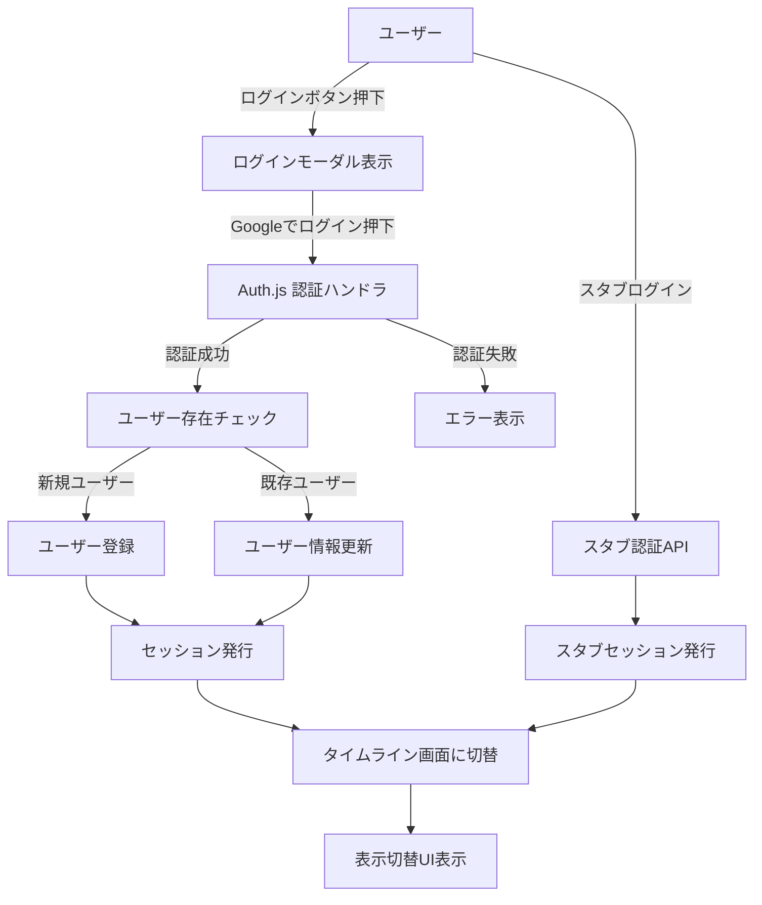
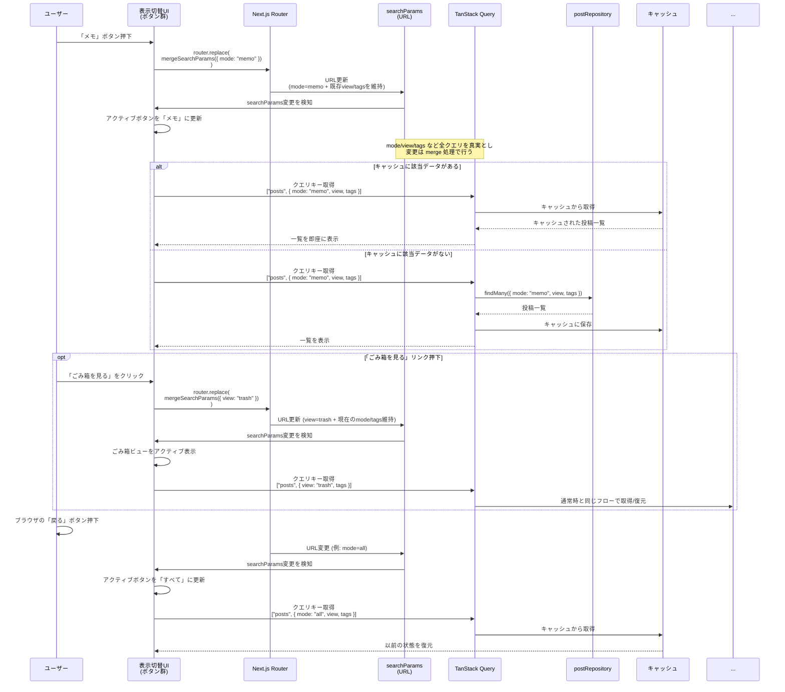

# 機能別設計（仕様書と対）

`docs/02.仕様書.md` の機能セクションから参照すべき設計章を、機能ごとにまとめる（本書の本文は横断設計が中心）。

## 目次

- 認証
- 投稿（作成・編集）
- 投稿一覧（無限スクロール）
- 表示切り替え（モード/ごみ箱）
- ごみ箱
- エラーハンドリング

## 認証

- 参照: 「認証・データ処理アーキテクチャ概要」「認証フロー設計」「セッション取得とUI更新方針」

## 投稿（作成・編集）

- 参照: 「データモデル設計（DB）」の Post、保存/更新時のキャッシュ更新は「投稿一覧取得・キャッシュ戦略（TanStack Query）」

## 投稿一覧（無限スクロール）

- 参照: 「投稿一覧取得・キャッシュ戦略（TanStack Query）」「投稿一覧ページング（無限スクロール）内部設計」

## 表示切り替え（モード/ごみ箱）

- 参照: 「URL正規化（canonical化）方針」「表示切替（URLをSource of Truth）内部フロー」

## ごみ箱

- 参照: 「表示切替（URLをSource of Truth）内部フロー」（`view=trash`）、「投稿一覧取得・キャッシュ戦略（TanStack Query）」（`status` 更新と差分反映）

## エラーハンドリング

- 参照: 「エラー通知実装設計」

# 全体方針

## 開発プロセス／開発方針

- 依存管理およびスクリプト実行には pnpm（Voltaでバージョン固定）を用いる
- テスト駆動開発で実装する
	    - Red → Green → Refactor

## スタブ／本番切り替え方針

- CRUD 処理およびログイン処理は、
		- 開発環境: スタブ／モックを利用して UI・ロジックを先行実装する
		- 本番環境: Prisma / Auth.js への本番実装のみを呼び出す
	という形で環境ごとに明確に分離する。

- スタブと本番実装の切り替えは環境変数で行い、アプリコードからは接続ポイント（authAdapter / postRepository）を経由してのみアクセスする。

## スタブ／モック設計

- 開発環境と本番環境の切り替え
	- 開発環境ではスタブとモックで製造する。
	- 本番環境にデプロイする際は強制的にスタブとモックを排除する設計とする
	    - **ToDo:** 実装内容の詳細は別途検討する

## 環境とスタブ／本番実装の使い分け

- 開発環境（ローカル）
  - UI・ロジックはスタブ認証／スタブCRUD経由で実装・検証する。
  - Server Actions や Prisma の CRUD は、テスト用 PostgreSQL（ローカル）に対して結合テストや API レベルのテストから本物実装を呼び出して確認する。
- テスト環境（CI / `NODE_ENV=test`）
  - スタブは無効化し、本物の Auth.js + テスト用 DB を利用する。
  - 「認証＋Server Actions＋DB＋UI」がつながる結合テストをここで実行する。
- ステージング環境（任意）
  - 本番と同様の構成（Vercel + Neon + Auth.js）を用意し、E2Eテストでブラウザ操作ベースの確認を行う。
- 本番環境
  - 常に本物の Auth.js + Neon DB のみを利用し、スタブは無効化する。

# システム構成

## 採用技術・構成技術

- アプリ
    - Next.js v15（Turbopackは使わない、install時のオプションはすべてデフォルトにする）
    - Biome
    - tiptap — 投稿エディタのリッチテキスト入力に使用。投稿本文は tiptap の JSON 形式で DB に保存する
    - prisma
    - dayjs — 投稿の作成日・更新日の日時フォーマット表示に使用
    - TanStack Query — 投稿一覧のキャッシュ・再検証・無限スクロールのデータ取得に使用（詳細は「投稿一覧取得・キャッシュ戦略」を参照）
- デザインシステム
	- storybook（将来的に導入）
- テスト
    - Jest
- UI
    - shadcn/ui
    - tailwindcss
    - next-themes — 外観（テーマ）切替に使用（詳細は「外観（テーマ）設計」を参照）
- アイコン
	- https://lucide.dev/
- DB
    - DBの種類とバージョン: PostgreSQL v17
    - ローカル: ローカル用PostgreSQL
    - 検証用: Neon
    - 本番用: Neon
- 認証
	- Auth.js

## UI実装ガイド

### UI(shadcn/ui)

- 本プロジェクトの共通UIは **shadcn/ui をCLIで追加して利用**する（手動実装を避ける）。
- 公式ドキュメント（実装/利用方法）は以下を参照する。
  - button: https://ui.shadcn.com/docs/components/button
  - dialog: https://ui.shadcn.com/docs/components/dialog
  - alert: https://ui.shadcn.com/docs/components/alert
  - alert-dialog: https://ui.shadcn.com/docs/components/alert-dialog
  - popover: https://ui.shadcn.com/docs/components/popover
  - skeleton: https://ui.shadcn.com/docs/components/skeleton（投稿一覧のローディング表示に使用）
  - sonner: https://ui.shadcn.com/docs/components/sonner
  - checkbox: https://ui.shadcn.com/docs/components/checkbox

### ブレイクポイント（Tailwindデフォルト）

- `md`: 768px （本プロジェクトでは Tailwind のデフォルト値を採用）

### 外観（テーマ）設計（next-themes）

### 方針

- アプリ全体の外観（`system` / `light` / `dark`）は **next-themes** で管理する。
- Tailwind の `dark:` を利用するため、Theme の反映は **class strategy**（`attribute="class"`）を採用する。

### 配置（RootLayout）

- `ThemeProvider` は RootLayout 配下でアプリ全体をラップする（Providerの外側で `useTheme()` を呼ばない）。
- 推奨設定（例）
  - `attribute="class"`
  - `defaultTheme="system"`
  - `enableSystem`
  - `disableTransitionOnChange`（必要なら）
- hydration 差分が出る場合は `html` に `suppressHydrationWarning` を付与する（必要な場合のみ）。

### ライブラリ連携（sonner）

- `sonner` の Toaster は `useTheme()` の値を `theme` として渡すため、**必ず ThemeProvider 配下**でレンダリングされる構造にする。

### 文字サイズ切り替え

- `fontScale` は `normal` / `large` / `xlarge` の 3 段階を想定。`User.fontScale` とブラウザ `localStorage` の両方に保存し、サインアウト時も直近の設定を保持する。
- RootLayout で `data-font-scale` 属性を `html` に付与し、Tailwind の `@layer base` で `:root[data-font-scale="large"] { font-size: 1.1rem; }` のようにスケールを制御する。
- クライアントでは `useTheme()` と同様の `useFontScale()` フックを用意し、Popover 内の UI から `setFontScale("large")` を呼び出して `localStorage` → Server Action で `User` テーブルを更新する。
- テーマ切替 UI と同じくフェーズ1で基盤を整え（ThemeProvider 内で context を提供）、フェーズ3で UI + テストを実装する。

### 段階的導入（運用）

- フェーズ1: ThemeProvider の導入（基盤）を先行し、後続の UI 実装で手戻りが出ない状態を作る（切替UIは別タスク）。
- フェーズ3: テーマ切替UI（system/light/dark）と永続化、回帰テストを実装する（チェックリスト `P3-APP-01`）。

### UI設計方針（Miro連携）

- Miro ボード上のフレーム／アイテム情報を取得し、レイアウト構造や要素の優先度を設計のインプットとして活用する。
- 座標やサイズをピクセル単位で再現せず、並び順・まとまり・文言を参考にレスポンシブな構造を優先する。
- コンポーネント設計時は Miro 情報を要件定義書と照合し、TDD でスナップショット／挙動テストを先に書いてから実装する。
- Miro 側に更新が入った場合は差分を確認し、必要に応じて UI 設計を更新する。

## 設定ファイル構成

- ローカル: `.env.local`（gitignore、推奨）
- stg/prod: Vercel の Environment Variables（`.env` ファイルをコミット/配布しない）
- CI: GitHub Secrets

## 設定・環境変数設計

| key                  | stg/prod（Vercel env） | local（.env.local） | 備考                                                              |
| -------------------- | ---------------------- | ------------------- | --------------------------------------------------------------- |
| DATABASE_URL         | Neonのpooling           | ローカルDBのURL      |                                                                 |
| DATABASE_DIRECT_URL  | Neonのpooling無し       | ローカルDBのURL（通常 `DATABASE_URL` と同値でOK） |                                                                 |
| AUTH_SECRET          | 本番用の値              | local用の値           | [公式のコマンドで生成する](https://authjs.dev/guides/environment-variables) |
| GOOGLE_CLIENT_ID     | GoogleCloudから取得     | スタブ（開発中）      |                                                                 |
| GOOGLE_CLIENT_SECRET | GoogleCloudから取得     | スタブ（開発中）      |                                                                 |

## インフラ構成／アーキテクチャ設計

- 環境
	- local: Next.js dev + ローカルPostgreSQL（スタブ可）
	- test(CI): Next.js build + テスト用PostgreSQL、スタブ無効
	- stg(任意): Vercel + Neon + Auth.js（本番同等、E2E用）
	- prod: Vercel + Neon + Auth.js

- ホスティング/ネットワーク
	- Vercel（Nodeランタイム想定。edgeは使用しない）
	- CDN/静的アセット配信は Vercel CDN に委譲
	- カスタムドメイン/HTTPS は Vercel で終端

- DB
	- Neon (PostgreSQL 17)
	- 接続URL: `DATABASE_URL`（pool/PgBouncer）、`DATABASE_DIRECT_URL`（migrate用）
	- Migration: GitHub Actions で `prisma migrate deploy`（差分がある場合のみ実行）

- 認証
	- Auth.js (Google OAuth)
	- Route Handlers でサインイン/コールバック/セッション発行を実装
	- Cookieベース（JWTセッション）、本番は Secure / SameSite=Lax を前提

- 環境変数/Secrets管理
	- prod/stg: Vercel の Environment Variables に登録
	- CI: GitHub Secrets（`DATABASE_DIRECT_URL` / `VERCEL_DEPLOY_HOOK_URL` など）
	- local: `.env.local`（gitignore）、サンプルは `.env.example`

- デプロイ/CI
	- main への push で GitHub Actions: `prisma migrate deploy`（差分がある場合のみ）→ Vercel Deploy Hook
	- preview: 必要に応じて Vercel Preview Deploy を利用

### DBマイグレーション運用フロー（開発→本番）

目的: Prisma schema（DB構造）の変更を、開発環境から本番環境まで **安全に・再現可能に**反映する。

- 開発（ローカル）
	- 1) 機能追加に伴い Prisma schema を更新する
	- 2) ローカルDBに対してマイグレーションを **作成・適用**する（例: `prisma migrate dev`）
	- 3) 生成されたマイグレーション（`prisma/migrations`）をコミットする
- 本番反映（リリース）
	- 1) main へ反映（マージ）する
	- 2) GitHub Actions が、本番DBに対してマイグレーションを **適用のみ**行う（`prisma migrate deploy`）
	- 3) マイグレーション適用後に Vercel Deploy Hook を実行し、アプリをデプロイする

- 禁止/注意
	- 本番DBに対して `prisma migrate dev`（マイグレーションの作成）は実行しない（本番では **deploy（適用）**のみ）
	- `DATABASE_URL`（アプリ実行・pool）と `DATABASE_DIRECT_URL`（migrate用）の役割を混同しない
	- Secrets の登録先は方針に従い分離する（local: `.env.local`、CI: GitHub Secrets、stg/prod: Vercel Environment Variables）

- ログ/モニタリング（最小）
	- Vercel のログ
	- 追加する場合: Sentry/Logflare 等（未決）

### 投稿APIの暫定ガード（Auth.js 未実装期間）

- **目的**: 認可未実装の状態で誤って本番/Previewにデプロイしても投稿APIを動かさない
- **方針**: `NODE_ENV=production` では `/api/posts/**` を強制的に 403 にする（Vercel Preview も含む）
- **解除条件**: Auth.js 本番接続（P2-AUTH-01）でセッション由来の authorId + 認可チェックを実装後、このガードを撤去し「リクエストauthorIdをセッションと照合する」実装に置き換える
- **注意**: Auth.js 未実装のため現状は authorId をリクエストから受け取っているが、開発中限定の暫定措置であり、本番公開は不可
- キャッシュ/パフォーマンス
	- クライアント: TanStack Query でキャッシュ・再検証
	- サーバー側キャッシュは特に設けず、CDN は静的アセットのみ

- バックアップ/リストア
		- Neon の自動スナップショットを利用（詳細は Neon 設定に従う）

# アプリ設計

## 認証・データ処理アーキテクチャ概要

- 認証: Route Handlers（`app/api/auth/[...nextauth]/route.ts`）で Auth.js を用い、サインイン／コールバック／セッション発行を担当する。
- CRUD: Server Actions + TanStack Query で非同期処理を行い、Prisma Repository 経由で DB にアクセスする。UI のキャッシュ／再検証は TanStack Query に委譲する。
- 接続ポイント: 認証は `authAdapter`、CRUD は `postRepository` から呼び出し、環境変数でスタブ／本番を切り替える（本番ではスタブを無効化するガードを入れる）。

### リスクと対策（認証スタブ）

- フェーズ1では Auth.js 本番実装が未着手のため、`/api/auth/stub` + HTTP-only Cookie で簡易セッションを保持している。
- HTTP-only Cookie であるためフロントエンドの JS からは読み取れないが、ブラウザの開発者ツール上では値を確認できる。「開発環境のみ」「スタブユーザーしか生成されない」前提で使用する。
- 本番デプロイ時（`NODE_ENV=production`）にスタブが有効化されないよう `USE_STUB_AUTH` + ガードを必須化し、CI では `NODE_ENV=test` でスタブを無効化して Route Handler + Auth.js を呼び出す。
- **P1-RSK-01:** ドキュメント／CI 設定に上記前提を明記し、開発者限定の利用に留める。
- **P2-AUTH-01:** Auth.js 本番接続が完了したらスタブ Cookie を削除し、Google OAuth → Route Handler → DB セッションで統一してリスクを根本的に排除する。

#### スタブ認証の運用ガード（P1-RSK-01）

**実装箇所**:
- 接続ポイント（authAdapter）とスタブ認証の Route Handler で `USE_STUB_AUTH` をチェックし、無効時は 403 を返す

**環境変数**:
- 開発環境: `.env.local` に `USE_STUB_AUTH=true` を設定した場合のみ有効（デフォルト無効）
- CI/テスト環境: `NODE_ENV=test` により自動的に無効化
- 本番環境: `NODE_ENV=production` により自動的に無効化（`USE_STUB_AUTH=true` が設定されていても無効）

**確認手順**:
1. 本番環境（`NODE_ENV=production`）で `/api/auth/stub` にアクセスすると 403 が返ることを確認
2. CI 環境（`NODE_ENV=test`）でスタブ認証が無効化されていることを確認（統合テストで Auth.js を呼び出す）
3. 開発環境でのみスタブ認証が動作することを確認

**注意事項**:
- スタブ Cookie (`stub-session`) は開発環境専用であり、本番環境では使用しない
- スタブユーザーは固定値（`stub-user-1`, `stub@example.com`）のみが生成される
- フェーズ2で Auth.js 本番接続が完了したら、スタブ認証の Route Handler と Cookie を削除する

## 認証フロー設計

- 認証方式
  - Auth.js を利用し、Google を IdP としたシングルサインオンを行う
  - セッション方式は JWT ベースとする
- 実装ポイント
  - 認証処理は Route Handlers で実装する
  - ログインボタン押下 → ログインモーダル → 「Googleでログイン」押下 → Auth.js による認証フローへ遷移
- ユーザー登録・更新
  - 新規ユーザー
    - 認証成功時、スキーマに従い User テーブルにレコードを作成する
  - 既存ユーザー
    - 認証時のメールアドレスと DB 上のメールアドレスを比較し、異なる場合は更新する

- 認証失敗やユーザーキャンセル時は `AuthFail` に遷移し、モーダル内でエラーメッセージ表示または閉じて未ログイン画面へ戻る。
- フェーズ1は `/api/auth/stub` によるスタブセッション（開発専用 Cookie）を利用し、フェーズ2で Auth.js に差し替える。
- 成功時はセッション発行後に UI がリダイレクトまたは `router.refresh()` で更新され、表示切替UIを含むログイン後レイアウトを描画する。

## セッション取得とUI更新方針

- 判定レイヤー: Server Component（例: `app/page.tsx`）でセッション有無を確認し、未ログイン／ログイン中で画面を出し分ける（ミドルウェアは必要になった段階で検討）。
- サーバー側: Server Component や Route Handler で `auth()` を呼び、セッションを取得して UI に渡す。
- クライアント側: `next-auth/react` の `useSession()` をヘッダーやログインボタン、ユーザーアイコンなどで利用し、表示分岐やポップオーバーを制御する。
- 更新タイミング: サインイン／サインアウト後はリダイレクト、または `router.refresh()` 等でセッションを再取得し UI を更新する。
- 役割分担: Route Handlers は認証フロー（リダイレクト／セッション発行）、Server Actions は認証済みリクエストとして `auth()` 情報を参照して CRUD を実行、UI はセッション状態に応じて表示を切り替える（ログインボタンに独自の状態チェック処理は不要）。

## URL正規化（canonical化）方針

ログイン中のトップページ（`/`）では、searchParams を正規化（canonical化）し、不正値や未指定値を許容値に変換してから URL に反映する。

### 正規化の目的
- URL を常に「正しい形」に保つことで、共有・ブックマーク・戻る/進む操作での状態復元を確実にする
- 不正なクエリパラメータが残らないようにし、キャッシュキーの一貫性を保つ

### 正規化ルール

**`mode` パラメータ**:
- **許容値**: `all`, `memo`, `note`
- **意味**:
  - `memo`: 使い捨て前提のメモ
  - `note`: 書いて残すノート
- **未指定時**: `mode=all` を付与
- **不正値時**: `mode=all` に正規化
- **常に URL に含める**: `/` ではなく `/?mode=all` を canonical URL とする

**`view` パラメータ**:
- **許容値**: `trash` のみ
- **不正値時**: パラメータを削除（`view=hoge` → 削除）

**その他のクエリパラメータ**:
- `tags`, `errorTest` など、将来追加される可能性のあるパラメータは **保持**する
- 正規化処理は `mode` / `view` のみを対象とし、未知のキーはそのまま維持する

### 実装場所

- **正規化関数**: `lib/routing/normalizeHomeSearchParams.ts`
- **適用箇所**: `app/page.tsx`（Server Component）
- **適用条件**: ログイン中（`session` が存在する場合）のみ
- **動作**: 正規化前後で差分がある場合、`next/navigation` の `redirect()` で canonical URL にリダイレクト

### 例

- `/` → `/?mode=all`（リダイレクト）
- `/?mode=hoge` → `/?mode=all`（リダイレクト）
- `/?mode=memo` → そのまま（リダイレクトなし）
- `/?view=trash` → `/?mode=all&view=trash`（`mode` が付与されるためリダイレクト）
- `/?mode=note&tags=tag1` → そのまま（リダイレクトなし、`tags` は保持）

## 表示切替（URLをSource of Truth）内部フロー

**ポイント**:
- URL（searchParams）が唯一の真実（Source of Truth）
- UI状態は searchParams から導出
- TanStack Query のキャッシュで戻る/進む時に即座に復元
- クエリ変更は mergeSearchParams で既存の view/tags などを保持したまま差し替える
- 「ごみ箱を見る」リンク・タグフィルタも searchParams ベースで分岐し、同一フローでキャッシュ復元する
- ボタン押下は URL 更新のみ（直接的な状態変更は行わない）

## 投稿一覧取得・キャッシュ戦略（TanStack Query）

- クエリキー設計
  - 表示モード（`mode=all|memo|note`）とビュー（通常／`view=trash`）に加え、選択中の `tags`（配列）を含めて TanStack Query のクエリキーを分ける
  - 例: `["posts", { mode: "memo", view: "normal", tags: [] }]`, `["posts", { mode: "all", view: "normal", tags: ["tagA"] }]`, `["posts", { view: "trash" }]` など
- キャッシュ方針
  - 各クエリキーごとに取得した投稿一覧をキャッシュし、表示切替・タグ切替・ごみ箱表示時に状態を即時復元できるようにする
  - キャッシュ構造は `["posts", { mode, view, tags }]` キー配下に `pages: PostDTO[][]` を持ち、UI 側は `pages.flat()` で描画する
  - TanStack Query のキャッシュキーは `cursor` を含めない（ページングは `getNextPageParam` のみが持つ）ため、モードやビューを変更した場合でもページング状態を安全に切り替えられる
  - 追加フェッチ後は `queryClient.setQueryData` でページ配列を更新し、`invalidateQueries` は削除や復元などデータ破壊的操作時のみ行う
  - 投稿作成／更新後は、表示中の `mode` / `view` / `tags` と投稿の属性が一致する場合のみ、該当クエリキーを `setQueryData` で差分更新して即時反映する
  - `view=trash` 表示やタグフィルタ中は、対応するクエリキー（例: `["posts", { view: "trash" }]`）には影響を与えず、通常一覧のキーのみ更新する
  - 投稿をごみ箱に移動／復元した場合は、`postRepository` で `status` を更新（`status=trashed` または `status=active`）したうえで、TanStack Query の既存キャッシュ（`InfiniteData<FindManyResult>`）から対象投稿を差分更新する（`setQueryData` を使用）
  - クエリ無効化（`invalidateQueries`）による全再取得は行わず、スクロール済みページ数を保持したまま UI と整合を取る

## 投稿一覧ページング（無限スクロール）内部設計

- フェーズ1では postRepository スタブ（固定データ）＋ IntersectionObserver で無限スクロール UI の挙動を完成させ、フェーズ2で Prisma + Server Actions + Cursor ベースの本番処理に差し替える

### データ取得・ページング・キャッシュ

- フェーズ1
  - `useInfiniteQuery` を利用し、`pageParam` は `cursor`（投稿ID文字列）で扱う。初回は `undefined` で 10 件（`limit`）取得する
  - `getNextPageParam` は最終要素の ID（スタブ）を返し、さらにデータが無ければ `undefined` を返す
  - postRepository スタブは `findMany({ cursor, limit, mode, status })` をサポートし、`cursor` が与えられた場合はそれ以降の投稿を返す
  - 追加フェッチ中は `isFetchingNextPage === true` をトリガーにリスト末尾へ Skeleton セクション（1ページ分）を追加表示し、既存の投稿はそのまま表示し続ける
- フェーズ2
  - Server Action + Prisma で `cursor` ベースのページングを実装し、`NEXT_PUBLIC_USE_STUB_POSTS` フラグでスタブ ↔ 本番を切り替える

## タグ機能（内部設計）

- 登録/更新/削除 UI はフェーズ2で投稿エディタの下部に配置し、`tagSelector` コンポーネントを通して `postRepository` を呼び出す
- CRUD は `postRepository` → `tagRepository`（予定）で抽象化し、スタブ／本番の切り替えは既存の環境変数フラグを使う
- TanStack Query のキーは `{ mode, view, tags }` を含むオブジェクトに拡張し、タグの組み合わせごとにキャッシュを保持する
- 投稿保存時は `postRepository.create` / `update` の入力に `tagIds: string[]` を含め、Server Action 側で PostTag を upsert する

## エラー通知実装設計

### エラー種別

各機能実行時には適切なエラーハンドリングを行い、必要に応じてユーザーにフィードバックする。

- 認証エラー：ログインが必要な操作で未認証の場合
- 認可エラー：権限のない操作を試みた場合
- Not Found エラー：対象のリソースが存在しない場合
- バリデーションエラー：入力値が不正な場合
- サーバーエラー：サーバー側で予期せぬエラーが発生した場合
- 一般的なエラー：上記に分類されないエラー
- 成功メッセージ：操作が正常に完了した場合

エラーや成功メッセージはsonnerで表示し、ユーザーが現在の状態を理解できるようにする。

### 開発環境用エラーシミュレーション

- 開発環境のみ有効なエラー通知シミュレーション機能を実装する
- 実装方針
  - クエリパラメータ `errorTest` を監視し、値に応じて対応するsonner通知を表示する
    - `http://localhost:3000/?errorTest=auth` → 認証エラー
    - `http://localhost:3000/?errorTest=authorization` → 認可エラー
    - `http://localhost:3000/?errorTest=notfound` → Not Found エラー
    - `http://localhost:3000/?errorTest=validation` → バリデーションエラー
    - `http://localhost:3000/?errorTest=server` → サーバーエラー
    - `http://localhost:3000/?errorTest=generic` → 一般的なエラー
    - `http://localhost:3000/?errorTest=success` → 成功メッセージ
  - sonner通知表示後、`errorTest` クエリパラメータを URL から削除し、リロードしても再発火しないようにする
  - `process.env.NODE_ENV === "production"` の場合、この機能は無効化する
- 実装場所
  - クライアントコンポーネントまたは `useEffect` 相当のカスタムフックで URL を監視し、sonner通知表示とパラメータ削除を行う

## セキュリティ対策

- XSS 対策
  - 入力値はサーバー側・クライアント側で適切にエスケープする
  - tiptap のコンテンツを表示する際は、危険な HTML をレンダリングしない方針をとる
- SQL インジェクション対策
  - Prisma ORM を利用し、生の SQL を極力書かない
- その他
  - 認証・認可エラー時の情報漏洩を避けるため、詳細な内部情報をユーザーに表示しない

# データ設計

## データモデル設計（DB）

### User テーブル

- 現行（`prisma/schema.prisma`）はフェーズ1向けの **最小構成**。
- `id`: ユーザーの主キー（String）
- `posts`: ユーザーが作成した Post との 1 対多リレーション
- `createdAt`: 作成日時（自動付与）
- `updatedAt`: 更新日時（変更時に自動更新）

> 補足: Google OAuth 接続（フェーズ2）では `googleSub` / `email` / `name` 等のユーザー識別・表示に必要な属性を追加する。文字サイズ（`fontScale`）などのユーザー設定も、対応フェーズでテーブルに追加する。

### Post テーブル

- `postId`: 投稿の主キー（String、`cuid()`）
- `authorId`: 投稿者の `User.id` への外部キー
- `author`: User へのリレーション
- `contentJSON`: 投稿本文（tiptap の JSON を文字列として保存）
- `status`: 投稿の状態
  - `active`: 通常の投稿
  - `trashed`: ごみ箱に入っている状態
- `mode`: 投稿の種類（`memo` / `note`）。一覧の絞り込みに使用
- `createdAt`: 作成日時（自動付与）
- `updatedAt`: 更新日時（変更時に自動更新）
- `trashedAt`: ごみ箱移動日時（ソフト削除の指標。復元で `null` に戻す）

### Tag テーブル

- フェーズ2で導入予定（現行schemaには未追加）
- `tagId`: タグの主キー（String想定）
- `ownerId`: `User.id` への外部キー。ユーザーごとのカスタムタグを管理する
- `label`: タグ名（ユニーク制約は `ownerId` + `label` の組み合わせに付与）
- `createdAt` / `updatedAt`

### PostTag テーブル（中間）

- フェーズ2で導入予定（現行schemaには未追加）
- `postId`: Post への外部キー
- `tagId`: Tag への外部キー
- `sortOrder`: タグ表示順を将来的に制御するための数値（デフォルト 0）
- 複合ユニーク制約: (`postId`, `tagId`)

> 備考: Tag/PostTag を導入するまで、スタブと本番で同じ API を保つ必要がある場合は接続ポイント（`postRepository` 等）側で吸収する。

# 品質

## 非同期処理の多重実行防止設計

- 対象となる操作
  - 投稿の削除
  - 投稿のごみ箱投入
  - ごみ箱からの復元
  - ごみ箱を空にする／選択した投稿を削除する
- 方針
  - TanStack Query の Mutation の状態（`isPending` など）を利用し、実行中は該当ボタンを `disabled` にする
  - 連打による二重実行を防ぐため、同一対象に対する同一操作は、前のリクエスト完了を待ってから次を受け付ける

## 非機能要件 / パフォーマンス・チューニング

- 現時点では詳細未定（ToDo）
- 無限スクロールやキャッシュ戦略により、タイムラインの体感速度をできるだけ維持することを目標とする

## テスト戦略（Jest, モック, スタブ）

- 方針: テスト基盤は Jest + React Testing Library を採用し、TDD（Red→Green→Refactor）で品質を担保する（具体的なタスク・完了条件は `docs/04.作業計画書.md` に集約する）。
- 方針: 統合テスト／E2E が必要になった段階で Playwright 等を採用し、フェーズ別のテスト範囲と完了条件をチェックリストに反映する。

- 環境ごとの方針
  - 開発環境ではスタブ／モックを中心に UI／ロジックを Red → Green で回す（単体テストは DB なし）。
  - CI（`NODE_ENV=test`）ではスタブを無効化し、テスト用 PostgreSQL を用いた結合テストまで実行して最終確認する。
  - E2E はステージング（検証用 Neon）で実施し、prod は対象外とする。

### テストレベル別のDB/スタブ方針

| テストレベル | 主な目的 | DB | スタブ/モック |
| --- | --- | --- | --- |
| 単体（Jest/RTL） | UI/ロジックの分岐を速く担保 | 原則使わない | `auth()`/`useSession()` や接続ポイント（`authAdapter` / `postRepository`）をモック/スタブ |
| 結合（Jestで実施可） | Server Actions + Prisma + DB の接続保証 | テスト用 PostgreSQL（local/CI） | スタブは無効（外部OAuthは実呼び出ししない方針） |
| E2E（Playwright想定） | 本番同等導線の回帰 | 検証用 Neon（stg、prod と分離） | スタブは無効（Auth.js はテスト用アカウント等で運用） |

- 認証
  - サーバー側: `jest.mock("@/auth", () => ({ auth: jest.fn() }))` で `auth()` をモックし、未ログイン／ログイン時の分岐をテストする
  - クライアント側（必要に応じて）: `next-auth/react` の `useSession` などをモックし、UI 分岐をテストする
- DB
  - 結合テストではテスト用 PostgreSQL を用い、`DATABASE_URL` をテストDB向けに設定する（DB名やURL例は `docs/05.開発環境構築.md` を参照）
  - 各テストで `deleteMany()` 等によりデータを初期化することで、Server Actions の CRUD を外部 API なしで検証可能にする
- UI
  - React Testing Library を用いて、エディタ・一覧・フォーカス／キャンセルなどの振る舞いを DOM レベルで検証する
- 外観（テーマ）
  - `next-themes` を利用するコンポーネントは `next-themes` を jest mock し、`setTheme` 呼び出し（`system` / `light` / `dark`）をユニットテストで担保する
  - `sonner` の Toaster は `ThemeProvider` 配下でレンダリングされること（構造の回帰）をスモークで担保する
- ネットワーク
  - テストでは外部 HTTP 呼び出し（特に Google OAuth）を実際には発生させない

## 単体テスト（例・ToDo 含む）

- エディタ
  - 保存
    - 正常:
      - 保存ボタン押下で接続ポイント（`postRepository`）が呼び出される（DB保存の成立は結合テストで担保）
    - 準正常:
      - 保存時に JS コードがエスケープされる
    - 異常:
      - 保存上限文字数を超える入力時にエラーとなる（DB 設定依存のため要調査）
      - 未入力の場合にアラートが表示される
  - 読み取り
  - 更新
  - 削除
- ログイン
  - 未ログイン／ログイン済みでの画面分岐
- データベース接続
  - `postRepository` がエラーを返した場合のハンドリング（エラー表示/トースト等）

## 結合テスト（例・ToDo 含む）

- 投稿表示
  - 認証＋Server Actions＋DB＋UIを通した一連の表示を確認する
- ログイン
- ログアウト

## E2Eテスト

- Playwrightを使用した自動テストを行う予定（詳細はまだ未定）
- Skeletonの表示・非表示によるレイアウトシフトの発生をテストする予定
- 外観（テーマ）切替の確認（実施する場合）
  - UI操作で `system` / `light` / `dark` が切り替わり、`html`（または `body`）の `dark` クラス反映が変わる
  - リロード後も選択が維持される（永続化）
