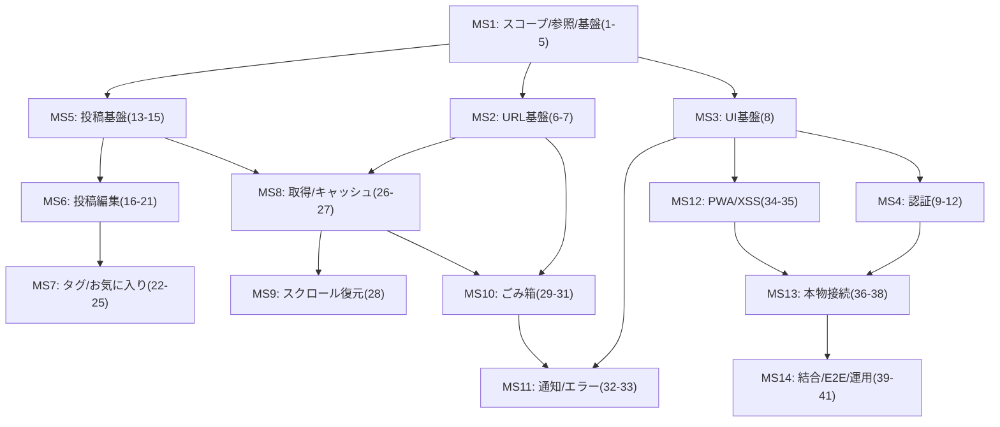

# 実装プラン（エピック＝マイルストーン基準 / 作業計画書V2準拠）

## サマリ

- `docs/04.作業計画書.md`（項番1〜41）を **エピック（=マイルストーン）** に再編し、各エピックを **TDD（Red→Green→Refactor）** で完了させる。
- 前提（ユーザー確定事項）
  - MVPはフル（作業計画書どおり）
  - Miroは作成済みでMCPで参照できる
  - マイルストーンはエピック基準で管理する
- 2フェーズ方針は維持：
  - フェーズ1：スタブ認証/スタブCRUDでUI/ロジック完成（単体テスト中心）
  - フェーズ2：Auth.js + Prisma + PostgreSQLへ差し替え（結合/E2E/運用を強化）
- 禁止事項（AGENTS.md）により、AIは **マイグレーション作成/適用・DBデータ更新・.env参照** を行わない（プラン上は「人間が実施する手順」を明示するのみ）。

---

## 作業計画書の更新運用（実装と同期する）

- 更新対象: `docs/04.作業計画書.md`
- 目的: 「実装の進捗」と「作業計画表のチェック状態/保留理由」が常に一致している状態を保つ
- 更新タイミング（最小ルール）
  - 各マイルストーン完了時に、そのマイルストーンに含まれる項番の **チェックリスト（未/済）** と **進捗情報** を更新する
  - ブロッカーが発生した時は、該当項番の **進捗情報** に `保留(理由: ...)` を追記し、理由を1行で明確化する
- 更新粒度
  - 進捗管理は **項番単位（1〜41）**で行う（マイルストーンは括りとして補助）
- 完了条件（DoDに追加）
  - 各マイルストーン完了時点で、該当する項番が「済」になっている（または、保留理由が明記されている）
  - 実装内容の変更により項番の分割/統合が必要になった場合は、`docs/04` も最小差分で追従更新されている

---

## マイルストーン構成（依存関係）

---

## マイルストーン（=エピック）一覧（項番トレーサビリティ付き）

| MS | エピック名 | 含む項番 | 依存 | 成果物（要点） |
|---:|---|---|---|---|
| 1 | スコープ/参照/基盤整備 | 1–5 | なし | MVP確定、Miroフレーム一覧、文言辞書方針、Jest/RTL最小整備、接続ポイント雛形 |
| 2 | URL正規化・URL更新基盤 | 6–7 | MS1 | canonical化、`mergeSearchParams()`、未ログイン時クエリ全削除 |
| 3 | UI基盤（shadcn/tailwind/Toaster） | 8 | MS1 | shadcn導入/最低限UI部品、Toaster/Alert土台、レイアウト骨格 |
| 4 | 認証（接続ポイント→スタブ→UI） | 9–12 | MS1, MS3 | `authAdapter`固定、スタブ認証ガード、ログインモーダル/ログアウトPopover |
| 5 | 投稿（接続ポイント→スタブCRUD） | 13–15 | MS1 | `postRepository`固定、スタブCRUD、`content/contentText`生成/バリデーション |
| 6 | 投稿エディタ/編集/離脱ガード | 16–21 | MS5 | memo/note作成、note拡大、一覧表示要素、編集UI、hasEditsガード |
| 7 | タグ/お気に入り/検索UI | 22–25 | MS6 | `normalizeTagLabel`、タグ編集、favorite、filters/解除（URL駆動） |
| 8 | 取得・キャッシュ・無限スクロール | 26–27 | MS2, MS5 | TanStack Query導入、queryKey設計、cursor paging + Skeleton |
| 9 | スクロール復元 | 28 | MS8 | 一覧条件単位の保存/復元（ベストエフォート） |
| 10 | ごみ箱（view=trash + 操作） | 29–31 | MS2, MS8 | trash切替、復元/完全削除、選択削除/空にする（連打防止） |
| 11 | 通知/エラー共通化 + エラーシミュレーション | 32–33 | MS3–MS10 | エラー分類→UI挙動統一、`errorTest`クエリの開発用通知 |
| 12 | PWA/manifest + XSS最小対策 | 34–35 | MS3 | manifest route、icons配置、tiptap read-only/リンク許可プロトコル制限 |
| 13 | 本物接続（Auth.js / Prisma / Repo差替え） | 36–38 | MS4–MS12 | Auth.js v5実装、Prismaスキーマ反映（※migrationは人間）、Repository差替え |
| 14 | 結合/E2E/運用ドキュメント | 39–41 | MS13 | テストDB/CI方針、結合テスト、Playwright E2E、運用手順の最小版 |

---

## 主要なI/F（公開インターフェース）を先に固定する（計画上の決定）

実装者が迷わないよう、接続ポイントとDTO/エラー境界を **最初に固定**する。

### 1) `authAdapter`（Server-only）

- 目的：UI/Server Actions/Route Handlerから認証実装（スタブ or Auth.js）を直接呼ばない。
- I/F（例：最小）
  - `getSession(): Promise<Session | null>`
  - `signIn(): Promise<void>`（UI起点でAuth.jsへ遷移、スタブならスタブAPIへ）
  - `signOut(): Promise<void>`
- ガード：`NODE_ENV === "test"|"production"` ではスタブ無効、無効時は403。

### 2) `postRepository`（Server-only）

- 目的：CRUDの接続先（スタブ or Prisma）を集約し、認可（`authorId=session.user.id`）を最終防波堤にする。
- I/F（例：最小）
  - `findMany({ status, mode?, tags?, favorite?, limit, cursor? })`
  - `create({ mode, content, tags, favorite? })`
  - `update({ postId, content, tags, favorite? })`
  - `trash({ postId })` / `restore({ postId })`
  - `hardDelete({ postId })`
  - `hardDeleteMany({ postIds })` / `hardDeleteAllTrashed()`

### 3) ルーティング/URLユーティリティ（純関数）

- `normalizeHomeSearchParams(searchParams, isLoggedIn)`（canonical化判定も含める）
- `mergeSearchParams(current, patch)`（重複排除/ソート/削除規約を内包）

### 4) エラー型（UI挙動を一意化）

- `AppError`（例：`kind: "unauthenticated"|"forbidden"|"notFound"|"validation"|"server"` + `status`）
- Server Actions/Repositoryは `AppError` を返す or throw し、UI側で共通ハンドラがtoast/alertへ変換。

---

## テスト戦略（計画として確定）

- **単体（Jest/RTL）**：MS1〜MS12の主戦場。接続ポイントはスタブ/モック。
- **結合（Jest + PostgreSQL + Prisma）**：MS13以降。`NODE_ENV=test` でスタブ無効を前提。
- **E2E（Playwright）**：MS14で、stg（検証用Neon）運用が固まった後に最小回帰から開始。
- テストファイル分離（設計方針）：
  - unit：`*.test.ts(x)`（jsdom中心）
  - integration：`*.int.test.ts`（node環境・DBあり）
  - e2e：`mono-log/e2e/**`（Playwright）

---

## 各マイルストーン詳細（実装者向け：入口/出口・観点・テスト・DoD）

### MS1 スコープ/参照/基盤整備（項番1–5）

**目的**
- 後続エピックが迷わず進む「正（参照元/文言/テスト/接続ポイント）」を確定する。

**作業**
- (1) MVPスコープ確定（今回：フルで確定）＋「将来機能」リストを `docs/04` の進捗欄へ反映
- (2) Miroフレーム一覧化（画面/コンポーネント → フレーム）を `docs/04` or 別紙に追記
- (3) `docs/05` を正とする **文言辞書**（例：`texts.ts`）の方針/置き場所確定
- (4) Jest/RTL最小整備（Next.js App Router前提で動くこと）
- (5) `authAdapter` / `postRepository` のI/Fと配置（server-only）を決定し、利用箇所を以後ここに固定

**テスト（最小）**
- Toasterがlayout配下でレンダリングされるスモーク
- `authAdapter`/`postRepository` のダミー実装をモックしてUIが起動するスモーク

**DoD**
- テストコマンドでスモークが通る
- 接続ポイントのimport先が決まり、アプリコードが直接Auth.js/Prismaを参照しない方針が明文化される

---

### MS2 URL正規化・URL更新基盤（項番6–7）

**目的**
- URLを単一の正とし、canonical URLへ統一してキャッシュキーや戻る/進むを安定させる。

**作業**
- `app/page.tsx`（Server Component）で正規化→差分があれば`redirect()`
  - 未ログイン：searchParamsがあれば常に`/`へ（全削除）
  - ログイン：`/?mode=memo`を基準にcanonical化（`mode/view/tags/favorite`のみ正規化、未知キーは保持）
- `mergeSearchParams()`を実装し、UIはstateを持たずURL更新だけ行う

**テスト（ユニット中心）**
- canonical例（設計書の例）に対する入出力
- `tags`の重複排除/ソート、`favorite=true`→`1`、`favorite=false`→削除などの規約

**DoD**
- URLの入力パターンが収束し、後続のModeSwitch/FiltersがURL駆動で実装できる

---

### MS3 UI基盤（shadcn/tailwind/Toaster）（項番8）

**目的**
- shadcn/ui + tailwind + sonner（Toaster）で、後続機能のUI部品を揃える。

**作業**
- shadcn導入（CLI優先。不可なら同等最小実装で代替し、後で置換可能に）
- 利用予定部品（Button/Dialog/Alert/AlertDialog/Popover/Skeleton/Sonner/Checkbox/Toggle相当）を揃える
- 共通レイアウト骨格（SP/PC、`md=768px`）をMiro準拠で作る

**テスト**
- Dialog/Popoverが最低限開閉できる（RTL）
- Toasterの表示確認（RTL）

**DoD**
- 後続のログインモーダル/削除確認モーダル/スケルトンがブレずに実装できる

---

### MS4 認証（接続ポイント→スタブ→UI）（項番9–12）

**目的**
- 認証の参照点を固定し、未ログイン時挙動（401→toast+ログインモーダル自動表示）を成立させる。

**作業**
- `authAdapter`実装（スタブ→本物へ差替え可能）
- スタブ認証：`USE_STUB_AUTH` + `NODE_ENV` ガード（production/testでは無効で403）
- ログインUI（モーダル）、ログアウトUI（Popover）
- ログアウト成功時：URL全削除→`router.replace("/")`、必要なら`router.refresh()`、Queryキャッシュ破棄（設計書のキーに限定）

**テスト**
- 未ログイン時にログイン導線が出る
- 401相当でtoast+モーダル自動表示（ベストエフォート）
- ログアウトでURLが`/`に戻る・キャッシュ破棄が呼ばれる（モックで確認）

**DoD**
- 認証状態によるUI分岐が安定し、後続CRUDが「未ログイン時は401で統一」できる

---

### MS5 投稿（接続ポイント→スタブCRUD）（項番13–15）

**目的**
- 投稿データの境界（DTO、content/contentText、status/mode/favorite/tags）を確定し、スタブでCRUDを回せるようにする。

**作業**
- `postRepository` のスタブ実装（`USE_STUB_POSTS` + `NODE_ENV` ガード）
- `content`（tiptap JSON）を正にし、`contentText`はサーバー側生成
- バリデーション（空、memo280、note20000、タグ最大10）をServer Actionsで最終判断

**テスト**
- `contentText`抽出/正規化（改行→スペース等）
- バリデーションの境界値
- repository呼び出しが期待通りの引数になる

**DoD**
- UIがスタブCRUDを通じて「作成/更新/削除相当」を一通り呼べる

---

### MS6 投稿エディタ/編集/離脱ガード（項番16–21）

**目的**
- memo/noteの作成体験、note拡大、編集UI、hasEdits離脱ガードを完成させる。

**作業**
- 新規：memoはinput→tiptap最小docへ変換、noteはtiptap
- note新規の拡大/縮小（同一インスタンス維持、scroll lock）
- 一覧の表示要素（mode、作成日時、タグ、favorite、本文プレビュー）
- 既存編集：memoはインライン、noteはモーダル/Sheet（EditorFrame共通）
- hasEdits=trueでURL変更/編集切替/モーダルクローズ/ブラウザ離脱に確認

**テスト（RTL中心）**
- 新規保存成功→入力クリア/フォーカス戻し/成功toast
- note拡大/縮小で内容維持
- hasEditsの確認ダイアログ分岐（破棄して続行/編集を続ける）

**DoD**
- 投稿作成/編集がUX要件どおり動く（スタブでも本物でも同じ入口/出口）

---

### MS7 タグ/お気に入り/検索UI（項番22–25）

**目的**
- タグ正規化/編集、favorite、filters/解除（URL駆動）を成立させる。

**作業**
- `normalizeTagLabel`（NFKC、制御文字除去、空白圧縮、1行化、32文字）
- 投稿エディタ内タグ編集UI（候補/サジェスト/チップ追加削除）
- 一覧のTagFilter/FavoriteFilter/ClearFilters（URL更新のみ）
- tagsは`tagId`をURLに載せる（labelは載せない）

**テスト**
- `normalizeTagLabel`の入出力
- URLの`tags`操作（追加/解除/全解除）
- `view=trash`中はfilters UI非表示＆取得条件として無視（値は保持）

**DoD**
- tags/favoriteがURLを正として一貫して動く

---

### MS8 取得・キャッシュ・無限スクロール（項番26–27）

**目的**
- TanStack Queryで通常/ごみ箱のキャッシュ復元と、cursor無限スクロールを成立させる。

**作業**
- QueryProviderをlayoutへ導入
- queryKey設計（通常：`["posts",{view:"normal",mode}]`、ごみ箱：`["posts",{view:"trash"}]`）
- tags/favorite絞り込みは非キャッシュ（`gcTime:0, staleTime:0`相当で即破棄）
- `useInfiniteQuery` + sentinel + Skeleton（limit=10）
- 失敗時は状態維持+再試行導線（toast＋ボタン等）

**テスト**
- queryKey生成（純関数化して単体テスト）
- 無限スクロールのトリガー条件（`hasNextPage`/`isFetchingNextPage`ガード）
- 初回ロード/追加ロードのSkeleton分岐

**DoD**
- mode/view切替でキャッシュ復元が効き、体感が崩れない

---

### MS9 スクロール復元（項番28）

**目的**
- 「表示中の一覧条件」単位でスクロール位置を保存/復元し、戻る/進むで体感を維持。

**作業**
- 保存キー：`{view, mode, tags, favorite}`のeffective filters（trashはmode/tags/favorite無視）
- 復元タイミング：キャッシュ復元後の描画安定時（ベストエフォート）
- 失敗しても機能劣化に留める（クラッシュしない）

**テスト**
- キー生成の安定性（順序・重複の影響なし）
- 保存/復元呼び出し条件（モックで確認）

**DoD**
- キャッシュ復元と合わせて「戻った感」が出る

---

### MS10 ごみ箱（view=trash + 操作）（項番29–31）

**目的**
- view=trashのUI/操作（復元/完全削除/一括/空にする）を完成させる。

**作業**
- `view=trash`切替（filters UI非表示、effective filters固定）
- 単体操作：復元/完全削除（成功toast、選択解除、連打防止）
- 一括操作：表示中全選択、選択削除（確認モーダル）、空にする（全trashed対象、確認モーダル）
- view出入りで選択状態リセット

**テスト（RTL中心）**
- 選択数表示とリセット
- 確認モーダル文言（`docs/05`準拠）と確定/キャンセル
- 連打防止（disabled）

**DoD**
- ごみ箱が通常一覧と同品質で運用できる

---

### MS11 通知/エラー共通化 + シミュレーション（項番32–33）

**目的**
- エラー分類→UI挙動（toast/alert、状態維持、ログインモーダル自動表示）を共通化する。

**作業**
- `AppError`分類、共通ハンドラ（UI側）
- 401/403/404/422/5xxの扱いを設計書どおり固定
- `errorTest`クエリで開発用通知→表示後にパラメータ削除、productionで無効

**テスト**
- エラー→toast/alert分岐（文言は`docs/05`準拠）
- `errorTest`の一回性（削除される）

**DoD**
- 失敗しても「状態維持＋適切な通知」でユーザーが復帰できる

---

### MS12 PWA/manifest + XSS最小対策（項番34–35）

**目的**
- PWAのmanifestと、表示のXSS最小対策を入れて品質を底上げ。

**作業**
- Next.jsのMetadata Routeでmanifest相当を実装（`start_url=/`、`display=standalone`、iconsは`public/icons/`）
- tiptapのread-onlyレンダリングを正にして`dangerouslySetInnerHTML`回避
- リンク許可プロトコル制限（保存時に除去）

**テスト**
- リンクプロトコル制限のユニット
- read-onlyレンダリングで危険HTMLが混入しない（最低限のスモーク）

**DoD**
- セキュリティ事故を起こしにくい構造になっている

---

### MS13 本物接続（Auth.js / Prisma / Repo差替え）（項番36–38）

**目的**
- スタブを排し、本番相当の認証・DB・Repositoryへ差し替える。

**作業**
- Auth.js v5 + Google Provider（ルートは設計書どおりに集約）
- Prismaスキーマへ`docs/03.v2/80_DBモデル.md`を反映
  - ※ **migration作成/適用は人間が実施**（AIは禁止）
- `postRepository`をPrisma実装へ差替え（認可は必ず`authorId=session.user.id`でスコープ）

**テスト**
- 結合テストへブリッジ（MS14の前提を整えるため、まずはDB接続疎通の最小テスト方針を固める）

**DoD**
- `NODE_ENV=production/test`でスタブが完全に無効になっている
- 認可の最終防波堤がRepositoryにある

---

### MS14 結合/E2E/運用ドキュメント（項番39–41）

**目的**
- 「本物接続が壊れていない」ことをCI/運用で担保できる状態にする。

**作業**
- 結合テスト：Server Actions + Prisma + PostgreSQL を通す（スタブ無効）
  - DB初期化方針は「禁止事項（DB更新）」に抵触しない形で運用ルールを明文化（テスト専用DBは人間の手順で準備）
- E2E：stg（検証用Neon）で主要回帰（ログイン→作成→編集→ごみ箱→絞り込み→無限スクロール）
- 運用手順ドキュメント：CI環境変数、DB、stg/prod分離、テストアカウント運用を最小版で作る

**DoD**
- 「どこまで自動化され、何を手動でやるか」が運用として決まり、回帰を継続できる

---

## 既知のリスク/ギャップ（計画に織り込む）

- 現状リポジトリは `mono-log/app` がテンプレ状態なので、MS1〜MS3で **“実装の置き場所”** を先に確定しないと以後の変更が散らばる（このプランではMS1で固定する）。
- shadcn導入はネットワーク/CLI事情で詰まる可能性があるため、MS3は「CLI優先・不可なら最小代替→後で置換」というフォールバック込みで進める。
