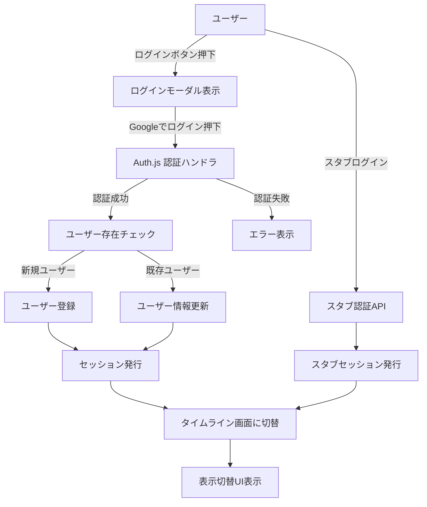
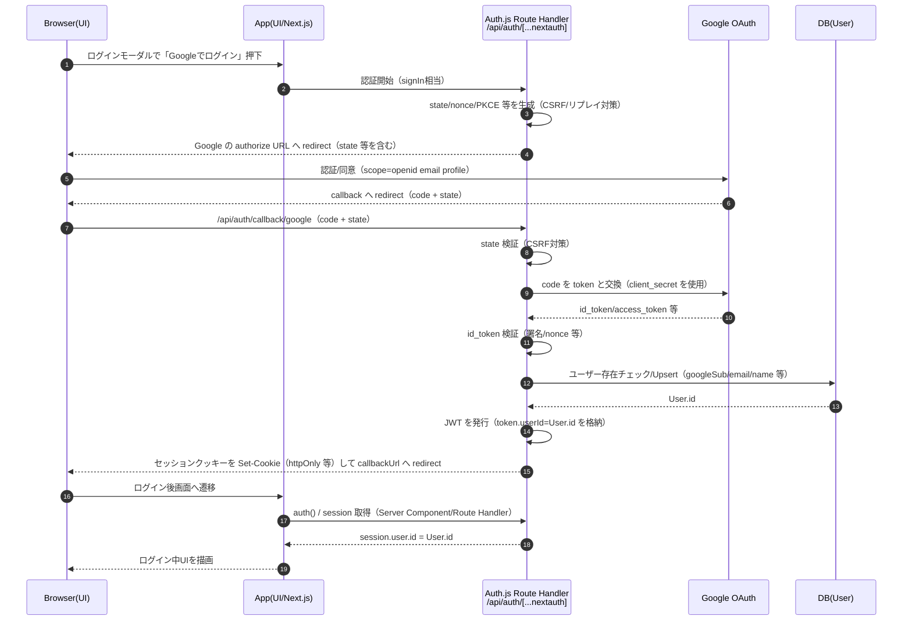
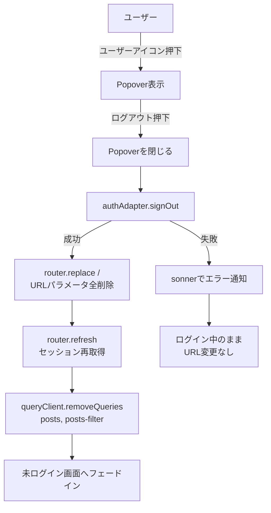
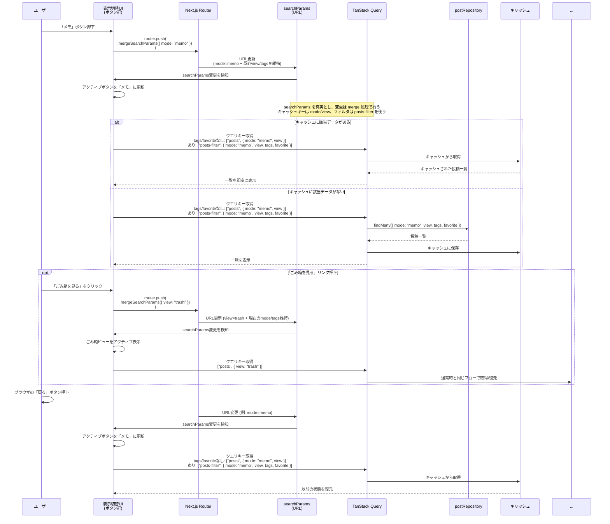
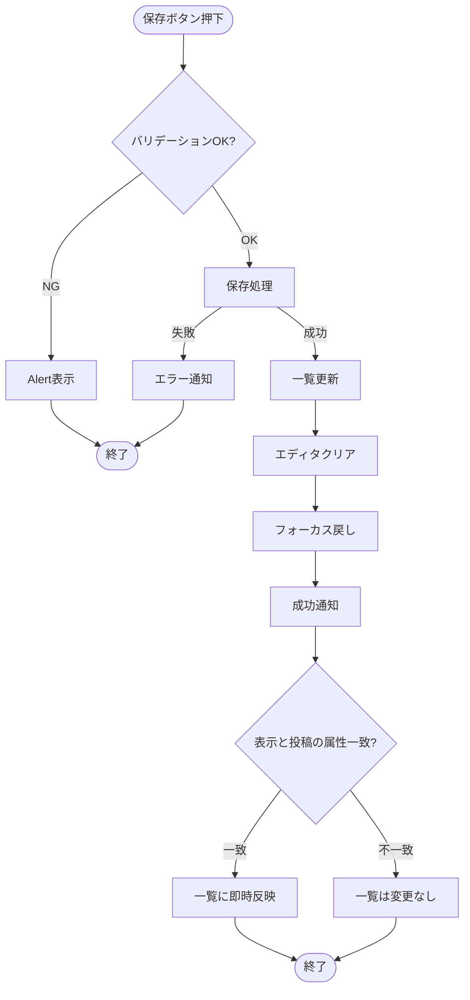

> [!NOTE]
> 本ドキュメント（V1）は設計書V2へ移行中です。最新の参照先は `docs/03.設計書.v2.md` を参照してください。
> （新規追記・修正は原則V2へ）

# 開発・テストの方針

- 依存管理およびスクリプト実行には pnpm（Voltaでバージョン固定）を用いる
- テスト駆動開発で実装する
	    - Red → Green → Refactor
- **日常の開発ではスタブ認証・スタブCRUDを用いて** UI／ロジックを素早く検証する
- 単体・結合・E2Eのテストファイルは、それぞれ実行タイミングや依存関係が異なるので**ファイルを分離**して実装する

---

# 開発・テストの流れ

- **フェーズ1: UIを実装する**
	- 結合テストがしやすいように、接合するUIから優先的に実装する
	- 各UIを実装する際は必ずユニットテストを実装する
		- フェーズ1の単体テストはスタブ・モックを使用する
		- 実装可能な結合テストがあれば都度実装する
	- 単体テスト・結合テストは随時実行する
	- UIの実装が終わったらE2Eテストを実装・実行する
- **フェーズ2: 認証ロジック、データベースを介したCRUD処理を実装する**
	- 単体テストはフェーズ1と同様にテストを実装する
	- 結合テスト・E2Eテストはモック・スタブを介さずに本番同等の環境を構築し実行する

---

# システム構成

- アプリ
    - Next.js v15（Turbopackは使わない、install時のオプションはすべてデフォルトにする）
    - Biome
    - tiptap — 投稿エディタのリッチテキスト入力に使用。投稿本文は tiptap の JSON 形式で DB に保存する
    - prisma
    - dayjs — 投稿の作成日・更新日の日時フォーマット表示に使用（表示フォーマット: `YYYY-MM-DD HH:mm`）
    - TanStack Query — 投稿一覧のキャッシュ・再検証・無限スクロールのデータ取得に使用（詳細は「投稿データ取得・キャッシュ戦略（TanStack Query）」を参照）
- デザインシステム
	- storybook（検討中、初期リリース時は導入しない）
- テスト
    - Jest（単体テスト、結合テスト）
    - Playwright（E2Eテスト）
- UI
    - shadcn/ui
    - tailwindcss
- アイコン
	- https://lucide.dev/
- DB
    - 種類とバージョン: PostgreSQL v17
    - ローカル: ローカル用PostgreSQL
    - 検証用: Neon
    - 本番用: Neon
- 認証
	- Auth.js
- ホスティング
	- Vercel

---

# 可用性・運用

- Vercel + Neon によるホスティング
- Neon の自動スナップショットによるバックアップ

---

# 設定
## envファイル構成

| 種類  | ローカル開発     | ローカルテスト   | STG    | PRD    |
| --- | ---------- | --------- | ------ | ------ |
| env | .env.local | .env.test | Vercel | Vercel |

## 環境変数設計

| key                  | stg/prod（Vercel env） | local（.env.local） | 備考                                                              |
| -------------------- | ---------------------- | ------------------- | --------------------------------------------------------------- |
| DATABASE_URL         | Neonのpooling           | ローカルDBのURL      |                                                                 |
| DATABASE_DIRECT_URL  | Neonのpooling無し       | ローカルDBのURL（通常 `DATABASE_URL` と同値でOK） |                                                                 |
| AUTH_SECRET          | 本番用の値              | local用の値           | [公式のコマンドで生成する](https://authjs.dev/guides/environment-variables) |
| AUTH_URL             | VercelのURL（stg/prod） | `http://localhost:3000` | Auth.js が参照するベースURL（リダイレクト/コールバックURLの単一正）。Auth.js v5 前提。 |
| GOOGLE_CLIENT_ID     | GoogleCloudから取得     | スタブ（開発中）      |                                                                 |
| GOOGLE_CLIENT_SECRET | GoogleCloudから取得     | スタブ（開発中）      |                                                                 |
| USE_STUB_AUTH        | 未設定（無効）           | `true` の場合のみ有効 | 開発専用。未指定/`false` は無効。`NODE_ENV=test/production` では常に無効（Route Handler / `authAdapter` は 403） |
| USE_STUB_POSTS       | 未設定（無効）           | `true` の場合のみ有効 | 開発専用。未指定/`false` は無効。`NODE_ENV=test/production` では常に無効（`postRepository` 側で切替/ガード） |

---

## デザイン・レイアウト

- 画面レイアウトは別途資料（Miro）を正とし、スマートフォン相当と PC 画面相当の 2 系統で実装する
- Miro の参照は MCP（`mcp-miro`）経由で行い、ボードIDは設定（`mcp.json`）から取得する（ハードコードしない）
- ブレイクポイントは「ブレイクポイント（Tailwindデフォルト）」の `md: 768px` を基準とする
- 実装時の進め方
  - UI 実装に着手する際は、**まず MCP 経由で Miro に接続して該当フレームのレイアウトを確認**し、その内容を単一正として実装する
  - docs（本書/仕様書）は「挙動・状態・I/F」の単一正を担い、レイアウトの細部は Miro を優先する

## カラースキーム

- 初期リリースは shadcn/ui のデフォルト（ライト）を採用し、ブランドカラーは未導入とする
- PWA（manifest）採用値（暫定）
  - `theme_color`: `#ffffff`
  - `background_color`: `#ffffff`
  - 備考: デザイン確定後、必要に応じて `theme_color`/`background_color` を更新する（GAP-018）

---

# UI

## コンポーネントテンプレート(shadcn/ui)

- 本プロジェクトの共通UIは **shadcn/ui をCLIで追加して利用**する（手動実装を避ける）。
- 公式ドキュメント（実装/利用方法）は以下を参照する。
  - button: https://ui.shadcn.com/docs/components/button
  - dialog: https://ui.shadcn.com/docs/components/dialog
  - alert: https://ui.shadcn.com/docs/components/alert
  - alert-dialog: https://ui.shadcn.com/docs/components/alert-dialog
  - popover: https://ui.shadcn.com/docs/components/popover
  - skeleton: https://ui.shadcn.com/docs/components/skeleton（投稿一覧のローディング表示に使用）
  - sonner: https://ui.shadcn.com/docs/components/sonner
  - checkbox: https://ui.shadcn.com/docs/components/checkbox

## ブレイクポイント（Tailwindデフォルト）

- `md`: 768px （本プロジェクトでは Tailwind のデフォルト値を採用）

---

# 基本設計

## SPA（画面状態とURL）

- 本アプリは SPA とし、**画面状態（モード/ごみ箱等）は URL パラメータから一意に決定される（URL を単一の正とする）** 形で設計する
- 主要パラメータ
  - `mode`: 通常一覧の表示モード（`memo|note`）
  - `view`: 画面の表示ビュー（`trash`）
  - `tags`: タグ絞り込み（複数）
  - `favorite`: お気に入り絞り込み
- URL の正規化（canonical化）
  - 不正値/未指定値を許容値へ変換してから URL を確定する（詳細は「URL正規化（canonical化）方針」を参照）
  - 目的: 共有/ブックマーク/戻る・進むで状態復元できること、キャッシュキーの一貫性を保つこと

## SPA（投稿一覧キャッシュの切替）

- モード切替、ごみ箱表示のような「同一画面内の状態切替」では、**取得済みの投稿一覧をキャッシュから即時復元**する
- キャッシュ/再検証は TanStack Query に集約する
  - `mode`/`view` をクエリキーに含め、状態切替時に「キャッシュを切り替えて表示」できるようにする
  - `tags` / `favorite` による絞り込みは **キャッシュせず毎回再取得**する（仕様書「タグ絞り込み/お気に入り絞り込み時は再取得」に合わせる）
  - 詳細は「投稿データ取得・キャッシュ戦略（TanStack Query）」「投稿一覧ページング（無限スクロール）内部設計」「表示切替（URLをSource of Truth）内部フロー」を参照

## 対象ブラウザ

- サポート対象
  - PC: Chrome / Firefox / Safari / Edge の最新版
  - Mobile: iOS Safari / Android Chrome の最新版
- 方針
  - 仕様上必須の機能（ログイン、投稿作成/編集、モード/ごみ箱切替、無限スクロール、トースト通知）が対象環境で一通り動作することを担保する
  - 特定ブラウザ依存の挙動がある場合は、回避策（CSS/JS）を設計として明記し、E2E/手動確認項目に落とす

## スマートフォンのホーム画面追加（PWA / manifest）

- `manifest.json`（または Next.js の Metadata Route により同等の manifest を生成）を実装する
- キー設計
  - `name` / `short_name`: アプリ名（例: Mono Log）
  - `id` / `start_url` / `scope`: SPA の起点（**未ログインでも開ける URL**）。本プロジェクトでは未ログイン時に URL パラメータを全削除する方針のため `/` を起点候補とする（ログイン中は canonical 化により `/?mode=memo` へ寄せる）
  - `display`: `standalone`
  - `theme_color` / `background_color`: 「カラースキーム」の採用値を使用する
  - `icons`: 192/512 に加え `purpose: "maskable"` を含む（Android で重要）
- アイコン成果物（格納場所・命名）
  - 置き場所: `public/icons/`
  - ファイル
    - `mono-log-192.png`（192x192）
    - `mono-log-512.png`（512x512）
    - `mono-log-192-maskable.png`（192x192 / maskable）
    - `mono-log-512-maskable.png`（512x512 / maskable）
  - manifest の `icons[]` は上記ファイルを参照し、maskable は `purpose: "maskable"` を指定する
- 初期リリース方針
  - オフライン対応は要件に含めず、Service Worker の導入は将来検討とする（導入する場合は運用/キャッシュ戦略を別途設計する）

---

# ルーティング / URLスキーム設計

本アプリでは、画面状態（モード/ごみ箱/絞り込み条件）を URL（searchParams）で表現する。

## 対象URL

- `/`（ログイン前/後で同じURLを利用）
  - 未ログイン時: ウェルカム + ログイン導線を表示（URL の searchParams は全削除して `/` に正規化する）
  - ログイン中: 投稿エディタ + 投稿一覧（タイムライン）を表示

## URLスキーム（`/` の searchParams）

| key | 型 | 許容値/形式 | デフォルト | 用途 |
| --- | --- | --- | --- | --- |
| `mode` | string | `memo` \| `note` | `memo` | 通常一覧の表示モード |
| `view` | string? | `trash` | なし | `trash` の場合はごみ箱一覧 |
| `tags` | string[] | `tags=<tagId>` の複数指定 | `[]` | タグ絞り込み（複数選択） |
| `favorite` | boolean | `favorite=1`（truthy のみ有効） | false | お気に入り絞り込み |

補足:
- `tags` は `tags=tagA&tags=tagB` のように **同一キーの複数指定**で表現する（順序は意味を持たない）
- `tags` の複数指定は **OR 条件（いずれかを含む）** とする

### 表示別の URL 例（canonical）

`mode` は canonical URL として **常に含める**（`/?mode=memo` が基準）。`view=trash` 中は URL 上に `tags` / `favorite` が存在しても **一覧フィルタには使わず**、値は保持する。

| 表示 | canonical URL例 | 参照するparams | 一覧フィルタとして無視するparams | フィルタUI |
| --- | --- | --- | --- | --- |
| 通常一覧（メモ） | `/?mode=memo` | `mode`, `tags`, `favorite` | - | 表示 |
| 通常一覧（ノート） | `/?mode=note` | `mode`, `tags`, `favorite` | - | 表示 |
| ごみ箱 | `/?mode=memo&view=trash` | `mode`, `view` | `tags`, `favorite`（値は保持） | 非表示 |
| ごみ箱（URLに filters が残っている例） | `/?mode=memo&view=trash&tags=<tagId>&favorite=1` | `mode`, `view` | `tags`, `favorite`（値は保持） | 非表示 |

補足:
- 「通常ビュー」は `view` 未指定（`view !== "trash"`）を指す

## 状態導出（URL → 画面）

- `mode` / `view` / `tags` / `favorite` を URL から導出し、表示・データ取得の条件に反映する
- ごみ箱表示（`view=trash`）時は UI/UX を単純に保つため **モード切替（ModeSwitch）/タグ/お気に入り絞り込みは無効（UIは非表示）** とし、`status=trashed` の一覧を表示する（URL上の `mode` / `tags` / `favorite` の値は保持）

## URL更新規約（UI → URL）

- ユーザー操作による状態遷移は原則 `router.push()` で URL を更新し、ブラウザの戻る/進むで状態復元できるようにする
- URL 更新は `mergeSearchParams()` で既存パラメータを保持しつつ差分のみ反映する
- 正規化（canonical化）による URL 整形は `replace`/`redirect` 相当で履歴を汚さない（次節参照）

---

# URL正規化（canonical化）方針

トップページ（`/`）では、セッション状態に応じて URL を正規化（canonical化）する。

- 未ログイン時: URL パラメータは **全削除**し、常に `/` に寄せる
- ログイン中: searchParams を正規化（canonical化）し、不正値や未指定値を許容値に変換してから URL に反映する

## 正規化の目的
- URL を常に「正しい形」に保つことで、共有・ブックマーク・戻る/進む操作での状態復元を確実にする
- 不正なクエリパラメータが残らないようにし、キャッシュキーの一貫性を保つ

## 正規化ルール

**`mode` パラメータ**:
- **許容値**: `memo`, `note`
- **意味**:
  - `memo`: 使い捨て前提のメモ
  - `note`: 書いて残すノート
- **未指定時**: `mode=memo` を付与
- **不正値時**: `mode=memo` に正規化
- **常に URL に含める**: `/` ではなく `/?mode=memo` を canonical URL とする

**`view` パラメータ**:
- **許容値**: `trash` のみ
- **不正値時**: パラメータを削除（`view=hoge` → 削除）

**`tags` パラメータ**:
- **形式**: `tags=<tagId>` を複数指定（例: `tags=tagA&tags=tagB`）
- **未指定時**: パラメータなし（`tags=[]` として扱う）
- **空値**: 削除（例: `tags=` → 削除）
- **重複**: 重複排除してから URL に反映する
- **順序**: 意味を持たないため、昇順にソートして URL に反映する（canonical化）

**`favorite` パラメータ**:
- **許容値**: `1`, `true`（truthy のみ有効）
- **無効値時**: パラメータを削除（例: `favorite=hoge` → 削除）
- **false 相当**: パラメータを削除（例: `favorite=0` / `favorite=false` → 削除）
- **true 相当**: `favorite=1` に正規化する

**その他のクエリパラメータ**:
- `errorTest` など、将来追加される可能性のあるパラメータは（ログイン中のみ） **保持**する
- 正規化処理は（ログイン中のみ） `mode` / `view` / `tags` / `favorite` を対象とし、未知のキーはそのまま維持する

## 実装場所

- **正規化関数**: `lib/routing/normalizeHomeSearchParams.ts`
- **適用箇所**: `app/page.tsx`（Server Component）
- **適用条件**:
  - 未ログイン時: searchParams が存在する場合、`next/navigation` の `redirect("/")` で `/` にリダイレクト
  - ログイン中: 正規化前後で差分がある場合、`next/navigation` の `redirect()` で canonical URL にリダイレクト

### 例

※以下はログイン中の例（未ログイン時は query を全削除して `/` に正規化する）

- `/` → `/?mode=memo`（リダイレクト）
- `/?mode=hoge` → `/?mode=memo`（リダイレクト）
- `/?mode=memo` → そのまま（リダイレクトなし）
- `/?view=trash` → `/?mode=memo&view=trash`（`mode` が付与されるためリダイレクト）
- `/?mode=note&tags=tag1` → そのまま（リダイレクトなし、`tags` は保持）
- `/?favorite=1` → `/?mode=memo&favorite=1`（`mode` が付与されるためリダイレクト）
- `/?favorite=true` → `/?mode=memo&favorite=1`（`favorite` を正規化する）
- `/?mode=note&tags=b&tags=a&tags=a` → `/?mode=note&tags=a&tags=b`（`tags` を正規化する）

---

# ログイン
## 認証とセッション（実装設計）

### 前提

- 認証方式: Auth.js を利用し、Googleを認証プロバイダーとしてシングルサインオンを行う
- セッション方式: JWT ベースとする

### Google OAuth 設定一覧（MVP）

本節は、Google Cloud Console（OAuth）と Auth.js（Google Provider）の **単一正**とする。

| 項目 | local | stg | prod | 備考 |
| --- | --- | --- | --- | --- |
| OAuth scope（最小） | `openid email profile` | `openid email profile` | `openid email profile` | Google API（Gmail/Drive 等）を呼ばない前提のため、MVP は最小権限とする |
| Authorized redirect URI（callback URL） | `http://localhost:3000/api/auth/callback/google` | `https://<stg-domain>/api/auth/callback/google` | `https://<prod-domain>/api/auth/callback/google` | Google Cloud Console に登録する値。stg/prod の `<...-domain>` は Vercel の実ドメインを正とする |
| Authorized JavaScript origins（任意） | `http://localhost:3000` | `https://<stg-domain>` | `https://<prod-domain>` | Google Cloud Console の設定。必要な場合のみ登録する |
| Provider 設定（Auth.js） | `Google({ authorization: { params: { scope: "openid email profile" } } })` | 同左 | 同左 | 実装では `app/api/auth/[...nextauth]/route.ts` に集約する |
| ベースURL（Auth.js が参照する URL） | `http://localhost:3000` | `https://<stg-domain>` | `https://<prod-domain>` | 環境変数（例: `AUTH_URL`）で明示し、コールバックURLの単一正を保つ |

#### セッションに載せる属性（アプリが参照してよい形）

- `session.user.id`: アプリ内のユーザー識別子（`User.id`）。投稿の `authorId` の単一正として扱う
- `session.user.email`: 表示/問い合わせ/将来のアカウント管理に利用
- `session.user.name`: UI 表示に利用
- `session.user.image`: ユーザーアイコン表示に利用
- （任意）`session.user.googleSub`: Google 側の subject。将来の監査/同一性確認のために保持したい場合は追加する

#### セッション失効・未認証時の挙動（MVP）

- `auth()` が取得できない（未ログイン/セッション切れ）場合:
  - 401 扱いとして `toast.error` を表示し、入力/画面状態は維持したままログインモーダルを自動で開く（ベストエフォート）
  - ログイン成功後の自動リトライは行わず、ユーザーが同操作を再実行する（初期方針）

### 認可（authorId の単一正）

目的: クライアント入力の改ざんや呼び出し漏れがあっても、他ユーザーの投稿データへ到達できないようにする。

#### 単一正（採用するユーザー識別子）

- **単一正**: `User.id`（= `session.user.id`）
- 投稿所有者: `Post.authorId = User.id`
- `email` は変更され得るため authorId に採用しない（表示/問い合わせ用途）
- `googleSub` は（保持する場合）同一性確認用の属性であり、authorId には採用しない

#### 認可チェック位置（どこで検証するか）

- **正（必須）: Repository（`postRepository`）**
  - すべての取得/更新/削除は **必ず `authorId = session.user.id` でスコープ**する
  - 例: 一覧取得は `authorId + status (+ mode)` で絞り込み（既存の一覧仕様と整合）
- **補助（入口）: Server Actions**
  - リクエストDTOで `authorId` を受け取らない（クライアント入力を単一正にしない）
  - `postRepository` 呼び出し前に、未認証（セッションなし）の場合は 401 扱いで失敗させる

#### エラーの扱い（MVP）

- 未認証（セッションなし）: 401
- 対象の投稿が存在しない / 他人の投稿: 404（Not Found）を基本とする
- 権限なし（環境ガード等で操作自体を禁止）: 403

### 目的

- サインイン／サインアウト後に、セッション状態に応じた UI（未ログイン／ログイン中）へ確実に切り替わること
- 認証方式（スタブ／Auth.js 本番）を切り替えても、アプリ側の呼び出し点を変えずに実装できること

### 構成要素と責務

- Route Handlers（`app/api/auth/[...nextauth]/route.ts`）
  - Auth.js の認証フロー（サインイン、コールバック処理、セッション発行）を担当する
  - 認証成功時のユーザー存在チェック／User 作成・更新（メールアドレス更新を含む）は Auth.js コールバック内で行う
- 接続ポイント（`authAdapter`）
  - アプリコードが直接 Auth.js / スタブ実装を参照しないための入口
  - 環境変数により「スタブ／本番」を切り替える（ガード条件の詳細は「スタブ認証の運用ガード」に集約）
- セッション参照（サーバー）
  - Server Component / Route Handler から `auth()` を呼び、セッションを取得して UI に渡す
- セッション参照（クライアント）
  - `next-auth/react` の `useSession()` をヘッダー、ログインボタン、ユーザーアイコン等の表示分岐に利用する
  - ログインボタン側に独自の状態チェック処理は持たせず、セッションを単一の情報源として扱う
- CRUD（参考：データ処理方針）
  - Server Actions + TanStack Query で非同期処理を行い、Prisma Repository 経由で DB にアクセスする
  - UI のキャッシュ／再検証は TanStack Query に委譲する

### セッションによる画面出し分け方針

- 判定レイヤーは Server Component（例: `app/page.tsx`）とし、セッション有無で未ログイン／ログイン中の画面を出し分ける
- ミドルウェアでの判定は当面行わず、必要になった段階で検討する

### UI更新（サインイン／サインアウト後）

- サインイン／サインアウト後は、リダイレクトまたは `router.refresh()` 等でセッションを再取得し、UI を更新する
- 更新後は、表示切替 UI を含むログイン後レイアウト（または未ログインレイアウト）が描画される
- サインアウト後は URL パラメータを全削除し `/` に寄せたうえで、未ログイン画面へ **フェードイン**で切り替える（ログアウト専用画面は作らない）

### フェーズ方針（スタブ → Auth.js）

- フェーズ1: `/api/auth/stub` によるスタブセッション（開発専用 Cookie）を利用する
- フェーズ2: Auth.js（Google OAuth）へ差し替える
- スタブを本番・CIで誤って使わないための条件・実装箇所は「スタブ認証の運用ガード」に集約する

## 認証フロー（ログイン: ユーザー操作／状態遷移）

- ログインボタン押下 → ログインモーダル → 「Googleでログイン」押下 → Auth.js による認証フローへ遷移

- 認証失敗やユーザーキャンセル時は `AuthFail` に遷移し、エラー通知（sonner）を表示し **ログインモーダルは閉じる**（再試行は再度ログイン操作から行う）。
- スタブ利用の前提と切り替え条件は「フェーズ方針（スタブ → Auth.js）」および「スタブ認証の運用ガード」を参照する。

### Auth.js（Google OAuth）内部フロー（セキュリティ観点）

本節は「ユーザーがログインボタンを押してから、アプリが `session.user.id`（= `User.id`）を信頼できる状態になるまで」を、Auth.js の責務として整理する。

#### セキュリティが保たれる理由（MVPでの単一正）

| フェーズ | 何を信頼するか | 主要な仕組み | 備考 |
| --- | --- | --- | --- |
| 認証開始〜Googleへリダイレクト | まだ何も信頼しない | state/nonce/PKCE の生成 | CSRF・リプレイ・コード横取りのリスクを下げる |
| callback 受信〜トークン交換 | callback の正当性のみ検証する | state 検証 + server-side で token 交換（client_secret） | client_secret はクライアントに出さない |
| トークン検証〜ユーザー確定 | Google が返した同意結果を検証する | id_token 検証（署名/nonce 等） | scope は最小（`openid email profile`） |
| セッション確立 | クッキー内のJWTを検証して session を復元する | `AUTH_SECRET` による署名（必要なら暗号化） + httpOnly cookie | セッションは「ログイン状態」の証明であり、アプリの主体IDは `session.user.id` を正にする |

### セッション確立後にセキュリティを保つ仕組み（認可の単一正）

認証が成功しても、それだけでは「このユーザーがどの投稿を操作してよいか」は決まりきらないため、アプリ側の認可（authorization）を **`session.user.id` を単一正**として実装する。

| レイヤー | 入口/責務 | セキュリティ上の役割 | 具体方針（MVP） |
| --- | --- | --- | --- |
| UI（クライアント） | ボタン/フォーム | 改ざんされ得るため単一正にしない | `authorId` を入力/送信しない（postId等のみ） |
| Server Actions | アプリの通信I/F（入口） | 未認証を排除し、DTOの境界を固定する | `auth()` から userId を取得し、未認証は 401。DTOに authorId を持たせない |
| Repository（`postRepository`） | DBアクセス直前 | 認可の最終防波堤（漏れを許さない） | すべての where に `authorId=session.user.id` を必須化 |
| DB（制約/インデックス） | データの単一正 | スコープ前提の効率と整合 | Post は `authorId` を持ち、一覧取得も authorId で絞る（既存設計と整合） |

※認可（authorId の単一正）の正は「ログイン > 認証とセッション（実装設計）」の「認可（authorId の単一正）」とする（本節は概要）。

## スタブ認証

- フェーズ1では Auth.js の代わりにスタブを実装する。`/api/auth/stub` + HTTP-only Cookie で簡易セッションを保持している。
- HTTP-only Cookie であるためフロントエンドの JS からは読み取れないが、ブラウザの開発者ツール上では値を確認できる。「開発環境のみ」「スタブユーザーしか生成されない」前提で使用する。
- 本番デプロイ時（`NODE_ENV=production`）にスタブが有効化されないよう `USE_STUB_AUTH` + ガードを必須化し、CI では `NODE_ENV=test` でスタブを無効化して Route Handler + Auth.js を呼び出す。
- Auth.js 本番接続が完了したらスタブ Cookie を削除し、Google OAuth → Route Handler → JWT セッションで統一してリスクを根本的に排除する。

## スタブ認証の運用ガード

**実装箇所**:
- 接続ポイント（authAdapter）とスタブ認証の Route Handler で `USE_STUB_AUTH` をチェックし、無効時は 403 を返す

**環境変数**:
- 開発環境: `.env.local` に `USE_STUB_AUTH=true` を設定した場合のみ有効（デフォルト無効）
- CI/テスト環境: `NODE_ENV=test` により自動的に無効化
- 本番環境: `NODE_ENV=production` により自動的に無効化（`USE_STUB_AUTH=true` が設定されていても無効）

**確認手順**:
1. 本番環境（`NODE_ENV=production`）で `/api/auth/stub` にアクセスすると 403 が返ることを確認
2. CI 環境（`NODE_ENV=test`）でスタブ認証が無効化されていることを確認（統合テストで Auth.js を呼び出す）
3. 開発環境でのみスタブ認証が動作することを確認

**注意事項**:
- スタブ Cookie (`stub-session`) は開発環境専用であり、本番環境では使用しない
- スタブユーザーは固定値（`stub-user-1`, `stub@example.com`）のみが生成される
- フェーズ2で Auth.js 本番接続が完了したら、スタブ認証の Route Handler と Cookie を削除する

---

# ログアウト

- ユーザーアイコンを押下→Popoverが開く
- Popoverの中の「ログアウト」テキストを押下
- クリック直後に Popover を閉じる
- ログアウト処理を実行（接続ポイント `authAdapter` 経由）
	- 成功:
		- URL パラメータを **全削除**し、`router.replace("/")` で `/` に遷移する
		- `router.refresh()` によりセッションを再取得し、未ログイン画面へフェードインで切り替える
		- TanStack Query のユーザー投稿キャッシュを破棄する（キャッシュ対象のキーに限定）
			- `queryClient.removeQueries({ queryKey: ["posts"] })`
			- `queryClient.removeQueries({ queryKey: ["posts-filter"] })`
	- 失敗:
		- `sonner` でエラー通知を表示する（Popover は閉じたまま）
		- URL は変更しない（必要ならリトライ可能）

---

# 表示切り替え
## 表示切り替え 内部フロー

**ポイント**:
- UI状態は searchParams から導出
- TanStack Query のキャッシュにより、ブラウザの戻る/進む時ボタンを押下したときに前回の投稿一覧を即時に復元する（スクロール位置は後述の Scroll Restoration で復元する）
- クエリ変更は mergeSearchParams で既存の view/tags などを保持したまま差し替える
- 「ごみ箱を見る」リンクは searchParams ベースで分岐し、キャッシュを切り替えて復元する
- タグ/お気に入り絞り込みは searchParams ベースで分岐するが、キャッシュは使わず毎回再取得する（仕様書に合わせる）

---

# 投稿エディタ

## UI構成

- テキスト入力フィールド
  - `mode=memo`: 一行テキスト（短文）を入力する input フィールド
  - `mode=note`: リッチテキストエディタ（tiptap）
- 配置（レイアウト）
  - スマートフォン表示: 画面下部に固定（入力しやすさ優先）
  - PC表示: サイドバーに固定
- 拡大/縮小（新規ノートのみ）
  - `mode=note` の新規投稿エディタは「拡大」ボタンでフルスクリーン表示へ切り替えられる
  - `mode=memo` の新規投稿エディタは拡大/縮小しない
- モード
  - URL（searchParams）の `mode` を単一の正として導出し、表示切替 UI で切り替える
  - **投稿作成後はモードを変更できない**
- タグボタン（タグ入力UIの開閉）
  - 詳細は「タグ / お気に入り」を参照
- 保存ボタン
  - 新規投稿時: ラベル「保存」
  - 編集時: ラベル「更新」
- キャンセルボタン（既存投稿の編集時のみ表示）

## エディタ拡大（新規ノート）

新規投稿エディタ（固定）のノート（`mode=note`）は、入力体験のため「拡大/縮小」を提供する。

- 状態
  - 通常: `docked`（スマホ下部固定 / PCサイドバー固定）
  - 拡大: `expanded`（フルスクリーン）
- トリガー
  - 「拡大」押下: `docked` → `expanded`
  - 「戻す（縮小）」押下 / `Esc`: `expanded` → `docked`
- 実装方針
  - エディタは **同一インスタンス** を維持し、DOM の移動/再マウントを行わない（入力・カーソル・Undo 履歴を保つ）
  - `expanded` 時はエディタコンテナに `position: fixed; inset: 0;`（Tailwind: `fixed inset-0`）を適用し、親レイアウトの幅から切り離す
  - `expanded` 時は背景スクロールを禁止する（scroll lock）
- `hasEdits` との関係
  - 拡大/縮小は入力内容を破棄しないため確認は出さない
  - ただし、`hasEdits=true` の状態で URL パラメータ変更やページ離脱が発生する場合は「編集中の離脱ガード」に従う
- 保存
  - 保存成功後は現在の表示状態（`docked`/`expanded`）を維持し、下書きをクリアしてフォーカスを戻す

## エディタフレーム（共通デザイン）

新規ノートの「拡大表示」と既存ノート編集の「モーダル表示」は、同じ見た目・操作感に揃える。

- 共通フレーム（EditorFrame）
  - ヘッダー: タイトル + 右上の「閉じる/戻す」ボタン
  - 本文: tiptap（read-only ではなく編集モード）
  - フッター: 保存/更新、タグ編集などの操作群
- 使い分け
  - 新規ノート（拡大）: 「戻す（縮小）」で `expanded` → `docked`（内容は保持）
  - 既存ノート編集（モーダル）: 「閉じる」でモーダルを閉じる（`hasEdits=true` の場合は確認を出す）

## 投稿本文の保存形式（tiptap JSON を正）

- 投稿本文の正は tiptap（ProseMirror）の doc JSON とする（メモ/ノートで保存形式を分けない）

- メモ（`mode=memo`）
  - UIは input だが、保存時に「最小の doc（paragraph + text）」へ変換して `content` に保存する
  - 1行テキストの制約を担保するため、サーバー側で改行等を正規化する
- ノート（`mode=note`）
  - UIは tiptap エディタ
  - マークダウン“テキスト”は保存しない（必要なら将来エクスポート時に生成する）

### `contentText` の生成・保存

- `contentText` は `content`（tiptap JSON）から導出される **派生データ** とする
- 生成タイミング
  - 投稿の作成/更新の Server Action で、サーバー側で `content` を元に抽出して保存する
  - クライアントから `contentText` を送っても採用しない（必要なら比較してログに残す）
- 抽出ルール（最小）
  - `mode=memo`: 1行に正規化した文字列を `contentText` とする
  - `mode=note`: ProseMirror doc JSON を走査してテキストを連結し、ブロック境界は改行として扱う（前後はトリム）
- 利用箇所
  - 一覧表示の本文プレビューは `contentText` を表示する（`dangerouslySetInnerHTML` しない）
    - `mode=memo`: 全文表示（省略しない）
    - `mode=note`: 最大10行まで表示し、10行を超える場合は「もっと見る / 折りたたむ」で開閉できる（初期は折りたたみ）
      - 「10行」は **表示上の行数**（CSS `line-clamp` 等）で定義する
  - 将来の全文検索は `contentText` を対象とする（初期リリースは未対応）

## 新規投稿

- 初期設定モードをセットする
- 空のエディタを表示する
- エディタをフォーカスする
- UI操作: 保存ボタンを押下
  - アクティブになっているモードを取得する
  - エディタに入力された内容を取得する
  - 取得したデータをデータベースに登録する（`content` を保存し、`contentText` はサーバー側で抽出して一緒に保存する）
  - 投稿一覧に投稿を反映する（表示中の条件に一致する場合）
  - 保存完了後の状態
    - エディタの入力内容をクリアする
    - 再びエディタにフォーカスを当てる
    - 成功通知（トースト）を表示する
  - 本文が未入力（空白のみ含む）の場合は保存を行わず、Alertで未入力であることを通知する（文言は `docs/06.テキスト・コンテンツ定義.md`）

### バリデーション（正規化後）

- 投稿本文・タグのバリデーションは、保存/更新の Server Action を単一正とする
  - クライアント側の先行チェックは任意（UX向上目的）だが、サーバー側判定が最終
- 投稿本文の判定対象は `contentText`（サーバー側で `content` から抽出・正規化済み）とする
  - 文字数の算出は `contentText.length`（実装で統一）

| 条件 | 代表ステータス | UI | 状態 | 表示文言（正） |
| --- | --- | --- | --- | --- |
| 空（`contentText.trim().length === 0`） | 422 | Alert | 維持 | 「内容を入力してください」 |
| `mode=memo` で 280 文字超 | 422 | Alert | 維持 | 「内容は最大280文字までです」 |
| `mode=note` で 20000 文字超 | 422 | Alert | 維持 | 「内容は最大20000文字までです」 |
| タグ数が 10 件超（正規化・重複排除後） | 422 | Alert | 維持 | 「タグは最大10件まで追加できます」 |

※認可（authorId の単一正）の方針は「ログイン > 認証とセッション（実装設計）」の「認可（authorId の単一正）」を正とする。

## 新規投稿保存フロー

**ポイント**:
- バリデーション失敗時は Alert、create失敗時はエラー通知（トースト） + 状態維持で再入力しやすくする
- エディタクリア + フォーカス戻しで連続入力を容易にする
- 表示中の mode/view と保存投稿の属性が一致する場合のみ即時反映し、不一致の場合はモード切替時に表示する
- タグ/お気に入り絞り込み中は一覧をキャッシュしない方針のため、差分反映は行わず再取得で整合を取る

## 既存投稿の編集

- 既存投稿のモードをセットする
- 既存投稿の投稿内容をエディタにセットする
- 編集UIの出し方
  - メモ（`mode=memo`）: **インライン編集**（対象投稿カードの表示領域を編集UIに差し替える）
  - ノート（`mode=note`）: **モーダル（またはSheet）内で編集**（EditorFrame のデザインは新規ノートの拡大表示と共通）
    - モーダル表示中は、背景の固定投稿エディタ（新規投稿用）はロックし入力できないようにする（誤操作防止）
- 投稿作成後はモードを変更できない（編集時も固定）
- `hasEdits`（未保存の変更あり）
		- 編集開始時点の内容と比較して、未保存の変更がある状態を `hasEdits=true` とする
		- 対象: 本文 / タグ / お気に入り（編集UIで変更可能なもの）
- UI操作: 更新ボタンを押下
	- 保存処理と同様の流れで更新を実行
	- 成功通知（トースト）を表示する
	- 成功時は編集を終了し `hasEdits=false` に戻す
- UI操作: キャンセルボタンを押下
	- `hasEdits=false` の場合は即キャンセル
	- `hasEdits=true` の場合は離脱確認を表示し、ユーザーが「破棄して続行」を選んだ場合のみキャンセルする
	- キャンセル時は編集状態から通常表示に戻り、新規投稿用エディタを表示する

### 編集中の離脱ガード（確認）

- `hasEdits=true`（新規投稿の未保存入力を含む）のときに以下の操作を行う場合は確認を表示する
		- モード切替 / タグ絞り込み / お気に入り絞り込み / ごみ箱表示切替など、URLパラメータが変わる操作
		- 他の投稿の編集開始
		- ノート編集モーダル（またはSheet）のクローズ操作（× / Esc / 背景クリック）
		- ブラウザの戻る/進む、リロード、タブを閉じる
- 確認の選択肢
	- 「破棄して続行」：編集を破棄して操作を実行する
	- 「編集を続ける」：操作をキャンセルし、編集状態を維持する
		- URLパラメータが変わる操作の場合、URL変更も取り消し（元のURLに戻す）編集状態を維持する

---

# タグ / お気に入り

本アプリでは、投稿に「タグ」と「お気に入り」を付与でき、投稿一覧ではそれらで絞り込みできる。

## タグの識別子（tagId / label）

- `tagId`: タグの主キー（DB）であり、URL の `tags=<tagId>` に載せる識別子
  - 生成: `cuid()`（スタブ/本番とも同形式）
- `label`: ユーザーが入力・表示するタグ名（UIの正）
- URL には `label` を載せず、常に `tagId` を載せる（共有URLの安定性のため）
- 投稿の保存/更新時は、入力された `label` を正規化したうえで `ownerId + label` で既存検索し、`tagId` を解決する（なければ作成）
- URL に含まれる `tagId` がタグクラウド（表示対象）に存在しない場合（未使用で非表示/削除/未同期等）でも、ユーザーが詰まらないよう「絞り込み解除（tags/favorite を全解除）」の導線を提供する（「投稿検索 > 絞り込み解除」参照）

## タグクラウド/候補の表示方針

- タグクラウド（既存タグ一覧）およびサジェストの候補は、「少なくとも1件の `status=active` 投稿に紐づく Tag」のみを表示する（未使用タグは DB に残すが UI には表示しない）
- ユーザーが未使用タグの `label` を入力して保存した場合は、既存 Tag があれば再利用され、付与後に候補へ現れる

## 画面状態（URL）

- 投稿一覧の絞り込み状態は URL に反映する
  - タグ: `tags=<tagId>`（複数指定）
  - お気に入り: `favorite=1`
- URL スキーム/正規化の詳細は「ルーティング / URLスキーム設計」「URL正規化（canonical化）方針」に従う
- `view=trash` ではタグ/お気に入り絞り込み UI を無効化（UIは非表示）し、一覧は `status=trashed` を表示する（URL上の値は保持）

## 投稿エディタでのタグ編集

- タグボタン押下でタグ入力 UI（アコーディオン）を開閉する
- タグクラウド（既存タグ一覧）
  - 表示範囲は「タグクラウド/候補の表示方針」に従う
  - ボタン押下で編集対象の投稿にタグを追加/除去する（投稿は複数タグを持てる）
- タグ入力（新規/既存）
  - 入力中に既存タグをサジェストし、選択でタグを追加する
  - 追加したタグはチップとして表示し、チップ押下で除去できる
  - 新規タグは保存/更新時に作成し、完了後にタグクラウドへ反映される

## タグ ラベルの正規化・制約

### 適用ポイント

| 対象 | 適用場所（正） | 備考 |
| --- | --- | --- |
| タグの作成/解決（`label` → `tagId`） | 保存/更新の Server Action | クライアントからの `label` は参考にしても、そのまま採用しない |
| 入力補助（任意） | クライアント | 先行でエラー表示してUXを上げてもよいが、サーバー側が単一正 |

### 正規化ルール（`normalizeTagLabel`）

| ルール | 入力例 | 出力例 | 目的/備考 |
| --- | --- | --- | --- |
| Unicode NFKC で正規化 | `ｶﾀｶﾅ` | `カタカナ` | 全角/半角や互換文字の揺れを減らす |
| 制御文字を除去 | `foo\u0007bar` | `foobar` | 表示崩れ・不可視文字混入を防ぐ |
| 空白を圧縮してトリム | `  foo\t\nbar  ` | `foo bar` | `\\s+` を半角スペース1つに寄せ、前後を削除する |
| 1行化（改行を保持しない） | `foo\nbar` | `foo bar` | タグチップ/ボタン表示を前提に「常に1行」を保証する |

### バリデーション（正規化後）

| 条件 | 代表ステータス | UI | 状態 | 備考 |
| --- | --- | --- | --- | --- |
| 空（`""`） | 422 | Alert | 維持 | 文言/詳細は「エラー通知実装設計」 |
| 32 文字超 | 422 | Alert | 維持 | 文字数は `label.length`（実装で統一） |

### 同一性・競合時の扱い

| 観点 | ルール |
| --- | --- |
| 大小文字 | 区別する。例: `React` と `react` は別タグ |
| 同一性（同名扱い） | `ownerId + label`（正規化後 `label`）の完全一致 |
| DB制約 | `ownerId + label` にユニーク制約 |
| 同時実行 | ユニーク制約違反が発生した場合は既存 Tag を再取得して吸収する |

## 投稿一覧：絞り込み

- タグクラウド
  - 押下で `tags` を URL に反映し、選択されたタグを含む投稿のみを表示する
  - アクティブにできるタグは複数（タグ押下で追加、アクティブなタグ押下で解除）
  - 選択タグが 0 件になった場合、タグ絞り込みは解除される
- お気に入りトグル
  - ON で `favorite=1` を URL に付与し、OFF で削除する

---

# データ取得/キャッシュ

- `tags` / `favorite` による絞り込みは **キャッシュせず毎回再取得**する（仕様書方針）
- 取得 I/F は `postRepository.findMany({ mode, status, tags, favorite, limit, orderBy, cursor })`
- タグ/お気に入りの更新が発生した場合も、絞り込み中は差分更新を行わず再取得で整合を取る
- 一覧取得のキャッシュはクライアント（TanStack Query）で行い、サーバー側キャッシュは当面設けない（CDN は静的アセットのみ）

---

# 投稿一覧

## 入力（Source）
- 画面状態は URL パラメータから導出する
- `mode`: `memo | note`（未指定/不正値は `memo` に正規化）
- `tags`: `string[]`（URL の `tags` を `getAll()` して導出、未指定は `[]`）
- `favorite`: boolean（URL の `favorite` が truthy の場合のみ true、未指定は false）
- `limit`: 10（初期表示件数、固定）

## 投稿検索（タグ/お気に入り）

- 投稿検索 UI は「タグ絞り込み（TagFilter）」「お気に入り絞り込み（FavoriteFilter）」に加えて、「絞り込み解除（ClearFilters）」を提供する
  - 絞り込み解除は `tags` と `favorite` を URL から削除する（`view` / `mode` は維持する）
  - `tags` に表示対象外の `tagId` が含まれていても（未使用で非表示/削除/未同期等）、絞り込み解除で通常状態へ戻れる

## 表示ルール
- 一覧は1カラム（縦1列）で `createdAt` 降順に表示する
- 同一 `createdAt` の安定ソートのため、第二キーとして `postId` 降順を併用する
- 各投稿カードでは、少なくとも以下を表示する（MVP）
  - モード（メモ/ノート）
  - 作成日時（絶対時刻。表示: `YYYY-MM-DD HH:mm`、dayjsでフォーマット、ローカルタイム）
  - タグ（チップ）
  - お気に入り（スター）ボタン（通常ビューのみ）
  - 本文プレビュー（`contentText`）
  - 更新日時（MVPでは表示しない）

## 投稿データ取得・キャッシュ戦略（TanStack Query）

- 取得条件
	- `status=active` かつ `mode=<URLのmode>`（通常ビュー）
- 取得I/F
	- `postRepository.findMany({ mode, status: "active", tags, favorite, limit, orderBy: [{ createdAt: "desc" }, { postId: "desc" }], cursor })`

## クエリキー設計

  - **キャッシュ対象**
	- 表示モード（`mode=memo|note`）とビュー（通常／`view=trash`）
		- 通常一覧（キャッシュする）: `["posts", { view: "normal", mode }]`
	    - ごみ箱一覧（キャッシュする）: `["posts", { view: "trash" }]`（※mode はデータ取得条件に使わない前提なら持たなくて OK）
	  - **非キャッシュ（毎回再取得）**
		- タグ絞り込み / お気に入り絞り込み（仕様書に合わせる）
		- 絞り込み（キャッシュしない）: `["posts-filter", { view, mode, tags, favorite }]`（`gcTime: 0` + `staleTime: 0` で即時破棄し、復元用キャッシュとして保持しない）

## キャッシュ方針

  - 目的: mode/view の切替や戻る/進むで、取得済み一覧を **即時に復元**する
  - 対象/形: クエリキーは mode/view のみ（`cursor` は含めない）。キャッシュは `pages: PostDTO[][]`（描画は `pages.flat()`）
  - 追加取得: `fetchNextPage()` を使い、TanStack Query が `pages` を自動更新する
  - 更新系: 一覧に影響する操作は `setQueryData` で差分更新する
  - フィルタ: tags/favorite は毎回再取得（`["posts-filter", ...]` は `gcTime: 0` + `staleTime: 0` で保持しない）
  - 再取得/その他: `invalidateQueries` は原則使わない（差分で整合が取れない場合のみフォールバック）。即時復元優先で `staleTime` 長め + `refetchOnMount` / `refetchOnWindowFocus` / `refetchOnReconnect` 無効

## スクロール位置の保存/復元（Scroll Restoration）

TanStack Query は **データ（一覧）**の復元を担うが、SPA遷移（URLのsearchParams切替）ではブラウザがスクロール位置を自動復元しないため、スクロール位置は別途保存/復元する。

### 目的

- mode/view/tags/favorite 切替やブラウザの戻る/進むで、ユーザーが見ていた位置（スクロール位置）を **体感的に維持**する
- 一覧の復元単位（queryKey）とスクロール復元単位を一致させ、手戻りを減らす

### 対象範囲

- 対象: 投稿一覧（通常 / ごみ箱 / 絞り込み）
- 非対象: 投稿本文エディタ内のキャレット位置やエディタ内スクロール（MVP対象外）

### 保存単位（キー設計）

スクロール位置は「現在表示している一覧の queryKey 単位」で保存/復元する（= 一覧データと同じ単位）。

- 通常（キャッシュ対象）: `["posts", { view: "normal", mode }]`
- ごみ箱（キャッシュ対象）: `["posts", { view: "trash" }]`
- 絞り込み（非キャッシュだがスクロールは best-effort で復元する）: `["posts-filter", { view, mode, tags, favorite }]`

保存キー文字列は、queryKey を安定に文字列化して作る。

- `scrollKey = "mono-log:scroll:v1:" + stableStringify(queryKey)`
- `stableStringify` は **キー順を固定**して JSON 文字列化する（tags は canonical 化により昇順前提）

### 保存先

- `sessionStorage`（タブ単位で、戻る/進むと相性が良い）

### 保存タイミング

二重化して「取りこぼし」を防ぐ。

1) **最優先**: URL を変更する直前（`router.push(mergeSearchParams(...))` の直前）に `save(scrollKey, window.scrollY)`
2) 保険: `PostList` の `useEffect` cleanup で `save(currentScrollKey, window.scrollY)`
3) 保険: `pagehide` で `save(currentScrollKey, window.scrollY)`（タブを閉じる/リロード等）

scroll イベントでの頻繁な書き込みは避け、必要なら 200ms 程度で throttle して保存する（MVPでは 1) + 2) + 3) を優先）。

### 復元タイミング

スクロール復元は「一覧データが描画され、DOMの高さが確定した後」に行う。

- `useInfiniteQuery` が `success` になり、`data.pages` を描画した後に `restore(scrollKey)` を実行する
- 復元手順（例）
  - `requestAnimationFrame` を 1〜2 回待つ（レイアウト確定待ち）
  - `window.scrollTo({ top: y, behavior: "auto" })`
- 保存値が無い場合は何もしない（= 先頭のまま）

### 無限スクロール（IntersectionObserver）との干渉

復元直後に viewport が末尾付近になると sentinel が即座に交差し、`fetchNextPage()` が連続発火しやすい。

- 対策: `isRestoringScroll` の間は IntersectionObserver を無効化/無視し、復元完了後に有効化する
  - 例: `useInfiniteScrollSentinel({ disabled: isRestoringScroll })`

### 破棄/上限（肥大化対策）

`sessionStorage` の肥大化を避けるため、以下で prune する。

- 最大 20 件（LRU）
- TTL 30 分（古いものは削除）

### 実装インターフェース（案）

- `createPostsScrollKey(queryKey): string`
- `scrollStore.get(key): number | null`
- `scrollStore.set(key, y): void`
- `useScrollRestoration({ key, restoreWhen }): { isRestoringScroll: boolean }`

## キャッシュ更新

### 更新責務の集約

- キャッシュ更新は posts のキャッシュ更新モジュール（例: `updatePostsCache.ts`）に集約する。UI/コンポーネントは `queryClient.*` を呼ばない
- 目的: queryKey 選定・mode/view 跨ぎ更新・並び順の変更点を 1 か所に閉じ込める

### `setQueryData` 用の純粋関数

- `removeById(infinite, postId)`（`pages` 全体から該当投稿を除去）
- `upsertSorted(infinite, post, { limit, comparator })`（重複除去→ソート順に挿入→必要ならページ配列を整える）
- `comparator`
  - 通常一覧: `createdAt DESC, postId DESC`
  - ごみ箱: `trashedAt DESC, postId DESC`

### 更新対象キー（略記）

- 通常: `K.normal(mode)` = `["posts", { view: "normal", mode }]`
- ごみ箱: `K.trash` = `["posts", { view: "trash" }]`
- 絞り込み: `["posts-filter", { view, mode, tags, favorite }]` は「毎回再取得」のため差分更新せず、必要に応じて `removeQueries` で破棄する

### キャッシュ更新表（操作 × 属性）

| 操作         | 状態遷移                  | 更新対象                              | ルール（`setQueryData`）                                                   |
| ---------- | --------------------- | --------------------------------- | --------------------------------------------------------------------- |
| 投稿作成       | （new）→ `active`       | `K.normal(post.mode)`             | `upsertSorted`（通常 comparator）                                         |
| 投稿更新       | `active` のまま          | `K.normal(post.mode)`             | `upsertSorted`（通常 comparator）                                         |
| ごみ箱投入      | `active` → `trashed`  | `K.normal(post.mode)` / `K.trash` | 通常: `removeById` ごみ箱: `upsertSorted`（trash comparator）             |
| 復元         | `trashed` → `active`  | `K.trash` / `K.normal(post.mode)` | ごみ箱: `removeById` 通常: `upsertSorted`（通常 comparator）                |
| 完全削除（単体）   | `trashed` → （deleted） | `K.trash`                         | ごみ箱: `removeById`（安全側で `K.normal(memo)` / `K.normal(note)` からも除去してよい） |
| 完全削除（複数選択） | `trashed` → （deleted） | `K.trash`                         | `postId` リストで一括除去（`removeById` の反復またはフィルタ）                            |
| ごみ箱を空にする   | `trashed` → （deleted） | `K.trash`                         | `pages=[]` 相当へ更新、または `removeQueries({ queryKey: K.trash })`           |

> 注意: 上記は「キャッシュが存在するキーのみ」差分更新する（未取得の view/mode は何もしない）。

## 投稿の自動取得（無限スクロール）

- 投稿一覧の末尾に sentinel を置き、表示領域に入ったら次の `limit` 件を自動的に取得開始する（詳細は「投稿一覧ページング（カーソル方式）内部設計」）
- 追加取得中は取得済みの一覧は維持し、末尾に Skeleton UI（`limit` 件分）を表示する
- 追加取得に失敗した場合も一覧は維持し、エラー通知＋再試行導線を表示する（状態維持）

## 投稿一覧ページング（カーソル方式）内部設計

### トリガー（IntersectionObserver）

- 一覧末尾に sentinel 要素を置き、表示領域に入ったら `fetchNextPage()` を実行する
- `hasNextPage === true` かつ `isFetchingNextPage === false` のときのみ `fetchNextPage()` を呼び、多重実行を防止する
- `hasNextPage === false` になったら observer を解除し、sentinel を表示しない（取得終了）

### ページング（TanStack Query）

- `useInfiniteQuery` を利用し、取得結果は `data.pages: PostDTO[][]`（1ページ=1回の取得結果 `PostDTO[]`）として保持する
  - 描画は `data.pages.flat()` を `PostDTO[]` として行う
- `pageParam` は `cursor`（投稿ID文字列）で扱う
  - 初回は `pageParam=undefined`（`cursor=undefined`）で `limit` 件を取得する
  - `queryFn({ pageParam })` は `postRepository.findMany({ ..., limit, orderBy, cursor: pageParam })` を呼ぶ
  - `getNextPageParam(lastPage)` は最終要素の ID を返し、次ページが無い場合は `undefined` を返す（`hasNextPage=false`）
- `orderBy` と cursor の前提を一致させる
  - 通常一覧: `createdAt DESC, postId DESC`（cursor は `postId`）
  - ごみ箱一覧: `trashedAt DESC, postId DESC`（cursor は `postId`）

### ローディング表示（Skeleton）

- 初回ロード/追加ロードのいずれも Skeleton を表示し、ユーザーに「取得中」を明示する
  - 初回ロード（例: `isLoading`）は Skeleton のみを表示する（一覧は未表示）
  - 追加ロード（例: `isFetchingNextPage`）は取得済み一覧は維持し、末尾に Skeleton を追加表示する
- Skeleton の表示件数は常に 1 ページ分（`limit` 件）とする

### エラーと再試行

- 追加ロードに失敗した場合は、取得済み一覧を維持したままエラー通知を表示し、再試行できる導線を提供する
  - 再試行の操作は `fetchNextPage()` を再実行する
- 初回ロードに失敗した場合は、エラー表示と再試行導線を提供する
  - 再試行の操作は `refetch()` を実行する（状態維持）

## UI責務と更新

- `ModeSwitch` はクリックで `router.push(mergeSearchParams({ mode }))` を行い URL を更新する（stateは持たない）
- `TagFilter` / `FavoriteFilter`（FavoriteFilter は shadcn/ui Toggle を使用）は検索条件を URL に反映し、再取得をトリガーする（キャッシュは保持しない）
- `ClearFilters`（投稿検索の絞り込み解除）は `tags` と `favorite` を URL から削除し、通常一覧を再取得する（`view` / `mode` は維持する）
- `PostList` は `mode` / `tags` / `favorite` 変更を検知して再取得し、ローディング/エラーは共通コンポーネントで表示する

---

# ごみ箱

## ごみ箱の基本設計

- ごみ箱には status: trashed の値を持つ投稿を表示する
- ごみ箱一覧は `trashedAt` 降順に表示する（同一 `trashedAt` の安定ソート: `postId` 降順）
- ごみ箱表示画面では、通常の投稿一覧と同じレイアウトの一覧コンポーネントを利用する
- ごみ箱内一覧を表示していても、通常の投稿一覧のキャッシュ状態は保持する（元の一覧画面に戻ったときに状態を復元できる）

## ごみ箱内の各投稿の要素

- ごみ箱内の各投稿の要素
	    - 選択用チェックボックス
	        - チェック状態に応じてラベルを「n件選択中」に更新する
	        - この n は「ロード済みの一覧のうち、ユーザーがチェックした件数」を表示する（未ロード分は含めない）
	    - 復元ボタン
	        - 押下で status を active に変更し、ごみ箱一覧からは非表示にする
	        - 成功した投稿はチェック状態（選択数）からも除去する
	    - 削除ボタン
	        - 押下でその投稿を完全削除し、「投稿を削除しました」トーストを表示する
	        - DB: Post を物理削除し、PostTag は連動削除（Tag は削除しない）
	        - 成功した投稿はチェック状態（選択数）からも除去する
		- タグ・お気に入りの検索UIは非表示

## ごみ箱一覧上部のインターフェース

- ごみ箱一覧の上部に以下のインターフェースを配置する
		    - ヘッダー: 「通常に戻る」（`view=trash` を解除して通常ビューへ戻る）
		    - 「表示されている投稿を選択」チェックボックス
		        - チェックを入れると、現在表示されている投稿すべてにチェックを付ける
		        - 無限スクロールで追加ロードされた投稿は自動でチェックしない（追加ロード分は未チェックのまま）
		        - チェック状態ではラベルを「n件選択中」のように切り替える
	        - チェック状態のときのみ「選択した投稿を削除」ボタンを表示する
	    - 「選択した投稿を削除」ボタン
	        - 押下で削除確認モーダルを開く
	        - モーダルで確認メッセージを表示する（文言は `docs/06.テキスト・コンテンツ定義.md`「削除確認モーダル」を参照）
	          - n=チェック数（ロード済みの一覧のうち、ユーザーがチェックした件数）
	    - 「ごみ箱を空にする」ボタン
	        - 押下で削除確認モーダルを開く
	        - モーダルで確認メッセージを表示する（文言は `docs/06.テキスト・コンテンツ定義.md`「削除確認モーダル」を参照）
	        - 対象はロード済み／未ロードを問わず、status が trashed の投稿すべてとする
- `view=trash` を抜ける/入るタイミングで、チェック状態（選択数）はリセットする（誤操作防止）
- 削除確認モーダル
	    - 確認メッセージ（文言は `docs/06.テキスト・コンテンツ定義.md`「削除確認モーダル」を参照）
	    - 警告メッセージ（文言は `docs/06.テキスト・コンテンツ定義.md`「削除確認モーダル」を参照）
	    - キャンセルボタン：モーダルを閉じる
- 削除ボタン：対象の投稿を完全に削除し、「投稿を削除しました」トーストを表示する

---

# エラーハンドリング: エラー通知実装設計

## エラー種別

各機能実行時には適切なエラーハンドリングを行い、必要に応じてユーザーにフィードバックする。

- 認証エラー：ログインが必要な操作で未認証の場合
- 認可エラー：権限のない操作を試みた場合
- Not Found エラー：対象のリソースが存在しない場合
- バリデーションエラー：入力値が不正な場合
- サーバーエラー：サーバー側で予期せぬエラーが発生した場合
- 一般的なエラー：上記に分類されないエラー
- 成功メッセージ：操作が正常に完了した場合

エラーや成功メッセージはsonnerで表示し、ユーザーが現在の状態を理解できるようにする。

## UI対応表

認証/認可/Not Found などのエラーは、HTTP ステータス（またはドメインエラー）から UI の振る舞いを一意に決める。
文言は `docs/06.テキスト・コンテンツ定義.md` を正とし、内部情報（例: 例外メッセージ/スタックトレース）は表示しない。

**ログインモーダルを自動表示する対象（ログイン必須操作）**:
- 投稿: 保存/更新/ごみ箱投入/復元/削除/完全削除
- 絞り込み: タグの追加/解除、お気に入りON/OFF
- 一覧: 無限スクロールの追加取得（セッション切れも想定して扱う）

| ケース | 代表ステータス | sonner（種別） | 表示文言 | UI挙動 | 再試行導線 |
| --- | --- | --- | --- | --- | --- |
| ログイン（OAuth）失敗/キャンセル | - | `toast.error` | 「認証エラーが発生しました」 | ログインモーダルは閉じる。状態は未ログインのまま | 再度ログイン操作（ログインボタン→モーダル→「Googleでログイン」） |
| 未認証（セッション切れ/未ログイン） | 401 | `toast.error` | 「ログインが必要です」 | **入力/画面状態は維持**し、ログインモーダルを自動で開く（MVP はベストエフォート）。この時点では `router.refresh()` 等で強制的に未ログイン画面へ切り替えない | ログイン成功後にユーザーが同操作を再実行（初期は自動リトライしない） |
| 認可（権限なし） | 403 | `toast.error` | 「権限がありません」 | 状態維持。必要なら該当データを再取得して整合を取る | 操作の再実行 |
| Not Found（対象なし/他人の投稿等） | 404 | `toast.error` | 「対象が見つかりません」 | 状態維持。編集/選択中の対象が消えた場合は編集解除し、一覧を再取得する | なし（再取得で整合） |
| バリデーション（入力不備） | 422 | （sonner ではなく Alert） | 「入力内容に不備があります」/「内容を入力してください」/「内容は最大280文字までです」/「内容は最大20000文字までです」/「タグは最大10件まで追加できます」 | Alert を表示し、入力状態は維持する | 入力修正→再実行 |
| サーバー/通信 | - / 5xx | `toast.error` | 「サーバーエラーが発生しました」/「エラーが発生しました」 | 状態維持（操作の途中状態を捨てない） | 必要に応じて「再試行」アクション（同操作の再実行）を提供する |

※補足: Auth.js（Google OAuth）の再ログインはリダイレクトが発生し得るため、MVP では未保存入力の完全な保持は保証しない。将来「下書きの自動保存/復元」（`sessionStorage` / `localStorage`）で改善する（要件: `docs/01.要件定義書.md`）。

## 開発環境用エラーシミュレーション

- 開発環境のみ有効なエラー通知シミュレーション機能を実装する
- 実装方針
  - クエリパラメータ `errorTest` を監視し、値に応じて対応するsonner通知を表示する
    - `http://localhost:3000/?errorTest=auth` → 認証エラー
    - `http://localhost:3000/?errorTest=authorization` → 認可エラー
    - `http://localhost:3000/?errorTest=notfound` → Not Found エラー
    - `http://localhost:3000/?errorTest=validation` → バリデーションエラー
    - `http://localhost:3000/?errorTest=server` → サーバーエラー
    - `http://localhost:3000/?errorTest=generic` → 一般的なエラー
    - `http://localhost:3000/?errorTest=success` → 成功メッセージ
  - sonner通知表示後、`errorTest` クエリパラメータを URL から削除し、リロードしても再発火しないようにする
  - `process.env.NODE_ENV === "production"` の場合、この機能は無効化する
- 実装場所
  - クライアントコンポーネントまたは `useEffect` 相当のカスタムフックで URL を監視し、sonner通知表示とパラメータ削除を行う

---

# データモデル設計（DB）

## User テーブル

- `id`: ユーザーの主キー（String）
- `posts`: ユーザーが作成した Post との 1 対多リレーション
- `createdAt`: 作成日時（自動付与）
- `updatedAt`: 更新日時（変更時に自動更新）

> 補足: Google OAuth 接続では `googleSub` / `email` / `name` 等のユーザー識別・表示に必要な属性を追加する。文字サイズ（`fontScale`）などのユーザー設定も、必要になった段階でテーブルに追加する。

## Post テーブル

- `postId`: 投稿の主キー（String、`cuid()`）
- `authorId`: 投稿者の `User.id` への外部キー
- `author`: User へのリレーション
- `content`: 投稿本文（tiptap / ProseMirror の doc JSON。PostgreSQL `jsonb`、Prisma では `Json` を想定）
- `contentText`: 投稿本文の抽出テキスト（一覧プレビュー/将来の全文検索用）
- `status`: 投稿の状態
  - `active`: 通常の投稿
  - `trashed`: ごみ箱に入っている状態
- `mode`: 投稿の種類（`memo` / `note`）。一覧の絞り込みに使用
- `favorite`: お気に入りフラグ（boolean、default false）
- `createdAt`: 作成日時（自動付与）
- `updatedAt`: 更新日時（変更時に自動更新）
- `trashedAt`: ごみ箱移動日時（ソフト削除の指標。復元で `null` に戻す）

### インデックス設計（投稿一覧のみ）

投稿一覧（通常/ごみ箱）の追加取得を安定して高速化するため、**Post テーブルに限って**必要最小限のインデックスを設計する。

**対象となる取得パターン（例）**:
- 通常一覧: `authorId` + `status=active` + `mode` で絞り込み、`createdAt DESC, postId DESC` で並び替え、`limit` 件ずつ追加取得（cursor）
- ごみ箱一覧: `authorId` + `status=trashed` で絞り込み、`trashedAt DESC, postId DESC` で並び替え、`limit` 件ずつ追加取得（cursor）

**インデックス（投稿一覧のみ / 最小）**:
- 通常一覧（`status=active` + `mode` 絞り込み）向け
  - `Post(authorId, status, mode, createdAt, postId)`（並び順は `createdAt DESC, postId DESC` を想定）
  - 投稿一覧の「絞り込み + 並び替え + cursor」に対応する
- ごみ箱一覧（`status=trashed`、mode で絞らない）向け
  - `Post(authorId, status, trashedAt, postId)`（並び順は `trashedAt DESC, postId DESC` を想定）
  - `status` + `trashedAt` の並びで追加取得できるようにする

**補足**:
- ごみ箱一覧の並び順は `trashedAt DESC` を採用する
- タグ/お気に入り絞り込み（Join/追加条件が増えるケース）のインデックスは、本設計では対象外とし、導入フェーズで計測してから設計する
- タグ/お気に入り絞り込み（Join/追加条件が増えるケース）のインデックスは、本設計では対象外とし、実導入後に計測してから設計する

## Tag テーブル

- `tagId`: タグの主キー（String、`cuid()`）
- `ownerId`: `User.id` への外部キー。ユーザーごとのカスタムタグを管理する
- `label`: タグ名（保存時に正規化し最大 32 文字、大小文字は区別する。ユニーク制約は `ownerId` + `label` の組み合わせに付与）
- `createdAt` / `updatedAt`

## PostTag テーブル（中間）

- `postId`: Post への外部キー
  - Post を完全削除（物理削除）した場合、PostTag は必ず削除される（推奨: FK `ON DELETE CASCADE`）
- `tagId`: Tag への外部キー
  - Tag は未使用でも自動削除しない（MVP）。Tag の物理削除を行う場合は別途手順を定義する
- `sortOrder`: タグ表示順を将来的に制御するための数値（デフォルト 0）
- 複合ユニーク制約: (`postId`, `tagId`)

---

# 品質

## 非同期処理の多重実行防止設計

- 対象となる操作
  - 投稿の削除
  - 投稿のごみ箱投入
  - ごみ箱からの復元
  - ごみ箱を空にする／選択した投稿を削除する
- 方針
  - TanStack Query の Mutation の状態（`isPending` など）を利用し、実行中は該当ボタンを `disabled` にする
  - 連打による二重実行を防ぐため、同一対象に対する同一操作は、前のリクエスト完了を待ってから次を受け付ける

---

## 非機能要件 / パフォーマンス・チューニング

- 目標: 本番URLにアクセスして Core Web Vitals（LCP/CLS/INP）が確認できること（運用の詳細はアプリ完成後に再検討する）
- 目標値（MVP, p75）
  - LCP <= 2.5s
  - CLS <= 0.1
  - INP <= 200ms
- 計測（本番）
  - Google PageSpeed Insights（Lighthouse）で随時計測（ラボ）
  - Vercel Speed Insights で実ユーザー計測（RUM）
- 無限スクロールやキャッシュ戦略により、タイムラインの体感速度をできるだけ維持することを目標とする

---

# セキュリティ
## セキュリティ対策

- XSS 対策
  - 入力値はサーバー側・クライアント側で適切にエスケープする
  - 投稿本文は tiptap JSON を正として保存し、表示は tiptap の read-only レンダリング（`editable: false`）で行う（`dangerouslySetInnerHTML` は使わない）
  - リンク（`href`）は許可プロトコル（例: `https:`, `http:`, `mailto:`）のみ許可し、それ以外（例: `javascript:`）は保存時に除去する
- SQL インジェクション対策
  - Prisma ORM を利用し、生の SQL を極力書かない
- その他
  - 認証・認可エラー時の情報漏洩を避けるため、詳細な内部情報をユーザーに表示しない

---

# テスト
## テスト戦略（Jest, モック, スタブ）

- 方針: テスト基盤は Jest + React Testing Library を採用し、TDD（Red→Green→Refactor）で品質を担保する（具体的なタスク・完了条件は `docs/04.作業計画書.md` に集約する）。
- 方針: 統合テスト／E2E が必要になった段階で Playwright 等を採用し、フェーズ別のテスト範囲と完了条件をチェックリストに反映する。

- 環境ごとの方針
  - 開発環境ではスタブ／モックを中心に UI／ロジックを Red → Green で回す（単体テストは DB なし）。
  - CI（`NODE_ENV=test`）ではスタブを無効化し、テスト用 PostgreSQL を用いた結合テストまで実行して最終確認する。
  - E2E はステージング（検証用 Neon）で実施し、prod は対象外とする。

### テストレベル別のDB/スタブ方針

| テストレベル | 主な目的 | DB | スタブ/モック |
| --- | --- | --- | --- |
| 単体（Jest/RTL） | UI/ロジックの分岐を速く担保 | 原則使わない | `auth()`/`useSession()` や接続ポイント（`authAdapter` / `postRepository`）をモック/スタブ |
| 結合（Jestで実施可） | Server Actions + Prisma + DB の接続保証 | テスト用 PostgreSQL（local/CI） | スタブは無効（外部OAuthは実呼び出ししない方針） |
| E2E（Playwright想定） | 本番同等導線の回帰 | 検証用 Neon（stg、prod と分離） | スタブは無効（Auth.js はテスト用アカウント等で運用） |

- 認証
  - サーバー側: `jest.mock("@/auth", () => ({ auth: jest.fn() }))` で `auth()` をモックし、未ログイン／ログイン時の分岐をテストする
  - クライアント側（必要に応じて）: `next-auth/react` の `useSession` などをモックし、UI 分岐をテストする
- DB
  - 結合テストではテスト用 PostgreSQL を用い、`DATABASE_URL` をテストDB向けに設定する（DB名やURL例は `docs/05.開発環境構築.md` を参照）
  - 各テストで `deleteMany()` 等によりデータを初期化することで、Server Actions の CRUD を外部 API なしで検証可能にする
- UI
  - React Testing Library を用いて、エディタ・一覧・フォーカス／キャンセルなどの振る舞いを DOM レベルで検証する
- 外観（テーマ）
  - `sonner` の Toaster は `ThemeProvider` 配下でレンダリングされること（構造の回帰）をスモークで担保する
- ネットワーク
  - テストでは外部 HTTP 呼び出し（特に Google OAuth）を実際には発生させない

## 単体テスト（例・ToDo 含む）

- エディタ
  - 保存
    - 正常:
      - 保存ボタン押下で接続ポイント（`postRepository`）が呼び出される（DB保存の成立は結合テストで担保）
    - 準正常:
      - 保存時に JS コードがエスケープされる
    - 異常:
      - 保存上限文字数を超える入力時にエラーとなる（`mode=memo`: 最大280 / `mode=note`: 最大20000）
      - 未入力の場合にアラートが表示される
  - 読み取り
  - 更新
  - 削除
- ログイン
  - 未ログイン／ログイン済みでの画面分岐
- データベース接続
  - `postRepository` がエラーを返した場合のハンドリング（エラー表示/トースト等）

## 結合テスト（例・ToDo 含む）

- 投稿表示
  - 認証＋Server Actions＋DB＋UIを通した一連の表示を確認する
- ログイン
- ログアウト

## E2Eテスト

- Playwrightを使用した自動テストを行う予定（詳細はまだ未定）
- Skeletonの表示・非表示によるレイアウトシフトの発生をテストする予定
- 外観（テーマ）切替の確認（実施する場合）
  - UI操作で `system` / `light` / `dark` が切り替わり、`html`（または `body`）の `dark` クラス反映が変わる
  - リロード後も選択が維持される（永続化）

---

# スタブ
## スタブ／本番切り替え方針

- CRUD 処理およびログイン処理は、
		- 開発環境: スタブ／モックを利用して UI・ロジックを先行実装する
		- 本番環境: Prisma / Auth.js への本番実装のみを呼び出す
	という形で環境ごとに明確に分離する。

- スタブと本番実装の切り替えは環境変数で行い、アプリコードからは接続ポイント（authAdapter / postRepository）を経由してのみアクセスする。

## スタブ／モック設計

- 切り替えの単一正
  - スタブ／本番の切り替え判定は、接続ポイント（`authAdapter` / `postRepository`）に集約する（アプリコードが直接スタブ実装を参照しない）
- 有効化条件（開発専用）
  - 認証スタブ: `USE_STUB_AUTH=true` かつ `NODE_ENV` が `test/production` 以外（詳細は「スタブ認証の運用ガード」）
  - 投稿スタブ: `USE_STUB_POSTS=true` かつ `NODE_ENV` が `test/production` 以外（詳細は「環境変数設計」）
- 本番/CIでの排除（誤デプロイ耐性）
  - `NODE_ENV=test/production` では `USE_STUB_*` が指定されていてもスタブは常に無効化し、スタブ導線は使えないようにする
  - Auth.js 未実装期間は、さらに「投稿操作（Server Actions）の暫定ガード」により本番/Previewで投稿操作自体が動作しないようにする

## 環境とスタブ／本番実装の使い分け

- 開発環境（ローカル）
  - UI・ロジックはスタブ認証／スタブCRUD経由で実装・検証する。
  - Server Actions や Prisma の CRUD は、テスト用 PostgreSQL（ローカル）に対して結合テストや API レベルのテストから本物実装を呼び出して確認する。
- テスト環境（CI / `NODE_ENV=test`）
  - スタブは無効化し、本物の Auth.js + テスト用 DB を利用する。
  - 「認証＋Server Actions＋DB＋UI」がつながる結合テストをここで実行する。
- ステージング環境（任意）
  - 本番と同様の構成（Vercel + Neon + Auth.js）を用意し、E2Eテストでブラウザ操作ベースの確認を行う。
- 本番環境
  - 常に本物の Auth.js + Neon DB のみを利用し、スタブは無効化する。

## 投稿操作（Server Actions）の暫定ガード（Auth.js 未実装期間）

本設計では、投稿の取得/作成/更新/削除等の **通信I/Fは Server Actions を正**とする（UI → Server Actions → `postRepository` → DB）。
Auth.js の認証/認可が未実装の期間に限り、誤って本番/Preview にデプロイしても投稿操作が動作しないようガードを入れる。

- **目的**: 認可未実装の状態で誤って本番/Previewにデプロイしても、投稿の取得/更新/削除等が実行されないようにする
- **方針**: `NODE_ENV=production`（Vercel Preview を含む）では、投稿に関する Server Actions（およびそれが呼ぶ接続ポイント/Repository）を **強制的に 403 相当**で失敗させる
  - 補足: Server Actions は Next.js の内部 I/F（パスは実装依存）経由で呼ばれるため、`/api/posts/**` のようなパスベースのガードを前提にしない
- **解除条件**: Auth.js 本番接続（P2-AUTH-01）で **セッション由来の userId（authorId）を単一正**として認可チェックを実装後、このガードを撤去する
- **注意**: Auth.js 未実装の期間は暫定的に「クライアント入力（例: authorId）」に依存する実装が発生し得るが、開発中限定の暫定措置であり、本番公開は不可

---

# DBマイグレーション運用フロー（開発→本番）

目的: Prisma schema（DB構造）の変更を、開発環境から本番環境まで **安全に・再現可能に**反映する。

- 開発（ローカル）
	- 1) 機能追加に伴い Prisma schema を更新する
	- 2) ローカルDBに対してマイグレーションを **作成・適用**する（例: `prisma migrate dev`）
	- 3) 生成されたマイグレーション（`prisma/migrations`）をコミットする
- 本番反映（リリース）
	- 1) main へ反映（マージ）する
	- 2) GitHub Actions が、本番DBに対してマイグレーションを **適用のみ**行う（`prisma migrate deploy`）
	- 3) マイグレーション適用後に Vercel Deploy Hook を実行し、アプリをデプロイする

- 禁止/注意
	- 本番DBに対して `prisma migrate dev`（マイグレーションの作成）は実行しない（本番では **deploy（適用）**のみ）
	- `DATABASE_URL`（アプリ実行・pool）と `DATABASE_DIRECT_URL`（migrate用）の役割を混同しない
	- Secrets の登録先は方針に従い分離する（local: `.env.local`、CI: GitHub Secrets、stg/prod: Vercel Environment Variables）

- ログ/モニタリング（最小）
	- Vercel のログ
	- 追加する場合: Sentry/Logflare 等（未決）
